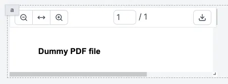

import DocCard from '@site/src/components/DocCard';

# PDF

The PDF component allows you to display a PDF file.

The following section details PDF component's specific settings. For more details on the App Editor, check the [dedicated documentation](../0_app_editor/index.mdx) or the App Editor [Quickstart](../../getting_started/7_apps_quickstart/index.mdx):

    <DocCard
        color="orange"
        title="App Editor Documentation"
        description="The app editor is a low-code builder to create custom User Interfaces with a mix of drag-and-drop and code."
        href="/docs/apps/app_editor"
    />
    <DocCard
        color="orange"
        title="Apps Quickstart"
        description="Learn how to build your first app in a matter of minutes."
        href="/docs/getting_started/apps_quickstart"
    />

## PDF configuration

| Name   |  Type   | Connectable | Templatable |  Default   | Description               |
| ------ | :-----: | :---------: | :---------: | :--------: | ------------------------- |
| Source | boolean |    true     |    true     | /dummy.pdf | The PDF file.             |
| Zoom   | number  |    true     |    true     |    100     | The zoom on the PDF view. |

## Outputs

| Name    |  Type   | Description                             |
| ------- | :-----: | --------------------------------------- |
| loading | boolean | The loading state of the PDF component. |
