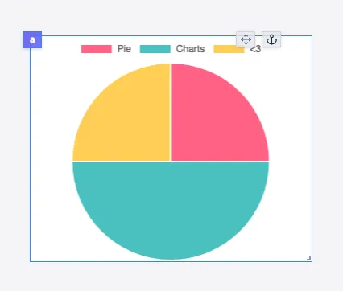

import DocCard from '@site/src/components/DocCard';

# Pie Chart

The Pie Chart component allows you to display a Pie Chart using the [Chart.js](https://www.chartjs.org/) library.

The following section details Pie Chart component's specific settings. For more details on the App Editor, check the [dedicated documentation](../0_app_editor/index.mdx) or the App Editor [Quickstart](../../getting_started/7_apps_quickstart/index.mdx):

    <DocCard
        color="orange"
        title="App Editor Documentation"
        description="The app editor is a low-code builder to create apps with components, create interactions with runnables, and configure the app settings."
        href="/docs/apps/app_editor"
    />
    <DocCard
        color="orange"
        title="Apps Quickstart"
        description="Learn how to build your first app in a matter of minutes."
        href="/docs/getting_started/apps_quickstart"
    />

## Pie Chart Input

|  Type  | Connectable | Templatable | Default | Description         |
| :----: | :---------: | :---------: | :-----: | ------------------- |
| Object |    true     |    false    |         | The pie chart data. |

## Pie Chart configuration

| Name          |  Type   | Connectable | Templatable | Default | Description                     |
| ------------- | :-----: | :---------: | :---------: | :-----: | ------------------------------- |
| theme         | string  |    false    |    false    | Theme1  | The chart theme.                |
| Doughnut style | boolean |    false    |    false    |  false  | Whether to use a doghnut style. |

## Outputs

| Name    |  Type   | Description                                   |
| ------- | :-----: | --------------------------------------------- |
| result  | Object  | The pie chart data.                           |
| loading | boolean | The loading state of the pie chart component. |
