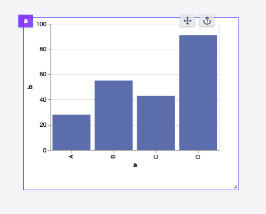

import DocCard from '@site/src/components/DocCard';

# Plotly

The Plotly component allows you to display a Plotly chart.

The following section details Plotly component's specific settings. For more details on the App Editor, check the [dedicated documentation](../0_app_editor/index.mdx) or the App Editor [Quickstart](../../getting_started/7_apps_quickstart/index.mdx):

    <DocCard
        color="orange"
        title="App Editor Documentation"
        description="The app editor is a low-code builder to create apps with components, create interactions with runnables, and configure the app settings."
        href="/docs/apps/app_editor"
    />
    <DocCard
        color="orange"
        title="Apps Quickstart"
        description="Learn how to build your first app in a matter of minutes."
        href="/docs/getting_started/apps_quickstart"
    />

## Plotly Input

|  Type  | Connectable | Templatable | Default | Description             |
| :----: | :---------: | :---------: | :-----: | ----------------------- |
| object |    true     |    false    |         | The Plotly chart config |

## Outputs

| Name   |  Type  | Description            |
| ------ | :----: | ---------------------- |
| result | Object | The Plotly chart data. |
