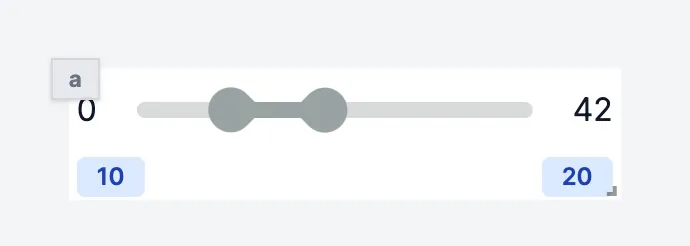

import DocCard from '@site/src/components/DocCard';

# Range

The slider component allows you to get a range of numbers from the user.

The following section details Range component's specific settings. For more details on the App Editor, check the [dedicated documentation](../0_app_editor/index.mdx) or the App Editor [Quickstart](../../getting_started/7_apps_quickstart/index.mdx):

    <DocCard
        color="orange"
        title="App Editor Documentation"
        description="The app editor is a low-code builder to create apps with components, create interactions with runnables, and configure the app settings."
        href="/docs/apps/app_editor"
    />
    <DocCard
        color="orange"
        title="Apps Quickstart"
        description="Learn how to build your first app in a matter of minutes."
        href="/docs/getting_started/apps_quickstart"
    />

## Range configuration

| Name |  Type  | Connectable | Templatable | Default | Description                     |
| ---- | :----: | :---------: | :---------: | :-----: | ------------------------------- |
| min  | number |    false    |    false    |    0    | The minimum value of the range. |
| max  | number |    false    |    false    |   42    | The maximum value of the range. |

## Outputs

| Name     |  Type  | Description             |
| -------- | :----: | ----------------------- |
| result 0 | number | The range bottom value. |
| result 1 | number | The range top value.    |
