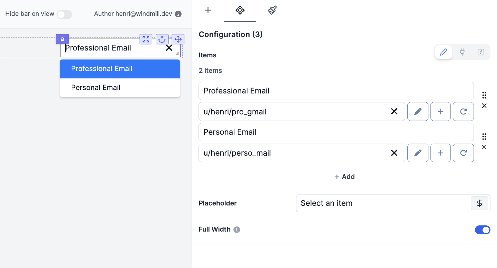

import DocCard from '@site/src/components/DocCard';

# Resource Select

The Resource Select component allows you to have users pick [resources](../../core_concepts/3_resources_and_types/index.mdx) from your Windmill workspace to interact with [integrations](../../integrations/0_integrations_on_windmill.mdx).

The following section details Resource Select component's specific settings. For more details on the App editor, check the [dedicated documentation](../0_app_editor/index.mdx) or the App editor [Quickstart](../../getting_started/7_apps_quickstart/index.mdx):

	<DocCard
		color="orange"
		title="App editor Documentation"
		description="The app editor is a low-code builder to create custom User Interfaces with a mix of drag-and-drop and code."
		href="/docs/apps/app_editor"
	/>
	<DocCard
		color="orange"
		title="Apps quickstart"
		description="Learn how to build your first app in a matter of minutes."
		href="/docs/getting_started/apps_quickstart"
	/>

## Resource Select configuration

| Name        |                               Type                                | Connectable | Templatable | Default | Description                                                     |
| ----------- | :---------------------------------------------------------------: | :---------: | :---------: | :-----: | --------------------------------------------------------------- |
| Items Name  |                              string                               |    true     |    false    |  "bar"  | The name of each suggested resource.                            |
| Items       |  [resource](../../core_concepts/3_resources_and_types/index.mdx)  |    true     |    false    |         | The Windmill resource.                                          |
| Placeholder | [variable](../../core_concepts/2_variables_and_secrets/index.mdx) |    false    |    false    |         | The variable that will be displayed by default.                 |
| Full Width  |                              boolean                              |    false    |    false    |  true   | Set the width of the options popup to 100% of the select width. |
| Disabled    |                              boolean                              |    false    |    false    |  false  | The state of the resource select.                               |

## Outputs

| Name   |  Type  | Description                                |
| ------ | :----: | ------------------------------------------ |
| result | string | The selected resource (in `$res:` format). |

## Connecting Runnables Inputs to Resources

Apps are [executed on behalf of publishers](../3_app-runnable-panel.mdx#policy) and by default cannot access viewer's [resources](../../core_concepts/3_resources_and_types/index.mdx).

If the resource passed here as a reference does not come from a static Resource Select component (which will be whitelisted by the auto-generated policy), you need to toggle "Resources from users allowed".

The toggle "Static resource select only / Resources from users allowed" can be found for each runnable input when the [source](../2_connecting_components/index.mdx) is an [eval](../3_app-runnable-panel.mdx#evals).

	<DocCard
		color="orange"
		title="Runnable editor"
		description="Learn how to create and configure Apps runnables."
		href="/docs/apps/app-runnable-panel"
	/>

## Event handler

The resource select component has the following event handler:

- `onSelect`: Trigger one or more runnables when the user selects a resource.
