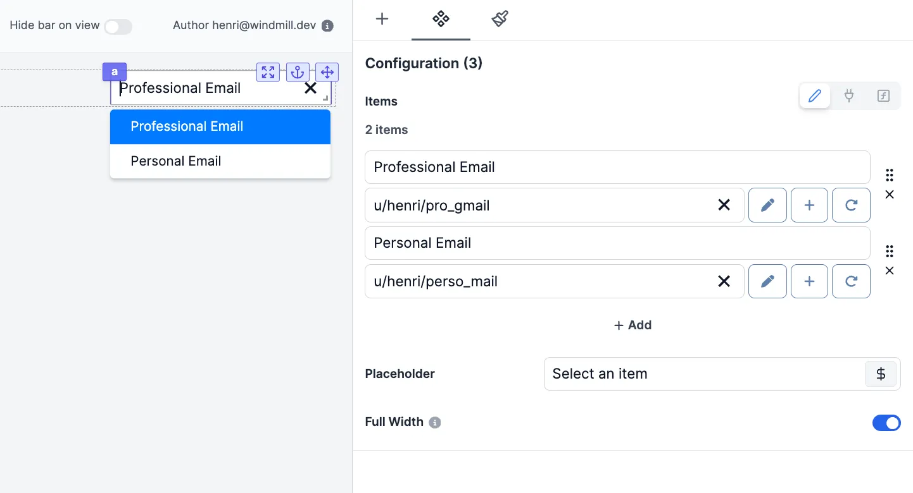

import DocCard from '@site/src/components/DocCard';

# Resource Select

The Resource Select component allows you to have users pick [resources](../../core_concepts/3_resources_and_types/index.mdx) from your Windmil workspace to interact with [intergrations](../../integrations/0_integrations_on_windmill.mdx).

The following section details Resource Select component's specific settings. For more details on the App Editor, check the [dedicated documentation](../0_app_editor/index.mdx) or the App Editor [Quickstart](../../getting_started/7_apps_quickstart/index.mdx):

    <DocCard
        color="orange"
        title="App Editor Documentation"
        description="The app editor is a low-code builder to create apps with components, create interactions with runnables (scripts & flows), and configure the app settings."
        href="/docs/apps/app_editor"
    />
    <DocCard
        color="orange"
        title="Apps Quickstart"
        description="Learn how to build your first app in a matter of minutes."
        href="/docs/getting_started/apps_quickstart"
    />

## Resource Select configuration

| Name        |                               Type                                | Connectable | Templatable | Default | Description                                                     |
| ----------- | :---------------------------------------------------------------: | :---------: | :---------: | :-----: | --------------------------------------------------------------- |
| Items Name  |                              string                               |    true     |    false    |  "bar"  | The name of each suggested resource.                            |
| Items       |  [resource](../../core_concepts/3_resources_and_types/index.mdx)  |    true     |    false    |         | The Windmill resource.                                          |
| Placeholder | [variable](../../core_concepts/2_variables_and_secrets/index.mdx) |    false    |    false    |         | The variable that will be displayed by default.                 |
| Full Width  |                              boolean                              |    false    |    false    |  true   | Set the width of the options popup to 100% of the select width. |

## Outputs

| Name   |  Type  | Description                                |
| ------ | :----: | ------------------------------------------ |
| result | string | The selected resource (in `$res:` format). |
