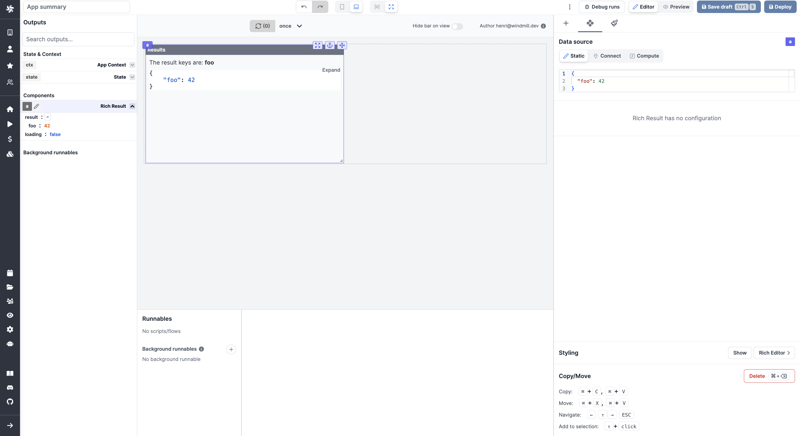

import DocCard from '@site/src/components/DocCard';

# Rich result

The Rich result component allows you to display the result of a Runnable.

The following section details Rich result component's specific settings. For more details on the App editor, check the [dedicated documentation](../0_app_editor/index.mdx) or the App editor [Quickstart](../../getting_started/7_apps_quickstart/index.mdx):

	<DocCard
		color="orange"
		title="App editor Documentation"
		description="The app editor is a low-code builder to create custom User Interfaces with a mix of drag-and-drop and code."
		href="/docs/apps/app_editor"
	/>
	<DocCard
		color="orange"
		title="Apps quickstart"
		description="Learn how to build your first app in a matter of minutes."
		href="/docs/getting_started/apps_quickstart"
	/>

## Rich result configuration

| Name        | Type | Connectable | Templatable |    Default    | Description                         |
| ----------- | :--: | :---------: | :---------: | :-----------: | ----------------------------------- |
| Data Source |      |    true     |             | `{"foo": 42}` | The data source to display results. |

## Controls

This component can be controlled by [frontend scripts](../3_app-runnable-panel.mdx#frontend-scripts) using these functions:

| Name   |        Parameters        | Description          | Example       |
| ------ | :----------------------: | -------------------- | ------------- |
| [setValue](../3_app-runnable-panel.mdx#setvalue) | id: string, value: any | Manually set or force the value of a component. | `setValue(id: 'a', value: 17)` |

## Outputs

| Name    |  Type   | Description                         |
| ------- | :-----: | ----------------------------------- |
| result  |         | The result of the runnable.         |
| loading | boolean | The loading state of the component. |
