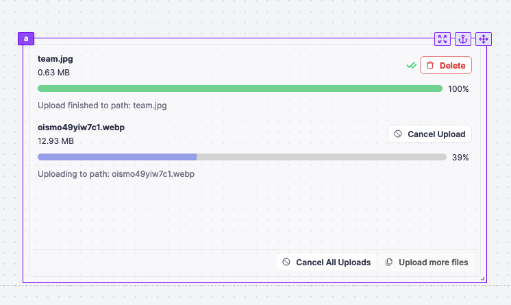

import DocCard from '@site/src/components/DocCard';

# S3 file uploader

The S3 file uploader component allows you to upload files to an S3 bucket.

The following section details S3 file uploader component's specific settings. For more details on the App editor, check the [dedicated documentation](../0_app_editor/index.mdx) or the App editor [Quickstart](../../getting_started/7_apps_quickstart/index.mdx):

	<DocCard
		color="orange"
		title="App editor Documentation"
		description="The app editor is a low-code builder to create custom User Interfaces with a mix of drag-and-drop and code."
		href="/docs/apps/app_editor"
	/>
	<DocCard
		color="orange"
		title="Apps quickstart"
		description="Learn how to build your first app in a matter of minutes."
		href="/docs/getting_started/apps_quickstart"
	/>

## Controls

This component can be controlled by [frontend scripts](../3_app-runnable-panel.mdx#frontend-scripts) using these functions:

| Name   |        Parameters        | Description          | Example       |
| ------ | :----------------------: | -------------------- | ------------- |
| [clearFiles](../3_app-runnable-panel.mdx#clearfiles) | id: string | Clear the files of a file input. | `clearFiles(id: 'a')` |

## Interactions

The S3 file uploader component offers the following interactions:

- Files are uploaded in chunks to the S3 bucket. The component emits the file path in the S3 bucket upon completion of the upload.
- The upload can be canceled by clicking on the 'Cancel' button.
- All uploads can be canceled simultaneously by clicking on the 'Cancel All' button.
- After completing all uploads, more files can be uploaded by clicking on the 'Upload More' button.
- Uploaded files can be deleted by clicking on the 'Delete' button.

## Inputs

|        Type         |    Type     | Connectable | Templatable | Default                                                | Description                                                    |
| :-----------------: | :---------: | :---------: | :---------: | ------------------------------------------------------ | -------------------------------------------------------------- |
|      resource       | S3 Resource |    true     |    false    | It defaults to the workspace S3 resource if it exists. | The S3 resource to use to upload the file.                     |
| Accepted File Types |    array    |    false    |    false    | "image/\*" ; "application/pdf"                         | The types of files you accept to be submitted.                 |
|   Allow Multiple    |   boolean   |    false    |    false    | false                                                  | If allowed, the user will be able to select more than one file |
|        Text         |   string    |    false    |    false    | Drag and drop files or click to select them            | The text displayed on the file input.                          |
|    Path template    |   string    |    false    |    false    | $\{file.name\}                                         | The path template to use to upload the file.                   |
|      Disabled       |   boolean   |    false    |    false    | false                                                  | The state of the file input.                                   |

## Outputs

| Name    |  Type   | Description                                          |
| ------- | :-----: | ---------------------------------------------------- |
| result  |  Array  | An array containing the paths of the uploaded files. |
| loading | boolean | The loading state of the S3 file uploader component.   |

## Event handler

The modal component has the following event handler:

- `onFileChange`: Trigger one or more runnables when the user uploads a file.
