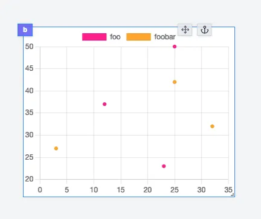

import DocCard from '@site/src/components/DocCard';

# Scatter Chart

The Scatter Chart component allows you to display a Scatter Chart using the [Chart.js](https://www.chartjs.org/) library.

The following section details Scatter Chart component's specific settings. For more details on the App Editor, check the [dedicated documentation](../0_app_editor/index.mdx) or the App Editor [Quickstart](../../getting_started/7_apps_quickstart/index.mdx):

    <DocCard
        color="orange"
        title="App Editor Documentation"
        description="The app editor is a low-code builder to create apps with components, create interactions with runnables, and configure the app settings."
        href="/docs/apps/app_editor"
    />
    <DocCard
        color="orange"
        title="Apps Quickstart"
        description="Learn how to build your first app in a matter of minutes."
        href="/docs/getting_started/apps_quickstart"
    />

## Scatter Chart Input

|      Type       | Connectable | Templatable | Default | Description             |
| :-------------: | :---------: | :---------: | :-----: | ----------------------- |
| `Array<Object>` |    true     |    false    |         | The scatter chart data. |

## Scatter Chart configuration

| Name     |  Type   | Connectable | Templatable | Default | Description                      |
| -------- | :-----: | :---------: | :---------: | :-----: | -------------------------------- |
| zoomable | boolean |    false    |    false    |  false  | Whether to use a zoomable style. |
| panable  | boolean |    false    |    false    |  false  | Whether to use a panable style.  |

## Outputs

| Name    |  Type   | Description                                       |
| ------- | :-----: | ------------------------------------------------- |
| result  | Object  | The scatter chart data.                           |
| loading | boolean | The loading state of the scatter chart component. |
