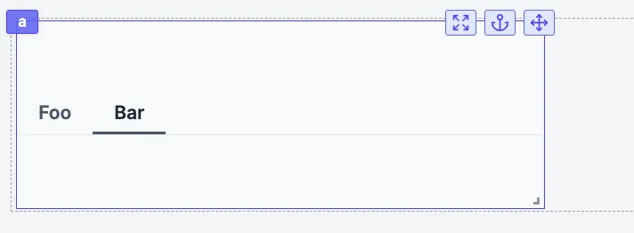

import DocCard from '@site/src/components/DocCard';

# Select tab

The Select tab is standalone tab component that behaves like a select component. It is meant to have the chosen tab to be chosen as input by components or runnables.

The following section details Select tab component's specific settings. For more details on the App editor, check the [dedicated documentation](../0_app_editor/index.mdx) or the App editor [Quickstart](../../getting_started/7_apps_quickstart/index.mdx):

	<DocCard
		color="orange"
		title="App editor Documentation"
		description="The app editor is a low-code builder to create custom User Interfaces with a mix of drag-and-drop and code."
		href="/docs/apps/app_editor"
	/>
	<DocCard
		color="orange"
		title="Apps quickstart"
		description="Learn how to build your first app in a matter of minutes."
		href="/docs/getting_started/apps_quickstart"
	/>

## Controls

This component can be controlled by [frontend scripts](../3_app-runnable-panel.mdx#frontend-scripts) using these functions:

| Name   |        Parameters        | Description          | Example       |
| ------ | :----------------------: | -------------------- | ------------- |
| [setValue](../3_app-runnable-panel.mdx#setvalue) | id: string, value: any | Manually set or force the value of a component. | `setValue(id: 'a', value: 17)` |
| [setTab](../3_app-runnable-panel.mdx#settab) | id: string, index:number | Set the current tab. | setTab('a',1) |

## Select tab configuration

| Name          |  Type  | Connectable | Templatable |    Default    | Description                                       |
| ------------- | :----: | :---------: | :---------: | :-----------: | ------------------------------------------------- |
| Items         | string |    true     |    false    | "Foo" ; "Bar" | The select tabs items (label and value, in JSON). |
| Default Value | string |    true     |    false    |               | The default value of the tabs labels and value.   |

## Outputs

| Name   |  Type  | Description       |
| ------ | :----: | ----------------- |
| result | string | The selected tab. |
