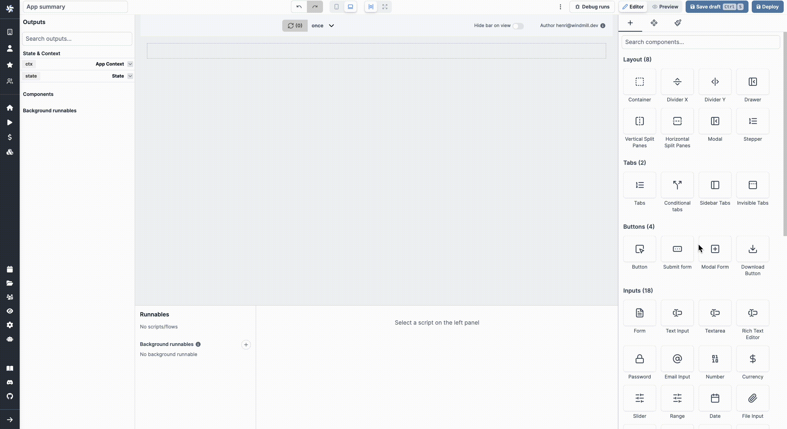

import DocCard from '@site/src/components/DocCard';

# Sidebar Tabs

The Sidebar Tabs component is basically a Tabs component whose `Tabs Kind` is "Sidebar".

The following section details Sidebar Tabs component's specific settings. For more details on the App Editor, check the [dedicated documentation](../0_app_editor/index.mdx) or the App Editor [Quickstart](../../getting_started/7_apps_quickstart/index.mdx):

    <DocCard
        color="orange"
        title="App Editor Documentation"
        description="The app editor is a low-code builder to create custom User Interfaces with components linked to runnables (scripts & flows)."
        href="/docs/apps/app_editor"
    />
    <DocCard
        color="orange"
        title="Apps Quickstart"
        description="Learn how to build your first app in a matter of minutes."
        href="/docs/getting_started/apps_quickstart"
    />

## 
