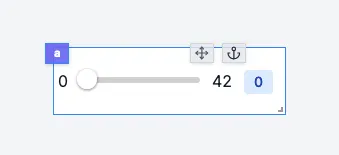

import DocCard from '@site/src/components/DocCard';

# Slider

The slider component allows you to get a number from the user.

The following section details Slider component's specific settings. For more details on the App Editor, check the [dedicated documentation](../0_app_editor/index.mdx) or the App Editor [Quickstart](../../getting_started/7_apps_quickstart/index.mdx):

	<DocCard
		color="orange"
		title="App Editor Documentation"
		description="The app editor is a low-code builder to create custom User Interfaces with a mix of drag-and-drop and code."
		href="/docs/apps/app_editor"
	/>
	<DocCard
		color="orange"
		title="Apps Quickstart"
		description="Learn how to build your first app in a matter of minutes."
		href="/docs/getting_started/apps_quickstart"
	/>

## Slider configuration

| Name          |  Type   | Connectable | Templatable |  Default  | Description                      |
| ------------- | :-----: | :---------: | :---------: | :-------: | -------------------------------- |
| min           | number  |    false    |    false    |     0     | The minimum value of the slider. |
| max           | number  |    false    |    false    |    42     | The maximum value of the slider. |
| step          | number  |    false    |    false    |     1     | The step of the slider.          |
| Default Value | number  |    false    |    false    | undefined | The default value of the slider. |
| Vertical      | boolean |    false    |    false    |   false   | The orientation of the slider.   |
| Disabled      | boolean |    false    |    false    |   false   | The state of the slider.         |

## Outputs

| Name   |  Type  | Description       |
| ------ | :----: | ----------------- |
| result | number | The slider value. |
