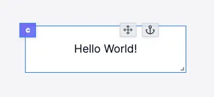

import DocCard from '@site/src/components/DocCard';

# Text

The text component allows you to display text.

The following section details Text component's specific settings. For more details on the App Editor, check the [dedicated documentation](../0_app_editor/index.mdx) or the App Editor [Quickstart](../../getting_started/7_apps_quickstart/index.mdx):

    <DocCard
        color="orange"
        title="App Editor Documentation"
        description="The app editor is a low-code builder to create apps with components, create interactions with runnables (scripts & flows), and configure the app settings."
        href="/docs/apps/app_editor"
    />
    <DocCard
        color="orange"
        title="Apps Quickstart"
        description="Learn how to build your first app in a matter of minutes."
        href="/docs/getting_started/apps_quickstart"
    />

## Text Input

|  Type  | Connectable | Templatable |   Default    | Description          |
| :----: | :---------: | :---------: | :----------: | -------------------- |
| string |    true     |    true     | Hello World! | The text to display. |

## Text configuration

| Name        |                      Type                      | Connectable | Templatable | Default | Description                                                     |
| ----------- | :--------------------------------------------: | :---------: | :---------: | :-----: | --------------------------------------------------------------- |
| style       | 'title', 'subtitle', 'body', 'label','caption' |    false    |    false    | 'body'  | The text style.                                                 |
| Extra Style |                     string                     |    false    |    false    |         | Extra style to apply to the text: CSS rules like "color: blue;" |

## Outputs

| Name    |  Type   | Description                              |
| ------- | :-----: | ---------------------------------------- |
| result  | string  | The text.                                |
| loading | boolean | The loading state of the text component. |

## Inline editor

You can directly edit the text by click the `Pen` icon on the app editor. You can also double click on the text to edit it.

<video
    className="border-2 rounded-xl object-cover w-full h-full dark:border-gray-800"
    autoPlay
    controls
    src="/videos/text_editor.mp4"
/>
