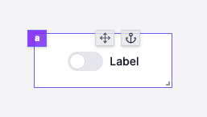

import DocCard from '@site/src/components/DocCard';

# Toggle

The toggle component allows you to get a boolean from the user.

The following section details Toggle component's specific settings. For more details on the App Editor, check the [dedicated documentation](../0_app_editor/index.mdx) or the App Editor [Quickstart](../../getting_started/7_apps_quickstart/index.mdx):

	<DocCard
		color="orange"
		title="App Editor Documentation"
		description="The app editor is a low-code builder to create custom User Interfaces with a mix of drag-and-drop and code."
		href="/docs/apps/app_editor"
	/>
	<DocCard
		color="orange"
		title="Apps Quickstart"
		description="Learn how to build your first app in a matter of minutes."
		href="/docs/getting_started/apps_quickstart"
	/>

## Toggle configuration

| Name          |  Type   | Connectable | Templatable | Default | Description                      |
| ------------- | :-----: | :---------: | :---------: | :-----: | -------------------------------- |
| label         | string  |    true     |    false    |  Label  | The toggle label.                |
| default value | boolean |    true     |    false    |         | The default value of the toggle. |

## Outputs

| Name   |  Type   | Description              |
| ------ | :-----: | ------------------------ |
| result | boolean | The state of the toggle. |
