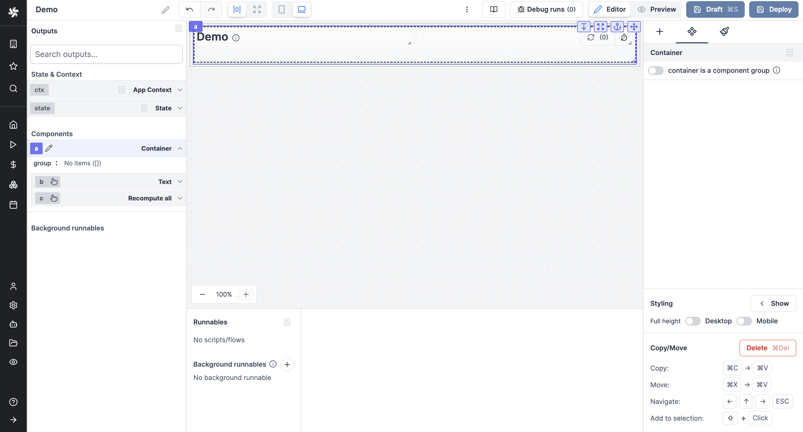
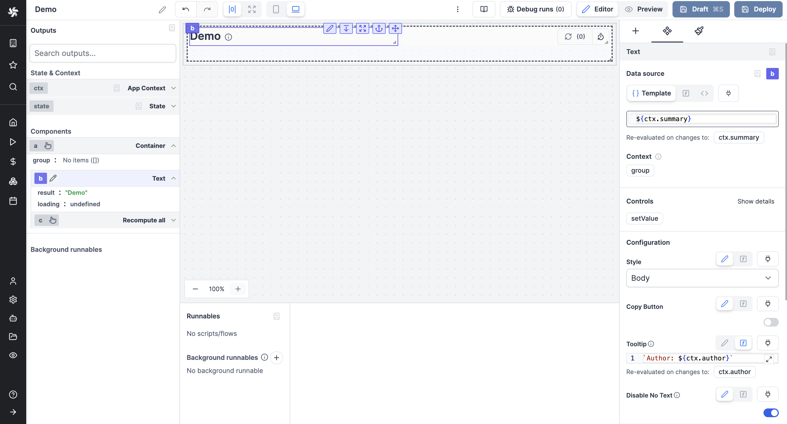
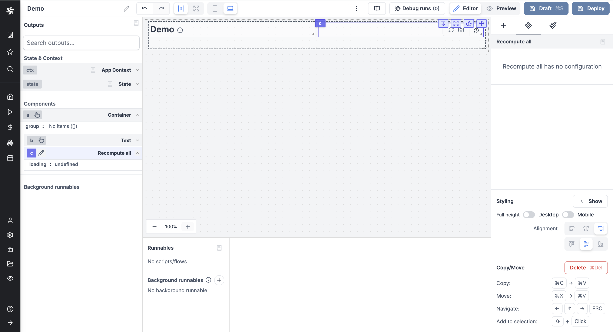

import DocCard from '@site/src/components/DocCard';

# Top Bar

The Top Bar component displays a top bar on your app, with the app Summary and the Recompute all button.

<video
	className="border-2 rounded-lg object-cover w-full h-full dark:border-gray-800"
	controls
	src="/videos/topbar.mp4"
/>

The following section details Top Bar component's specific settings. For more details on the App editor, check the [dedicated documentation](../0_app_editor/index.mdx) or the App editor [Quickstart](../../getting_started/7_apps_quickstart/index.mdx):

	<DocCard
		color="orange"
		title="App editor Documentation"
		description="The app editor is a low-code builder to create custom User Interfaces with a mix of drag-and-drop and code."
		href="/docs/apps/app_editor"
	/>
	<DocCard
		color="orange"
		title="Apps quickstart"
		description="Learn how to build your first app in a matter of minutes."
		href="/docs/getting_started/apps_quickstart"
	/>

The Top Bar component is in fact a [Container](#container) with a [Text](#text) and a [Recompute all](#recompute-all) components.

## Container

[Containers](./container.mdx) allow you to host other components in a box. Moving a container means moving all the components inside.

In that case, the container of the Top Bar component takes the whole width of the canvas and contains on its left a [Text](#text) component, and on its right a [Recompute all](#recompute-all) component.

## Text

The [Text](./text.mdx) component allows you to display text.

In that case, the Text component has by default template value `${ctx.summary}` which will display the [context](../2_outputs.mdx#app-context) [Summary](../0_toolbar.md#app-summary) of the app.

## Recompute all

The [Recompute all](./recompute_all.mdx) component allows you to recompute all elements in the app.

By default, it will be set to Once.

