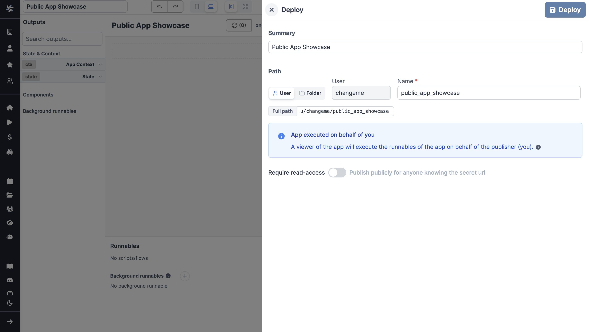
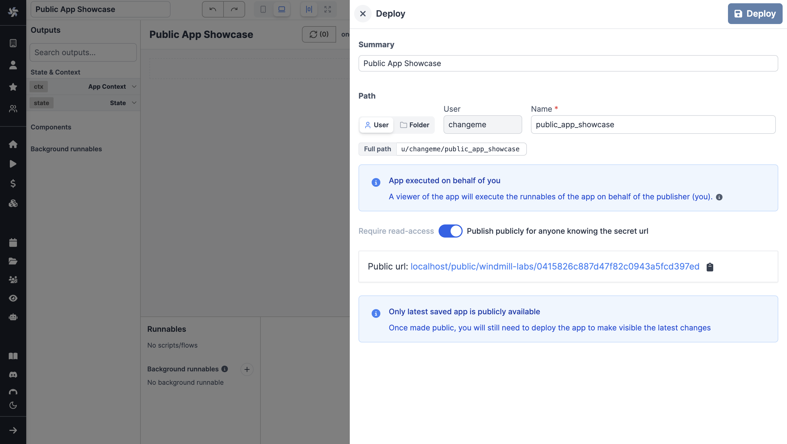

# Public Apps

Windmill apps are custom-made user interfaces meant to interact with scripts and flows.

There are two ways to [deploy](./6_app_deployment.mdx) an app:
- **Read-Access Required**: The app can be accessed & triggered by anyone who has [read access](../core_concepts/16_roles_and_permissions/index.mdx) to the app.
- **Publish Publicly**: The app can be accessed as a standalone app by anyone who has the secret URL.
This feature requires saving the app at least to [draft](../core_concepts/0_draft_and_deploy/index.mdx#draft) before.

