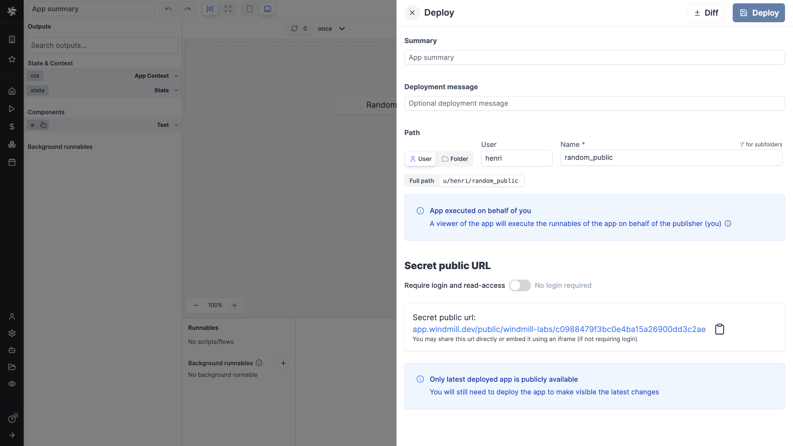
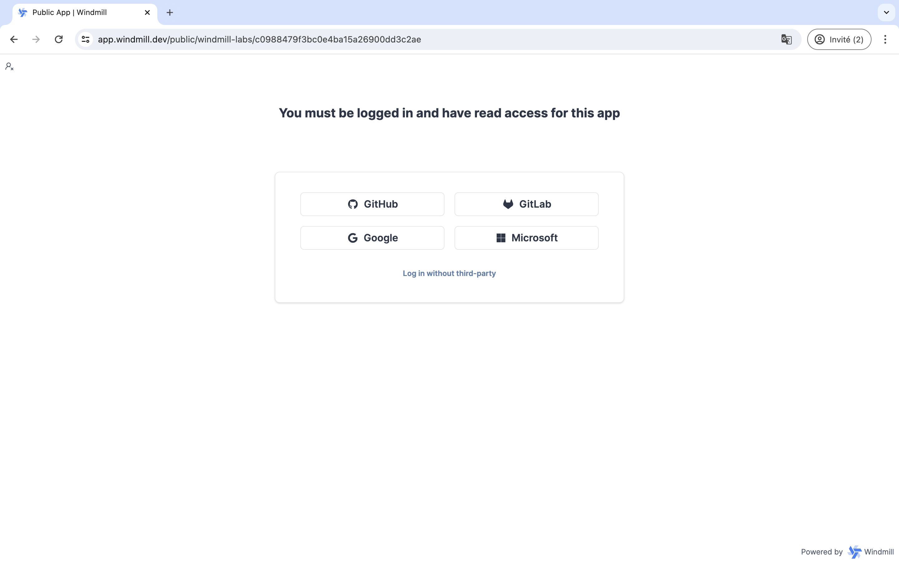
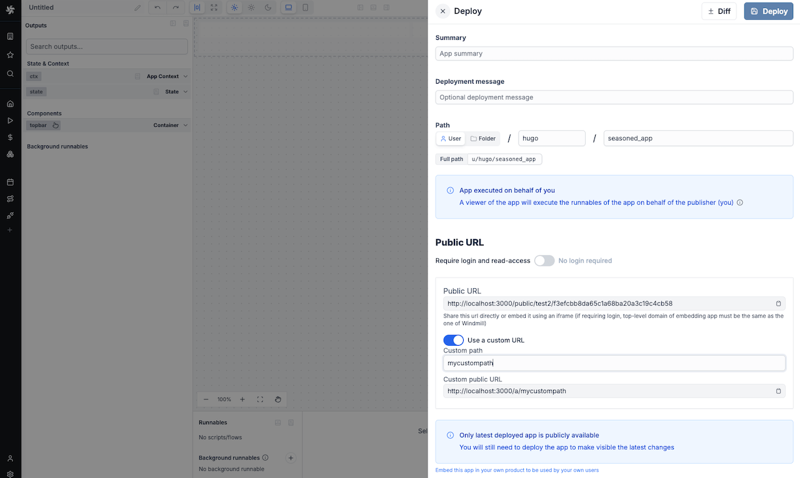

import DocCard from '@site/src/components/DocCard';

# Public apps

Windmill apps are custom-made user interfaces meant to interact with scripts and flows.

By default, [deployed](./6_app_deployment.mdx) apps are [accessible to](../core_concepts/16_roles_and_permissions/index.mdx) all users that belong to the [folder](../core_concepts/8_groups_and_folders/index.mdx) the app was deployed to.

A "Public" app is an app that can be seen and used by users outside this scope (i.e.) folder.

When deployed, an app automatically has a secret public URL.

By default, the public URL can be accessed only by logged-in users with [read-access](../core_concepts/16_roles_and_permissions/index.mdx).

You can also toggle "No login required" and anyone with the secret public URL will be able to access the app.

	<DocCard
		title="Roles and permissions"
		description="Find out about the roles within a Windmill instance and their respective permissions."
		href="/docs/core_concepts/roles_and_permissions"
	/>

## Rate limiting

Users can limit the number of public (anonymous) app executions per minute per server. This is useful to prevent abuse of public apps that don't require login.

The setting is found under workspace settings > Advanced > Apps. Set the value to 0 or leave empty to disable rate limiting. This is a per-server limit, not a global limit.

## Custom URL

[Cloud and enterprise](/pricing) users can also customize the public URL of their app. The app will be available at `https://mywindmill.com/a/<custom-path>`.

On cloud only, the custom path is prefixed by the workspace name.

