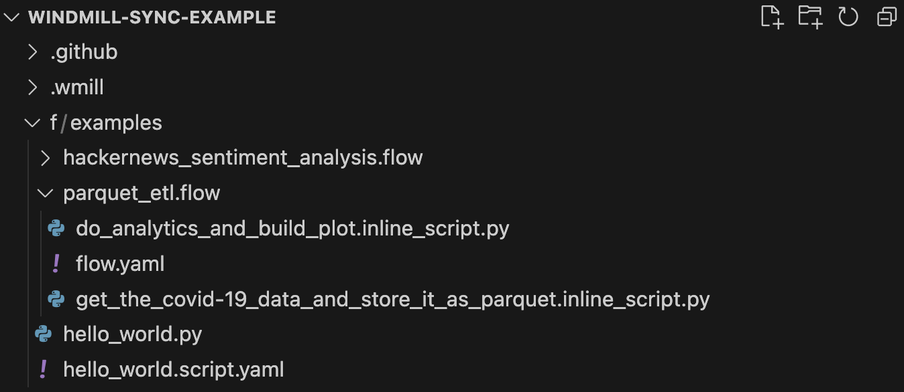

import DocCard from '@site/src/components/DocCard';

# VS Code Extension

The Windmill VS Code extension allows you to build scripts and flows in the comfort of your VS Code Editor, while leveraging Windmill UIs for test & flows edition.

The extension can be used in particular from a [repository syncronized to a Windmill instance](../../advanced/3_cli/sync.mdx) to [develop scripts & flows locally](../../advanced/4_local_development/index.mdx) while keeping them synced to your workspace.

	<DocCard
		title="Command-Line Interface - Sync"
		description="Sync with a Windmill workspace from Windmill CLI."
		href="/docs/advanced/cli"
	/>

<iframe
	style={{ aspectRatio: '16/9' }}
	src="https://www.youtube.com/embed/aSOF6AzyDr8?vq=hd1080"
	title="YouTube video player"
	frameBorder="0"
	allow="accelerometer; autoplay; clipboard-write; encrypted-media; gyroscope; picture-in-picture; web-share"
	allowFullScreen
	className="border-2 rounded-xl object-cover w-full dark:border-gray-800"
></iframe>

 

Windmill has its own IDE for creating [scripts](../../script_editor/index.mdx) and [flows](../../flows/1_flow_editor.mdx) from the Windmill application (cloud or [self-hosted](../../advanced/1_self_host/index.mdx)).

The Windmill UI allows you to edit direcly the deployed scripts & flows, which is great for maintenance and quick prototyping.

However in many production settings it is more common to version everything from git and to that end we have a CLI to sync a workspace to a local directory and the inverse operation (deploy local directory to a workspace). With this extension, you can efficiently edit scripts & flows directly from there.

To run scripts locally, see [Run Locally](../../advanced/4_local_development/run_locally.mdx).

	<DocCard
		title="Local Development"
		description="Develop from various environments such as your terminal, VS Code, and JetBrains IDEs."
		href="/docs/advanced/local_development"
	/>
	<DocCard
		title="Run Locally"
		description="Run scripts locally that interact with a Windmill instance."
		href="/docs/advanced/local_development/run_locally"
	/>
   <DocCard
		title="Command-Line Interface"
		description="Interact with Windmill instances right from your terminal."
		href="/docs/advanced/cli"
 />

## Installation

1. First of all, have your workspace synced locally with [Windmill CLI](../../advanced/3_cli/index.mdx).

> [Example repo](https://github.com/windmill-labs/windmill-sync-example) opened in VS Code. We see 2 flows and 1 script, the flows are their own folders, each step in a flow is a seperate file in their respective language. Scripts have their metadata in a seperate file.

 

With [wmill sync pull](../../advanced/3_cli/sync.mdx#pulling-1) and [wmill sync push](../../advanced/3_cli/sync.mdx#pushing-1) you can synchronize your remote workspace to a local directory which you would version with GitHub / GitLab.

1. Install the [extension](https://marketplace.visualstudio.com/items?itemName=windmill-labs.windmill).

2. Enter your Windmill remote URL and [token](../../core_concepts/4_webhooks/index.md#user-token), so the extension can execute scripts and flows on your workspace.

3. From any script file, use `> Windmill: Run preview in the current editor` or Ctrl+Enter and Shift+Enter to generate the UI preview (provided that the script meets the [few rules](../../core_concepts/13_json_schema_and_parsing/index.md#json-schema-in-windmill) required by Windmill).

The preview & run will work for any script meeting the specific language requirements (main function, imports) and being named with the dedicated file extension (.py, .go etc.). For scripts in Bun, name the file \[name\].bun.ts, ".ts" being by default Deno.

The extension will split your screen and display a panel. That panel will update automatically based on the edited document on the left.
- When editing a script (or a flow step), you see the script [preview UI](../../core_concepts/6_auto_generated_uis/index.mdx) with the [auto-inference of the parameters](../../core_concepts/13_json_schema_and_parsing/index.md).
- When editing a flow YAML, you it contains the flow builder and the flow [test UI](../../flows/18_test_flows.mdx).

In particular:

## Test scripts, flows and flows steps from VS Code

<video
  className="border-2 rounded-xl object-cover w-full h-full dark:border-gray-800"
  autoPlay
  loop
  src="/videos/vs_code_tour.mp4"
/>

## Editing the YAML definition of a flow instantly updates the rendered graph

<video
  className="border-2 rounded-xl object-cover w-full h-full dark:border-gray-800"
  autoPlay
  loop
  src="/videos/ui_to_yaml.mp4"
/>

## Editing the flow from the UI immediately modifies the YAML definition

<video
  className="border-2 rounded-xl object-cover w-full h-full dark:border-gray-800"
  autoPlay
  loop
  src="/videos/yaml_to_ui.mp4"
/>

## Commands

Access these commands through the Command Palette (Ctrl/Cmd+Shift+P):

| Command                                              | Description                                                                                                                                                                                         |
| ---------------------------------------------------- | --------------------------------------------------------------------------------------------------------------------------------------------------------------------------------------------------- |
| **Windmill: Show Preview**                           | This command launches a preview of your script in a new tab.                                                                                                                                        |
| **Windmill: Run preview**                            | Runs the current script and provides a preview within the VS Code environment. This feature lets you preview your work without leaving your code editor.                                             |
| **Windmill: Configure remote, workspace, and token** | Opens a setup wizard to configure your environment. This includes settings for the remote URL, workspace, and user token. You only need to do this once or when changing your environment settings. |
| **Windmill: Switch windmill workspace**              | Allows you to switch between different workspaces.                                                                                                                                                  |
| **Windmill: add a windmill workspace**                        | Adds a new workspace to your configuration.                                                                                                                                               |

## Settings

The extension provides the following settings:

| Setting                         | Description                                                                                                  |
| ------------------------------- | ------------------------------------------------------------------------------------------------------------ |
| `windmill.remote`               | The full remote URL including http and trailing slash. By default, it's "https://app.windmill.dev/".         |
| `windmill.workspaceId`          | The workspace id to use.                                                                                     |
| `windmill.token`                | The token to use to authenticate with the remote and workspace.                                              |
| `windmill.additionalWorkspaces` | The list of additional remotes to use. This allows you to set up multiple workspaces for different projects. |
| `windmill.currentWorkspace`     | The workspace name currently used (if multiple). main or empty is the default one.                           |

You can create a user token in the Windmill app. Follow the instructions in the [Windmill docs](/docs/core_concepts/webhooks#user-token).
