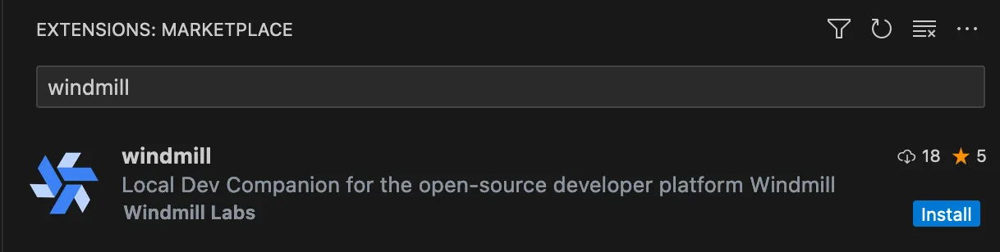
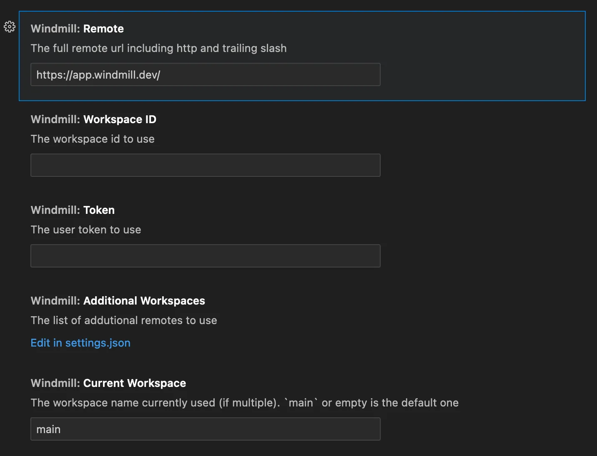

import DocCard from '@site/src/components/DocCard';

# VS Code Extension

The Windmill VS Code extension allows you to run your scripts & flows and preview the output within VS Code. This feature lets you preview your work without leaving the code editor.

The extension can be used in particular from a [repository syncronized to a Windmill instance](../../advanced/3_cli/sync.mdx) to [develop scripts & flows locally](../../advanced/4_local_development/index.mdx) while keeping them synced to your workspace.

<iframe
	style={{ aspectRatio: '16/9' }}
	src="https://www.youtube.com/embed/aSOF6AzyDr8?vq=hd1080"
	title="YouTube video player"
	frameBorder="0"
	allow="accelerometer; autoplay; clipboard-write; encrypted-media; gyroscope; picture-in-picture; web-share"
	allowFullScreen
	className="border-2 rounded-xl object-cover w-full dark:border-gray-800"
></iframe>

 

The VS Code extension is an efficient way to develop scripts and flows locally - not in Windmill's own [script](../../script_editor/index.mdx) and [flow](../../flows/1_flow_editor.mdx) editors - but the scripts and flows ran from there
are actually executed in remote from your Windmill instance. To run scripts locally, see [Run Locally](../../advanced/4_local_development/run_locally.mdx).

	<DocCard
		title="Local Development"
		description="Develop from various environments such as your terminal, VS Code, and JetBrains IDEs."
		href="/docs/advanced/local_development"
	/>
	<DocCard
		title="Run Locally"
		description="Run scripts locally that interact with a Windmill instance."
		href="/docs/advanced/local_development/run_locally"
	/>
   <DocCard
		title="Command-Line Interface"
		description="Interact with Windmill instances right from your terminal."
		href="/docs/advanced/cli"
 />

## Installation

1. Open VS Code and click on the Extensions icon on the Activity Bar on the side of the window.
2. Search for "Windmill" and select the Windmill extension by Windmill Labs.
3. Click on the Install button.

You can also follow this link to the extension page on the VS Code marketplace: [Install it](https://marketplace.visualstudio.com/items?itemName=windmill-labs.windmill).

## Quick Start

Open the command menu (Ctrl/Cmd+Shift+P) and run:

`> Windmill: Configure remote, workspace and token`

In the settings menu, set the remote url, workspace name and token.

Once done, on any page you'd like to edit, run:

`> Windmill: Run preview in the current editor`

The keybidings for that command are: Ctrl+Enter and Shfit+Enter.

The preview & run will work for any script meeting the specific language requirements (main function, imports) and being named with the dedicated file extension (.py, .go etc.). For scripts in Bun, name the file \[name\].bun.ts, ".ts" being by default Deno.

## Features

- The extension will automatically detect the current scripts & flows and load the schema.
- Run your scripts & flows and preview the output within VS Code.
- Review logs and results
- Check run history

## Commands

Access these commands through the Command Palette (Ctrl/Cmd+Shift+P):

| Command                                              | Description                                                                                                                                                                                         |
| ---------------------------------------------------- | --------------------------------------------------------------------------------------------------------------------------------------------------------------------------------------------------- |
| **Windmill: Show Preview**                           | This command launches a preview of your script in a new tab.                                                                                                                                        |
| **Windmill: Run preview**                            | Runs the current script and provides a preview within the VS Code environment. This feature lets you preview your work without leaving your code editor.                                             |
| **Windmill: Configure remote, workspace, and token** | Opens a setup wizard to configure your environment. This includes settings for the remote URL, workspace, and user token. You only need to do this once or when changing your environment settings. |
| **Windmill: Switch windmill workspace**              | Allows you to switch between different workspaces.                                                                                                                                                  |
| **Windmill: add a windmill workspace**                        | Adds a new workspace to your configuration.                                                                                                                                               |

## Settings

The extension provides the following settings:

| Setting                         | Description                                                                                                  |
| ------------------------------- | ------------------------------------------------------------------------------------------------------------ |
| `windmill.remote`               | The full remote URL including http and trailing slash. By default, it's "https://app.windmill.dev/".         |
| `windmill.workspaceId`          | The workspace id to use.                                                                                     |
| `windmill.token`                | The token to use to authenticate with the remote and workspace.                                              |
| `windmill.additionalWorkspaces` | The list of additional remotes to use. This allows you to set up multiple workspaces for different projects. |
| `windmill.currentWorkspace`     | The workspace name currently used (if multiple). main or empty is the default one.                           |

You can create a user token in the Windmill app. Follow the instructions in the [Windmill docs](/docs/core_concepts/webhooks#user-token).
