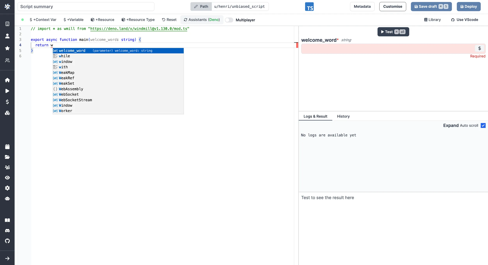

# Code assistants

Windmill integrates code assistants into its code editor to provide language-specific suggestions, linting, formatting, and more.

## How code assistants work

The code assistants in Windmill are integrated into the Monaco code editor. Windmill leverages servers in the backend to perform calculations and provide assistance to developers. The communication between the code editor and the backend servers is established using the Language Server Protocol (LSP).

Here's an overview of how the code assistants work:

1. **Language Server Protocol (LSP)**: Windmill utilizes the Language Server Protocol, a standardized protocol for communication between code editors and language servers.

2. **Language Servers**: For each supported programming language, Windmill employs dedicated language servers responsible for providing code assistance and language-specific functionality. The following language servers are used by Windmill for each language:

   - Deno: Deno LSP
   - Python: Ruff, Black, Pyright
   - Bash: shellcheck
   - Go: Go LSP

3. **WebSocket Communication**: The language servers communicate with the Windmill backend through websockets, enabling real-time exchange of information between the code editor and the language servers.

4. **Calculations and Suggestions**: As developers write code in the Windmill editor, the language servers process the code, perform calculations, and provide relevant suggestions. These suggestions can include auto-completion, syntax highlighting, linting errors, formatting options, and more.

By integrating these code assistants, Windmill enhances the development workflow, enabling developers to write code more efficiently, identify and correct errors, and adhere to best practices specific to each programming language.