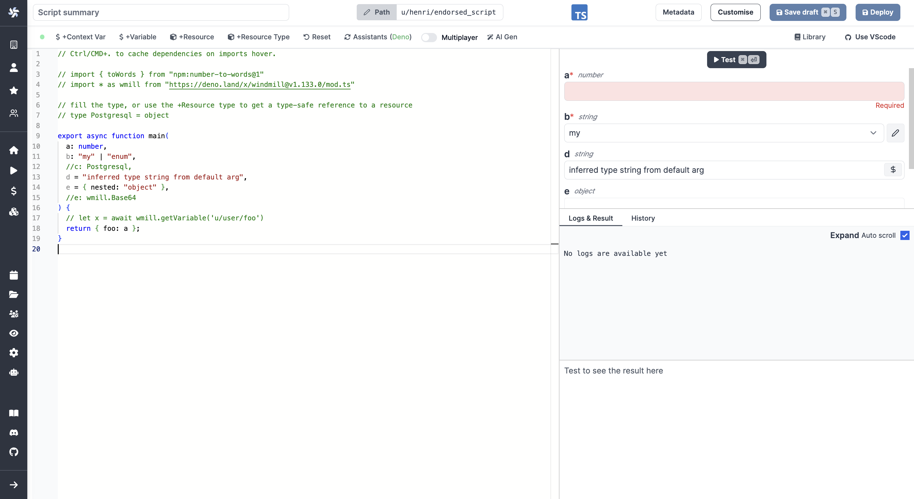

import DocCard from '@site/src/components/DocCard';

# Code Editor

The code editor is Windmill's integrated development environment. It allows you to write code in TypeScript, Python, Go, Bash, SQL, or even running any docker container through Windmill's Bash support.

The code editor is the main component for building scripts in Windmill's script editor, but it is also used in Windmill's Flow Editor to build steps or in the App Editor to add inline scripts.

Code Editor in Scripts:

Code Editor in Flows:

Code Editor in Apps:

	<DocCard
		title="Script Editor"
		description="Scripts are the basic building blocks that can be written in Typescript, Python, Go, Bash or launch docker containers."
		href="/docs/script_editor"
	/>
	<DocCard
		title="Flow Editor"
		description="Flows are state machines represented as DAGs that compose steps together to build workflows and ETLs."
		href="/docs/flows/flow_editor"
		color="teal"
	/>
	<DocCard
		title="App Editor"
		description="Apps are customized, user-friendly interfaces built using a drag-and-drop editor."
		href="/docs/apps/app_editor"
		color="orange"
	/>

