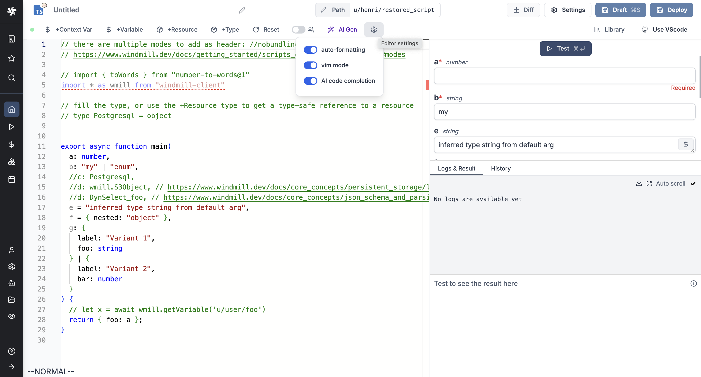
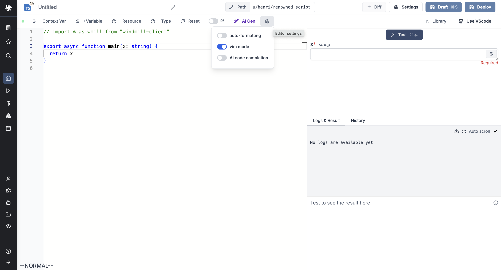

import DocCard from '@site/src/components/DocCard';

# Code editor Settings

Code editor supports configuration of appearance and behavior.

Settings can be accessed by clicking on the gear icon on the top right corner of the editor.

## Auto-formatting

Auto-Formatting is a feature that automatically formats the code when you save the code as [draft](../core_concepts/0_draft_and_deploy/index.mdx#draft) with command  `Ctrl +S` / `Cmd + S`.

<video
	className="border-2 rounded-lg object-cover w-full h-full dark:border-gray-800"
	controls
	src="/videos/auto_formatting.mp4"
/>

## Vim mode

We support [Vim](https://www.vim.org/) mode on the editor.

## AI code completion

Windmill provides ways to have AI help you in your coding experience.

<video
	className="border-2 rounded-lg object-cover w-full h-full dark:border-gray-800"
	controls
	src="/videos/ai_generation.mp4"
/>

 

All details at [Windmill AI](../core_concepts/22_ai_generation/index.mdx):

	<DocCard
		title="Windmill AI"
		description="Have AI complete code on Windmill."
		href="/docs/core_concepts/ai_generation"
	/>

