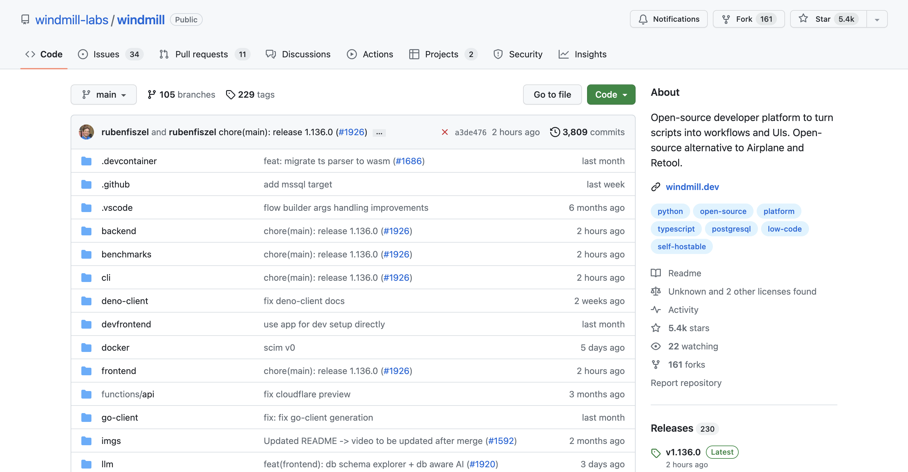

import DocCard from '@site/src/components/DocCard';

# Airplane Alternative for Internal Tools

Airplane is great for building internal tools. Windmill does it too, but makes it easier to deploy and maintain them at scale.

Although being a tool similar to Airplane, Windmill adopts radically different approaches.

## Open Source

Windmill is fully open source. Which mean you can read Windmill's tech stack and contribute to it.

This implies that Windmill can be self-hosted with just a few commands, providing cost-effective and secure solutions.
Windmill offers a clean slate, allowing you to fully explore its platform before committing to the product.
Windmill's open-source nature ensures that our platform is tested, approved, and continuously enhanced
to meet the community's needs.

At last, Windmill provides and integrates to its platform a [public community Hub](https://hub.windmill.dev/)
where users share useful and proven scripts, flows, and apps.

	<DocCard
		title="Windmill's GitHub"
		description="Windmill's official repository."
		href="https://github.com/windmill-labs/windmill"
	/>
    <DocCard
		title="Self Host Windmill tutorial"
		description="Self host Windmill in 2 minutes."
		href="/docs/advanced/self_host/"
	/>
    <DocCard
		title="Contributor Guide"
		description="Contribute to our codebase, Windmill Hub or our Discord."
		href="/docs/misc/contributing"
	/>

:::note Airplane
Airplane is a proprietary software and closed source.
:::

## Performance at scale & cold start

Given Airplane's architecture, [tasks are run on fresh fargate containers](https://docs.airplane.dev/self-hosting/aws).
This has pros and cons. The biggest cons is that one is subject to **the cold-start of Amazon fargate
that routinely can go as high as 2 minutes**.

Windmill's architecture is different and each task is run on the current fleet of worker
(which you can auto-scale automatically) and hence do not suffer from cold start.
Isolation and creating dedicated dependency environment is the secret sauce that makes Windmill
the fastest execution runtime for scripts (10ms cold start).

Thus Airplane cannot run to the scale of millions of tasks because of this design choice
and require a much costlier and heavier infrastructure than windmill.
Windmill can run 26M tasks a month on a single worker costing 5$. Airplane does not provide figures on its average runtime and performance.
Also, we have a [transparent API](https://app.windmill.dev/openapi.html#/), on which you could imagine launching 1m simulateously by API.

This inability to scale, inefficient architecture and high cold-start is the most common reasons for users to migrate from Airplane to Windmill.

Trust but verify: to ensure the performance of Windmill's workers and measure their capabilities,
we provide a benchmarking tool. This tool allows you to benchmark the execution of jobs and flows,
providing insights into the performance metrics.

    <DocCard
    	title="Workers and Worker Groups"
    	description="Worker Groups allow users to run scripts and flows on different machines with varying specifications."
    	href="/docs/core_concepts/worker_groups"
    />
	<DocCard
    	title="OpenAPI"
    	description="Interact with Windmill."
    	href="https://app.windmill.dev/openapi.html"
    />
	<DocCard
		title="Benchmarks"
		description="This folder includes a small deno/ts utility to benchmark execution of jobs & flows."
		href="https://github.com/windmill-labs/windmill/tree/main/benchmarks"
	/>

## Building and Deploying

Windmill's strength lies in its ability to run scripts without having to deal with separate dependency files.
This is achieved by automatically parsing the imports and resolving the dependencies.
Therefore, all dependencies can be handled from within the script.

At any point, you can test what you are building directly from the editors.

Deployments in Windmill can be done from the web UI in a matter of seconds, or from Windmill's CLI.

The videos below show how to:
- build
- manage dependencies
- deploy

the same script on Windmill vs Airplane (all loading times are at 100% speed).

<video
    className="border-2 rounded-xl object-cover w-full h-full dark:border-gray-800"
    controls
    src="/videos/cowsay_deploy_windmill.mp4"
/>

 

For Airplane, it implies:
- Creating the file from the web UI (or CLI).
- Editing it on a separate code editor.
- Testing on the web UI.
- Adding dependencies on a separate `package.json` file.
- Running `npm install`.
- Deploying from terminal.
- Running the actual script on another web UI page.

<video
    className="border-2 rounded-xl object-cover w-full h-full dark:border-gray-800"
    controls
    src="/videos/cowsay_deploy_airplane.mp4"
/>

## Low-Code Editors

Windmill embedds a web IDE and low-code builders to create endpoints, flows and apps.

:::note Scripts in Airplane
Building scripts in Airplane involves transitioning
from the web UI to a separate code editor and eventually employing the terminal.
:::

Windmill has a Script Editor with an integrated [Monaco Editor](../code_editor/index.mdx). Only if you prefer, you can also use our [CLI](../cli_local_dev/index.md) and [VSCode](../cli_local_dev/1_vscode-extension/index.md), and write your code [concurrently with your team](../core_concepts/7_multiplayer/index.md).

	<DocCard
		title="Windmill Scripts"
		description="Scripts are the basic building blocks that can be written in Typescript, Python, Go, Bash or launch docker containers."
		href="/docs/script_editor"
	/>

:::note Flows in Airplane
The workflow engine of Airplane is [built upon Temporal](https://docs.airplane.dev/tasks/workflows#workflow-runtime-overview
), which is incredibly complex.
This complexity results in a lack of efficiency and intuitiveness.
:::

Windmill's Flow Editor allows you to compose steps together to build workflows and ETLs,
represented as DAGs. As the flow editor has a dedicated web UI and relies on scripts, it is the perfect fit between code and low code.

	<DocCard
		title="Windmill Flows"
		description="Flows are state machines represented as DAGs that compose steps together to build workflows and ETLs."
		href="/docs/flows/flow_editor"
	/>

:::note Apps in Airplane
Building apps in Airplane implies going 100% through code using React, with [limited available components](https://docs.airplane.dev/views/components).
:::

Windmill's App Editor works on a drap-and-drop basis, with code where it matters. If you prefer, you can also [import apps in React/Vue/Svelte](../react_vue_svelte_apps/index.md) and link them to your scripts and flows.

	<DocCard
		title="Windmill Apps"
		description="Apps are customized, user-friendly interfaces built using a drag-and-drop editor."
		href="/docs/apps/app_editor"
	/>

## Pricing

Windmill has a [transparent pricing policy](../misc/7_plans_details/index.mdx), with clear steps for implementation.

Windmill is cheaper at scale.

	<DocCard
		title="Pricing"
		description="Windmill's subscription plans and simulations."
		href="/pricing"
	/>

## Integrations

Windmill has dozens of integrations initiated by the community and approved by the Windmill team.

Anyone can create an integration with just a few clicks.

	<DocCard
		title="Creating integrations on Windmill"
		description="Windmill provides a framework to easily add integrations."
		href="/docs/integrations/integrations_on_windmill"
	/>

## Everything else

For everyting else, it's comparable: you can [develop locally](../cli_local_dev/index.md), [use VSCode](../cli_local_dev/1_vscode-extension/index.md), generate [webhooks](../core_concepts/4_webhooks/index.md), etc.