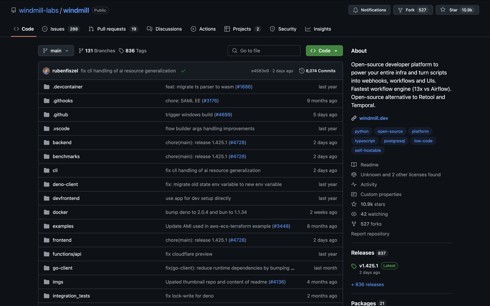
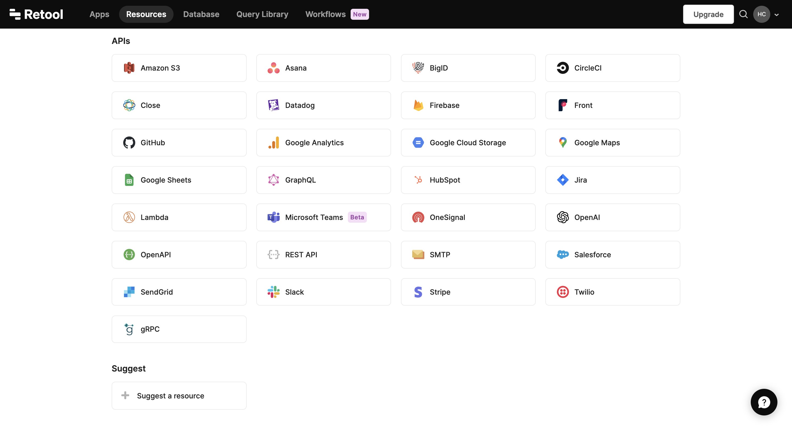

import DocCard from '@site/src/components/DocCard';

# Open Source Alernative to Retool for building UIs

Retool is great for building internal tools in low code. Windmill does it too, but it also broadens the realm of possibilities for more demanding developers.

Although having a very similar app builder, Windmill complements it with much more powerful and versatile script & flow editors that will take you further in your app building experience.

<a href="https://retool.com/" rel="nofollow">Retool</a> is a development platform that allows developers to build internal tools by connecting to various databases, APIs, and third-party integrations.
It offers a drag-and-drop interface combined with the flexibility of custom code.

## Open Source

[Windmill](https://www.windmill.dev/) is fully open source. This implies that Windmill can be self-hosted with just a few commands, providing cost-effective and secure solutions.

Windmill offers a clean slate, allowing you to fully explore its platform before committing to the product.
Windmill's open-source nature ensures that the platform is tested, approved, and continuously enhanced
to meet the community's needs.

Finally, Windmill provides and integrates into its platform a [public Community Hub](https://hub.windmill.dev/)
where users share useful and proven scripts, flows, and applications.
Unlike Retool, where you are limited to pre-written templates by the Retool teams.

	<DocCard
		title="Windmill's GitHub"
		description="Windmill's official repository."
		href="https://github.com/windmill-labs/windmill"
	/>
    <DocCard
		title="Self Host Windmill"
		description="Self host Windmill in 2 minutes."
		href="/docs/advanced/self_host/"
	/>
    <DocCard
		title="Contributor Guide"
		description="Contribute to our codebase, Windmill Hub or our Discord."
		href="/docs/misc/contributing"
	/>

:::info Retool
Retool is a proprietary software and closed source.
:::

## Integrations

Windmill has dozens of integrations initiated by the community and approved by the Windmill team.

Anyone can create an integration with just a few clicks.

	<DocCard
		title="Creating integrations on Windmill"
		description="Windmill provides a framework to easily add integrations."
		href="/docs/integrations/integrations_on_windmill"
	/>

:::info Retool
You can only use Retool's pre-approved integrations and "Suggest a resource" instead of adding it or sharing it yourself.

 

:::

## Versatility

The app builder of Retool is very similar to that of Windmill.
In the architecture, both platforms allow connecting components to code or workflows.
However, the possibilities with code on Retool will be much more limited:

### Languages and Scripts

Retool only supports JavaScript and SQL. Windmill supports JavaScript ([TypeScript](../getting_started/0_scripts_quickstart/1_typescript_quickstart/index.mdx)), [SQL](../getting_started/0_scripts_quickstart/5_sql_quickstart/index.mdx), but also [Python](../getting_started/0_scripts_quickstart/2_python_quickstart/index.mdx), [Go](../getting_started/0_scripts_quickstart/3_go_quickstart/index.mdx), [Bash](../getting_started/0_scripts_quickstart/4_bash_quickstart/index.mdx).
For each of those languages, scripts can be run [without having to deal with separate dependency files](../advanced/6_imports/index.md).
For other languages, Windmill supports [running any docker container](../advanced/7_docker/index.mdx) through its bash support.

All operations in Windmill are based on scripts. Unlike Retool, scripts in Windmill can be considered as standalone endpoints:
executable through [autogenerated UIs](../core_concepts/6_auto_generated_uis/index.mdx), [webhooks](../core_concepts/4_webhooks/index.md), etc.

	<DocCard
		title="Windmill Scripts"
		description="Scripts are the basic building blocks that can be written in Typescript, Python, Go, Bash, SQL or launch docker containers."
		href="/docs/script_editor"
	/>
	<DocCard
		title="Triggering Scripts"
		description="Trigger flows on-demand, by schedule or on external events."
		href="/docs/getting_started/trigger_scripts"
	/>

### Workflow engine

Retool is not originally designed as a workflow engine.
Its flow capabilities are geared towards non-technical users, similar to n8n.
Adding steps or for loops can be frustrating.
Flows will be limited without features like [approval steps](../flows/11_flow_approval.mdx), [early stop](../flows/2_early_stop.md), [sleep](../flows/15_sleep.md), etc.

The flow-building experience is cumbersome, as Retool has not managed to incorporate the same level
of low-code simplicity found in its app builder (e.g. picking inputs from previous steps’ outputs).

	<DocCard
		title="Windmill Flows"
		description="Flows are state machines represented as DAGs that compose steps together to build workflows and ETLs."
		href="/docs/flows/flow_editor"
	/>

### Developer experience

Despite being a low-code tool, Windmill has been designed to cater to developers.
It is possible to use Windmill from the terminal through its CLI, from VSCode, or deploy it from GitHub/GitLab.

Additionally, you can bypass the app builder in a no-code manner by directly [importing apps in React/Vue/Svelte](../react_vue_svelte_apps/index.md).

	<DocCard
		title="Command-Line Interface"
		description="Interact with Windmill instances right from your terminal."
		href="/docs/advanced/cli"
	/>
	<DocCard
		title="Local Development"
		description="Develop from various environments such as your terminal, VSCode, and JetBrains IDEs."
		href="/docs/advanced/local_development"
	/>
	<DocCard
		title="Version control from GitHub/GitLab"
		description="Use a GH/GL repo as the source of truth for part or all of your Windmill workspace."
		href="/docs/advanced/deploy_gh_gl"
	/>

## Pricing

Windmill has a [transparent pricing policy](../misc/7_plans_details/index.mdx), with clear steps for implementation.

Windmill is cheaper at scale and can be used for free at any scale thanks to its open source nature.

	<DocCard
		title="Pricing"
		description="Windmill's subscription plans and simulations."
		href="/pricing"
	/>
    <DocCard
		title="Plans Details and Subscriptions"
		description="Windmill transparently provides the content and pricing of its upgraded plans."
		href="/docs/misc/plans_details"
	/>

## What Retool does better and where is Windmill on those topics

Retool benefits from a vast library of <a href="https://retool.com/templates/" rel="nofollow">templates</a>.

Windmill provides the [Windmill Hub](https://hub.windmill.dev/) platform where anyone can share scripts, flows, and applications.
The most relevant ones are marked as "Approved" by the Windmill team and directly incorporated into the product.

Finally, Retool has a broad library of <a href="https://retool.com/components" rel="nofollow">components</a>.
On one hand, due to the limitations of using code & customization in Retool, many of these components are duplicates or even triplicates,
whereas they would be single customizable components in Windmill.
On the other hand, [our list of components](../apps/4_app_configuration_settings/1_app_component_library.mdx) is determined by the needs of our users.
Most of our users who have chosen Windmill over Retool have favored
Windmill's ability to quickly add the components that are useful to them.

## Everything else

For everyting else, it's comparable: you can run on [schedules](../core_concepts/1_scheduling/index.md) or [webhooks](../core_concepts/4_webhooks/index.md),
[source control](../core_concepts/17_collaboration/index.mdx#git-integration),
seamlessly interact your apps with [databases](../integrations/postgresql.md),
[link runnables to components](../apps/3_app-runnable-panel.mdx), give [styling](../apps/4_app_configuration_settings/4_app_styling.mdx) to apps, [resources](../core_concepts/3_resources_and_types/index.mdx) are handled in a similar way.

To conclude, Retool is an excellent engine for building custom applications within a reassuring and defined framework.

Windmill provides its users with transparency and versatility to delve deeper into the building of apps.
