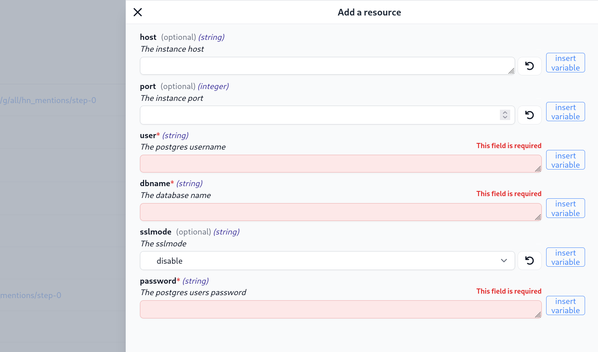
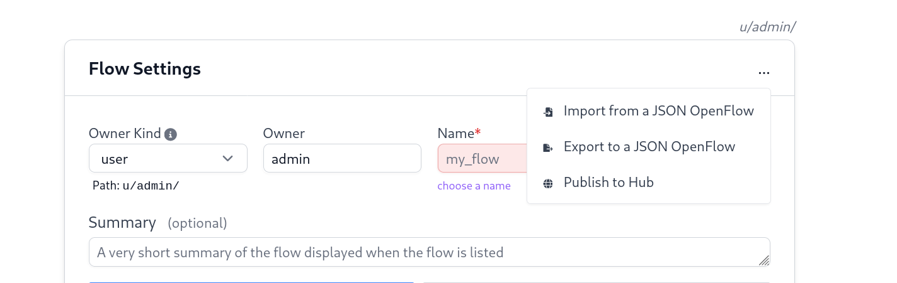
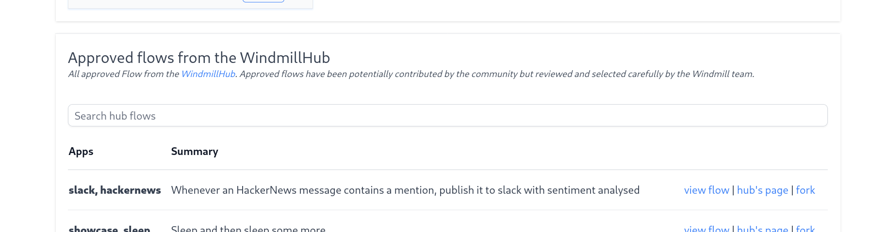
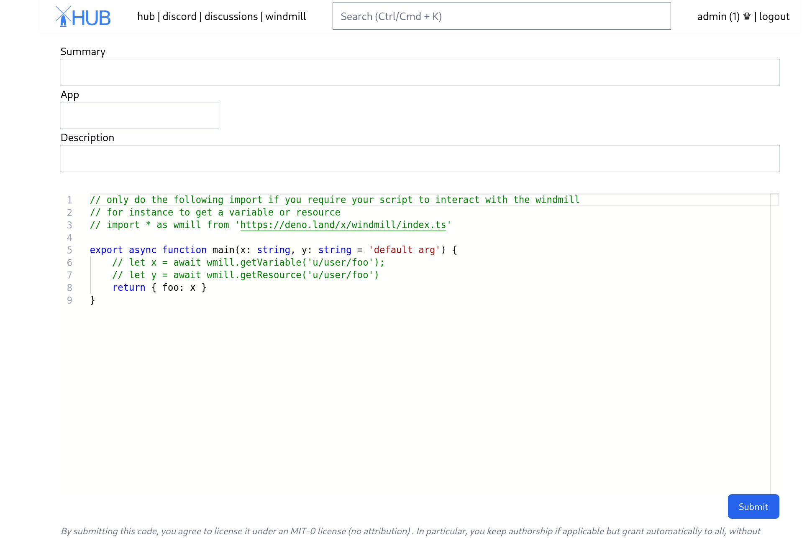
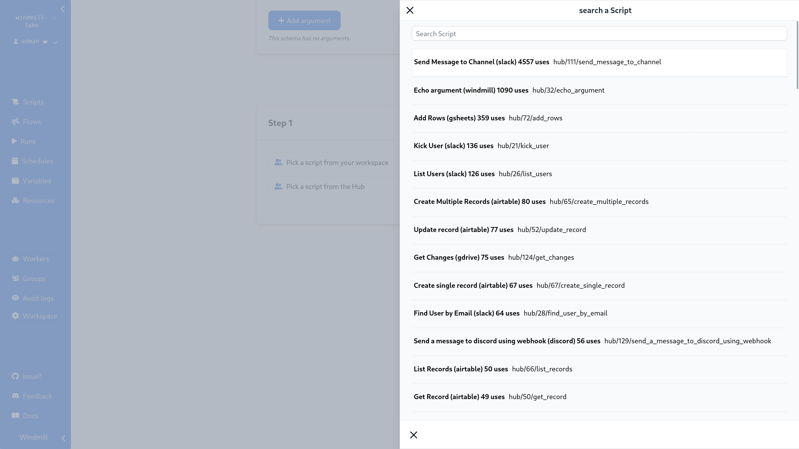

# Guide for contributors to Windmill

Thank you for showing interest in contributing to Windmill. Herebelow different
ways of being able to contribute.

## Add a resource type to the WindmillHub

[Resource types](./reference/#resource_types) are simply
[jsonschema](./reference/#jsonschema) whose reason of being is to give a "type"
to resources by constraining the properties or field that the resource can be as
a JSON object. In addition, they serve two main purposes in Windmill:

- filter resources by resource types for the generated UI
- allow to have a way to manually create resources of that resource types using
  the autogenerated UI from their jsonschema. Here for instance the form
  associated to the resource type postgres.



Adding a resource type to the hub will, once approved by the Windmill Team, be
automatically merged into the
[community/ folder of the windmil repo](https://github.com/windmill-labs/windmill/tree/main/community/resource_types)
through a
[github action](https://github.com/windmill-labs/windmill/blob/main/.github/workflows/pull-hub.yml).

Once added to the community folder of the repo, the
[windmill-gh-action-deploy](https://github.com/windmill-labs/windmill-gh-action-deploy)
will deploy it in the starter workspace of Windmill Cloud. Being deployed on the
starter workspace means that it will be available to all workspaces.

To add a resource type to the WindmillHub, go to <https://hub.windmill.dev>,
then in the Resource Types section, Submit a new Resource Type. You can then add
your argument one by one or use the monaco editor to edit it as a jsonschema
directly.

## Add an OAuth provider

To add a new OAuth provider, open a Pull Request to add a new item to:
[backend/oauth_connect.json](https://github.com/windmill-labs/windmill/blob/main/backend/oauth_connect.json).

The format is as follows:

```json
"<name_of_resource_type_for_integration>": {
     "auth_url": "<auth_url>",
     "token_url": "<token_url>",
     "scopes": <the list of default scopes to suggest by default>,
     "extra_params": {
         "<key>": "<val>",
     }
 },
```

where `extra_params` is an escape hatch to deal with OAuth provider that need
some extra fields to be passed along to the authorization URL.

## Add a flow to the WindmillHub

Using the [OpenFlow](./openflow) portable format, one can simply either copy and
paste the exported Json of the flow in the
[WindmillHub](https://hub.windmill.dev) Flow section -> "Submit a new Flow", or
click 'Publish to Hub' in the flow editor directly.



Once a flow is approved by the Windmill Team, it will be directly integrated
into the flows page of **every workspace of every instances of Windmill**.



## Add a script or trigger script to the WindmillHub

The [WindmillHub](https://hub.windmill.dev) only supports deno scripts. You can
add a trigger or standard script to the Hub by going to the appropriate section
and click "Submit a new script" or "Submit a new trigger script", then give it
an explicit summary and submit.



Once approved by the Windmill team, the script or trigger script will be
available for all to use directly inside their flows.


