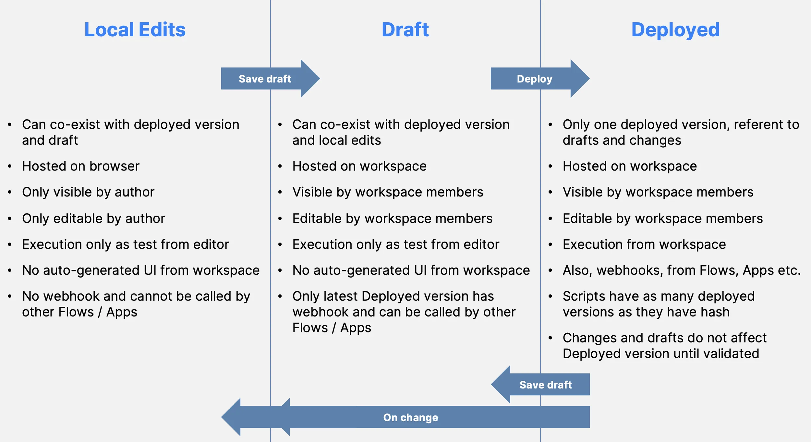

import DocCard from '@site/src/components/DocCard';

# Draft and Deploy

Draft, test, and deploy scripts, flows, and apps Windmill to iterate and save safely.

Each script, flow or app can be saved (sometimes concurrently) in 3 fashions, by your browser in `local storage`, by the backend as a `draft`, and `deployed`.

Once deployed, scripts, flows and apps will be visible, editable and/or runnable by users [with the right permissions](../16_roles_and_permissions/index.mdx).

<video
	className="border-2 rounded-xl object-cover w-full h-full dark:border-gray-800"
	autoPlay
	controls
	id="main-video"
	src="/videos/draft_and_deploy.mp4"
/>

 

:::tip Deploy to Staging or Prod

For achieving complete isolation between staging and production environments, consider using [Deploy to Staging or Prod](../12_staging_prod/index.md) feature, which facilitates the deployment of scripts, flows, variables, and resources to separate workspaces such as staging or production.

:::

## Local Edits

Changes made to a script, flow, or app are saved locally in your browser until they are validated as either a 'Draft' or 'Deployed' version.

Local edits can be run and tested only from the editor (script, flow or app) with the `Test` button.

## Draft

Local edits can be saved as a draft for staging purposes. A draft is visible from members of the workspace and can be edited. There is only one draft per runnable. The draft inherits the permission of the item it is attached to or at the path they are in for drafts non deployed items.

Drafts can be run and tested only from the editor (script, flow or app) with the `Test` button.

## Deployed Version

The deployed version is the authoritative version of a runnable. Once deployed, it is not only visible by workspace members [with the right permissions](../16_roles_and_permissions/index.mdx) but has its own [auto-generated UI](../6_auto_generated_uis/index.md), [webhooks](../4_webhooks/index.md), or can be called from flows and apps (for sripts and flows). This also means that local edits and drafts can be made in parallel to a deployed version of a runnable without affecting its behavior.

If you want to have several versions of the same runnable, just fork it with the `Fork` button on the drop down menu of `Deploy`.

	<DocCard
    	title="Roles and Permissions"
    	description="Control access and manage permissions within your instance and workspaces."
    	href="/docs/core_concepts/roles_and_permissions"
    />

## Diff Viewer

A diff viewer is available when loading scripts from autosave or draft.

<video
	className="border-2 rounded-xl object-cover w-full h-full dark:border-gray-800"
	controls
	src="/videos/diff_viewer.mp4"
/>

 

> Changes can then be reversed to previous version.

## Special case: Deployed versions of scripts

Apps and Flows only have one deployed version at a given path and doing a new deployment overwrite the previous one.

Scripts are special because each deployment of a script creates an immutable hash that will never be overwritten. The path of a script serves as a redirection to the last deployed hash, but all hashes live permanently forever. This ensures that if you refer to a script by its hash, its behavior is guaranteed to remain the same even if a new hash is deployed at the same path.

	<DocCard
		title="Versioning"
		description="Scripts, when deployed, can have a parent script identified by its hash."
		href="/docs/script_editor/versioning"
	/>

## Special case: Public Apps

Windmill apps can be [Published Publicly](../../apps/8_public_apps.md). It means that the app can be accessed as a standalone app by anyone who has the secret URL.

	<DocCard
		title="Public Apps"
		description="Apps can be accessed as a standalone app by anyone who has the secret URL"
		href="/docs/apps/public_apps"
	/>

## Recap

