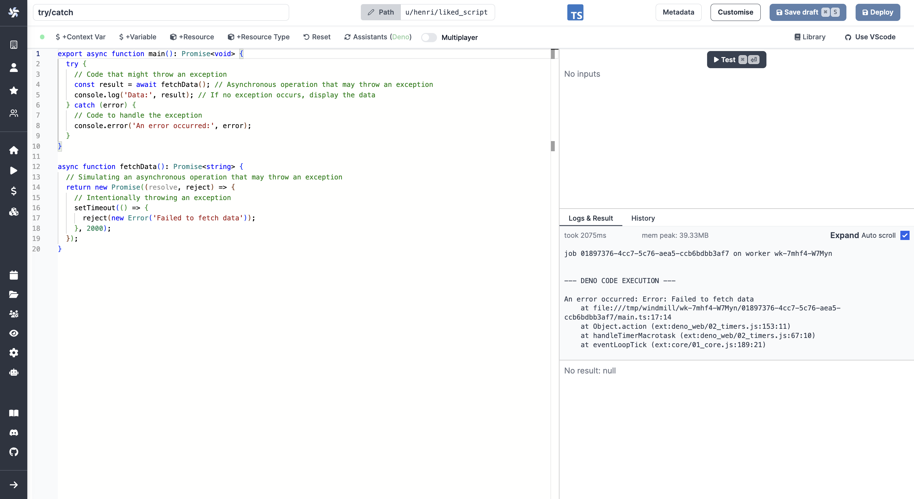

import DocCard from '@site/src/components/DocCard';

# Error handling

There are multiple ways to handle errors in Windmill.

## try/catch inside a script

One way to handle errors in Windmill is by using the `try/catch` block within a Script. This method is not specific to Windmill and can be used in any programming language that supports exception handling.

Here is an example in [TypeScript](../../getting_started/0_scripts_quickstart/1_typescript_quickstart/index.mdx):

```ts
// Define the main function which will handle errors using try/catch
export async function main() {
	try {
		// Your code that might throw errors goes here
		// For example, let's simulate a fetch request
		const response = await fetch('https://api.example.com/data');
		const data = await response.json();

		// Return the result if everything goes well
		return data;
	} catch (error) {
		// Handle errors that might occur during the fetch operation
		console.error('An error occurred:', error);

		// Return a custom error object or message
		return { error: 'An error occurred while fetching data.' };
	}
}
```

<br />



## Flows' error handlers

The Error handler is a special [flow](../../flows/1_flow_editor.mdx) step that is executed when an error occurs within a flow.

If defined, the error handler will take as input the result of the step that errored (which has its error in the 'error field').

<video
	className="border-2 rounded-lg object-cover w-full h-full dark:border-gray-800"
	controls
	src="/videos/error_handler.mp4"
/>

<br />

<div className="grid grid-cols-2 gap-6 mb-4">
	<DocCard
		title="Error handler"
		description="Configure a script to handle errors."
		href="/docs/flows/flow_error_handler"
	/>
</div>

### Error handling in flows

There are other tricks to do Error handling in flows, see:

<div className="grid grid-cols-2 gap-6 mb-4">
	<DocCard
		title="Error handling in flows"
		description="There are four ways to handle errors in Windmill flows."
		href="/docs/flows/error_handling"
	/>
</div>

## Schedules error handlers

Add a special script or flow to execute in case of an error in your [scheduled](../1_scheduling/index.mdx) script or flow.

Schedule Error hander is an [Enterprise Edition](/pricing) feature.

You can pick the Slack pre-set schedule error handler or define your own.

<video
	className="border-2 rounded-lg object-cover w-full h-full dark:border-gray-800"
	controls
	src="/videos/schedule_error_handler.mp4"
/>
<br />

<div className="grid grid-cols-2 gap-6 mb-4">
	<DocCard
		title="Schedules"
		description="Scheduling allows you to define schedules for Scripts and Flows, automatically running them at set frequencies."
		href="/docs/core_concepts/scheduling"
	/>
</div>

## Workspace error handler

Configure automatic error handling for workspace-level errors (e.g. scheduled job failures, trigger failures without their own error handlers). Choose from built-in notification options or define custom error handling logic.

Configure workspace error handlers from **Workspace Settings > Error Handler** tab. The system supports four types of error handlers:

### Slack error handler

Send error notifications to Slack channels. Requires workspace to be [connected to Slack](../../integrations/slack.mdx).

**Configuration:**
- Enable/disable Slack error handler toggle
- Specify Slack channel (without # prefix)
- Available on [Cloud plans and Self-Hosted & Enterprise Edition](/pricing)

<iframe
	style={{ aspectRatio: '16/9' }}
	src="https://www.youtube.com/embed/6QPONDONd5k?vq=1080p"
	title="Workspace Error handler on Slack"
	frameBorder="0"
	allow="accelerometer; autoplay; clipboard-write; encrypted-media; gyroscope; picture-in-picture; web-share"
	allowFullScreen
	className="border-2 rounded-lg object-cover w-full dark:border-gray-800"
></iframe>

### Microsoft Teams error handler

Send error notifications to Microsoft Teams channels. Requires workspace to be [connected to Teams](../../integrations/teams.mdx).

**Configuration:**
- Enable/disable Teams error handler toggle
- Select from available Teams channels dropdown
- Available on [Cloud plans and Self-Hosted & Enterprise Edition](/pricing)

### Email error handler

Send error notifications via email to specified recipients.

**Configuration:**
- Specify email addresses to receive error notifications
- Only available on Self-Hosted instances (not available on Cloud)
- Requires SMTP configuration

### Custom error handler

Execute custom scripts or flows as error handlers for advanced error handling logic.

**Configuration:**
- Script or flow selection via script picker
- Additional arguments can be configured if the chosen script or flow has parameters
- Template creation options

**Parameters passed to custom error handlers:**

All custom workspace error handlers receive the following base parameters:

- `workspace_id`: The workspace id where the error occurred
- `job_id`: The job id of the failed execution
- `path`: The path of the script or flow that errored
- `is_flow`: Whether the error comes from a flow
- `started_at`: When the failed job started
- `email`: The email of the user who ran the script or flow that errored
- `schedule_path`: The schedule path (only present if the error comes from a scheduled job)

**Custom error handler template:**

```ts
// Custom workspace error handler template

export async function main(
	workspace_id: string, // The workspace id where the error occurred
	job_id: string, // The job id of the failed execution
	path: string, // The path of the script or flow that errored
	is_flow: boolean, // Whether the error comes from a flow
	started_at: string, // When the failed job started
	email: string, // The email of the user who ran the script or flow that errored
	schedule_path?: string // The schedule path (only present if error from scheduled job)
) {
	const run_type = is_flow ? 'flow' : 'script';
	console.log(
		`Workspace error: ${run_type} ${path} run by ${email} failed in workspace ${workspace_id}`
	);
	console.log(`Job ${job_id} started at ${started_at}`);
	
	if (schedule_path) {
		console.log(`Scheduled job from: ${schedule_path}`);
	}
	
	// Add your custom error handling logic here
	// Examples: send to external monitoring, create incidents, etc.
	
	// Note: The actual error details are available through the job context
	// and can be retrieved using Windmill's job APIs if needed
	
	return { handled: true, workspace_id, job_id };
}
```

---

From the workspace settings, go to the "Error handler" tab and select your preferred error handler type.


### Error handler execution

- Error handlers are executed by the automatically created group `g/error_handler`
- If your error handler requires variables or resources, add them to the `g/error_handler` group
- Error handlers run as different users depending on type:
  - Custom, Slack, Teams error handlers: `error_handler@windmill.dev`
  - Email error handlers: `email_error_handler@windmill.dev`
- The system prevents infinite loops by not triggering error handlers for error handler jobs themselves

### Advanced configuration

**Skip error handler for cancelled jobs:**
Enable the "Do not run error handler for canceled jobs" option to prevent error handlers from triggering when jobs are manually cancelled.


## Trigger error handlers

Each trigger type (HTTP routes, Webhooks, Kafka, SQS, WebSocket, Postgres, NATS, MQTT, GCP, Email) can have its own local error handler configured. If a trigger-specific error handler is defined, it will be used for that trigger instead of the workspace error handler. **Trigger error handlers only work for scripts** (not flows).


### Configuring trigger error handlers

When creating or editing a trigger, you can configure the same error handler options as workspace error handlers:
- **Custom script or flow**: Execute your own custom error handling logic
- **Slack integration**: Send error notifications to Slack channels
- **Microsoft Teams integration**: Send error notifications to Teams channels  
- **Email notifications**: Send error alerts via email to specified recipients

For each trigger error handler, you can also specify:
- **Error handler arguments**: Additional arguments for the custom error handler (only configurable if the chosen script or flow has parameters)
- **Retry configuration**: Number of retries and retry strategy before invoking the error handler

### Parameters passed to trigger error handlers

Trigger error handlers receive the following base parameters:
- `error`: The error details from the failed job
- `path`: The path of the script or flow that errored
- `is_flow`: Whether the error comes from a flow (always `false` for triggers)
- `trigger_path`: The trigger path in format `<trigger_kind>/<trigger_path>` (e.g., `http_trigger/my-webhook`, `kafka_trigger/my-topic`)
- `workspace_id`: The workspace id where the error occurred
- `email`: The email of the user who triggered the execution
- `job_id`: The job id of the failed execution
- `started_at`: When the failed job started

If using a custom trigger error handler, additional custom arguments can be passed via the error handler configuration.

### Example trigger error handler

Here's a template for a trigger error handler:

```ts
// Trigger error handler template
export async function main(
	error: object, // The error details from the failed job
	path: string, // The path of the script or flow that errored
	is_flow: boolean, // Whether the error comes from a flow
	trigger_path: string, // The trigger path in format <trigger_kind>/<trigger_path>
	workspace_id: string, // The workspace id where the error occurred
	email: string, // The email of the user who triggered the execution
	job_id: string, // The job id of the failed execution
	started_at: string // When the failed job started
) {
	const run_type = is_flow ? 'flow' : 'script';
	console.log(
		`Trigger error: ${run_type} ${path} run by ${email} failed in workspace ${workspace_id}`
	);
	console.log(`Trigger: ${trigger_path}, Job ID: ${job_id}, Started: ${started_at}`);
	console.log('Error details:', error);
	
	// Add custom logic for trigger-specific error handling
	
	return error;
}
```

This allows you to customize error handling behavior per trigger while maintaining consistent fallback to workspace-level error handling.

## Instance error handler

You can define a script to be executed automatically in case of error in your instance (all workspaces).

This Superadmin Error handler is defined by setting the path to the script to be executed as an env variable to all servers using: `GLOBAL_ERROR_HANDLER_PATH_IN_ADMINS_WORKSPACE`.

The following args will be passed to the error handler:

- path: The path of the script or flow that errored.
- email: The email of the user who ran the script or flow that errored.
- error: The error details.
- job_id: The job id.
- is_flow: Whether the error comes from a flow.
- workspace_id: The workspace id of the failed script or flow.

Here is a template for your workspace error handler:

```ts
// Global / workspace error handler template

export async function main(
	path: string, // The path of the script or flow that errored
	email: string, // The email of the user who ran the script or flow that errored
	error: object, // The error details
	job_id: string, // The job id
	is_flow: boolean, // Whether the error comes from a flow
	workspace_id: string // The workspace id of the failed script or flow
) {
	const run_type = is_flow ? 'flow' : 'script';
	console.log(
		`An error occurred with ${run_type} ${path} run by ${email} in workspace ${workspace_id}`
	);
	console.log(error);
	return error;
}
```

## Special case: throw an error in a script

Errors have a specific format to be [rendered](../19_rich_display_rendering/index.mdx#error) properly in Windmill.

```ts
return { "error": { "name": "418", "message": "I'm a teapot", "stack": "Error: I'm a teapot" }}
```

<div className="grid grid-cols-2 gap-6 mb-4">
	<DocCard
		title="Rich Display Rendering"
		description="Windmill processes some outputs (from scripts or flows) intelligently to provide rich display rendering, allowing you to customize the display format of your results."
		href="/docs/core_concepts/rich_display_rendering"
	/>
</div>