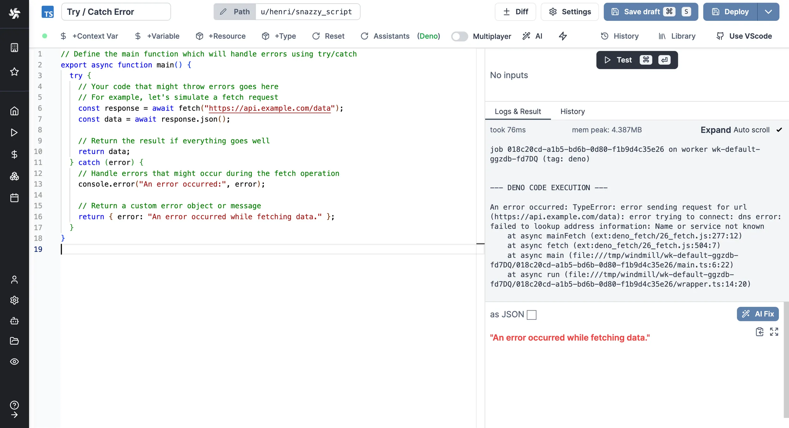

import DocCard from '@site/src/components/DocCard';

# Error handling

There are 5 ways to do error handling in Windmill.

## try/catch inside a script

One way to handle errors in Windmill is by using the `try/catch` block within a Script. This method is not specific to Windmill and can be used in any programming language that supports exception handling.

Here is an example in [TypeScript](../../getting_started/0_scripts_quickstart/1_typescript_quickstart/index.mdx):

```ts
// Define the main function which will handle errors using try/catch
export async function main() {
	try {
		// Your code that might throw errors goes here
		// For example, let's simulate a fetch request
		const response = await fetch('https://api.example.com/data');
		const data = await response.json();

		// Return the result if everything goes well
		return data;
	} catch (error) {
		// Handle errors that might occur during the fetch operation
		console.error('An error occurred:', error);

		// Return a custom error object or message
		return { error: 'An error occurred while fetching data.' };
	}
}
```

<br />



## Flows' error handlers

The Error handler is a special [flow](../../flows/1_flow_editor.mdx) step that is executed when an error occurs within a flow.

If defined, the error handler will take as input the result of the step that errored (which has its error in the 'error field').

<video
	className="border-2 rounded-lg object-cover w-full h-full dark:border-gray-800"
	controls
	src="/videos/error_handler.mp4"
/>

<br />

<div className="grid grid-cols-2 gap-6 mb-4">
	<DocCard
		title="Error handler"
		description="Configure a script to handle errors."
		href="/docs/flows/flow_error_handler"
	/>
</div>

### Error handling in flows

There are other tricks to do Error handling in flows, see:

<div className="grid grid-cols-2 gap-6 mb-4">
	<DocCard
		title="Error handling in flows"
		description="There are four ways to handle errors in Windmill flows."
		href="/docs/flows/error_handling"
	/>
</div>

## Schedules error handlers

Add a special script or flow to execute in case of an error in your [scheduled](../1_scheduling/index.mdx) script or flow.

Schedule Error hander is an [Enterprise Edition](/pricing) feature.

You can pick the Slack pre-set schedule error handler or define your own.

<video
	className="border-2 rounded-lg object-cover w-full h-full dark:border-gray-800"
	controls
	src="/videos/schedule_error_handler.mp4"
/>
<br />

<div className="grid grid-cols-2 gap-6 mb-4">
	<DocCard
		title="Schedules"
		description="Scheduling allows you to define schedules for Scripts and Flows, automatically running them at set frequencies."
		href="/docs/core_concepts/scheduling"
	/>
</div>

## Workspace error handler

Define a script or flow to be executed automatically in case of error in the workspace (e.g. a scheduled job fails to re-schedule).

### Workspace error handler on Slack and Microsoft Teams

On [Cloud plans and Self-Hosted & Enterprise Edition](/pricing), you can [connect workspace to Slack](../../integrations/slack.mdx) or [Microsoft Teams](../../integrations/teams.mdx) and enable an automated error handler on a given channel.

<iframe
	style={{ aspectRatio: '16/9' }}
	src="https://www.youtube.com/embed/6QPONDONd5k?vq=1080p"
	title="Workspace Error handler on Slack"
	frameBorder="0"
	allow="accelerometer; autoplay; clipboard-write; encrypted-media; gyroscope; picture-in-picture; web-share"
	allowFullScreen
	className="border-2 rounded-lg object-cover w-full dark:border-gray-800"
></iframe>

<br />

### Custom workspace error handler

You can also define a custom script or flow to be executed automatically in case of error in the workspace.

From the workspace settings, on the "Error handler" tab and pick a script or flow.


The following args will be passed to the error handler:

- path: The path of the script or flow that errored.
- email: The email of the user who ran the script or flow that errored.
- error: The error details.
- job_id: The job id.
- is_flow: Whether the error comes from a flow.
- workspace_id: The workspace id of the failed script or flow.

The Error handler will be executed by the automatically created group g/error_handler. If your error handler requires variables or resources, you need to add them to the group.

Here is a template for your workspace error handler:

```ts
// Workspace error handler template

export async function main(
	path: string, // The path of the script or flow that errored
	email: string, // The email of the user who ran the script or flow that errored
	error: object, // The error details
	job_id: string, // The job id
	is_flow: boolean, // Whether the error comes from a flow
	workspace_id: string // The workspace id of the failed script or flow
) {
	const run_type = is_flow ? 'flow' : 'script';
	console.log(
		`An error occurred with ${run_type} ${path} run by ${email} in workspace ${workspace_id}`
	);
	console.log(error);
	return error;
}
```

## Instance error handler

You can define a script to be executed automatically in case of error in your instance (all workspaces).

This Superadmin Error handler is defined by setting the path to the script to be executed as an env variable to all servers using: `GLOBAL_ERROR_HANDLER_PATH_IN_ADMINS_WORKSPACE`.

The following args will be passed to the error handler:

- path: The path of the script or flow that errored.
- email: The email of the user who ran the script or flow that errored.
- error: The error details.
- job_id: The job id.
- is_flow: Whether the error comes from a flow.
- workspace_id: The workspace id of the failed script or flow.

Here is a template for your workspace error handler:

```ts
// Global / workspace error handler template

export async function main(
	path: string, // The path of the script or flow that errored
	email: string, // The email of the user who ran the script or flow that errored
	error: object, // The error details
	job_id: string, // The job id
	is_flow: boolean, // Whether the error comes from a flow
	workspace_id: string // The workspace id of the failed script or flow
) {
	const run_type = is_flow ? 'flow' : 'script';
	console.log(
		`An error occurred with ${run_type} ${path} run by ${email} in workspace ${workspace_id}`
	);
	console.log(error);
	return error;
}
```

## Special case: throw an error in a script

Errors have a specific format to be [rendered](../19_rich_display_rendering/index.mdx#error) properly in Windmill.

```ts
return { "error": { "name": "418", "message": "I'm a teapot", "stack": "Error: I'm a teapot" }}
```

<div className="grid grid-cols-2 gap-6 mb-4">
	<DocCard
		title="Rich Display Rendering"
		description="Windmill processes some outputs (from scripts or flows) intelligently to provide rich display rendering, allowing you to customize the display format of your results."
		href="/docs/core_concepts/rich_display_rendering"
	/>
</div>