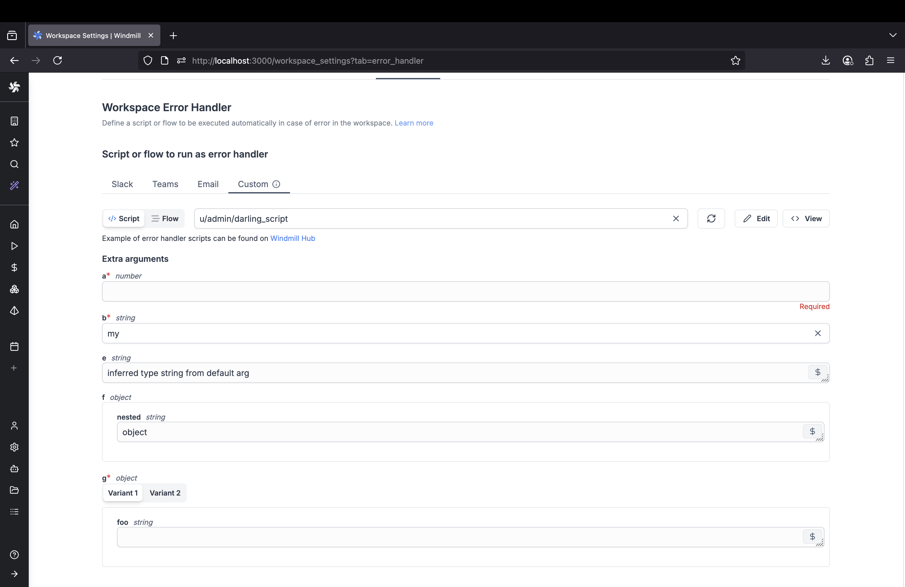

import DocCard from '@site/src/components/DocCard';

# Error Handling

There are 5 ways to do error handling in Windmill.

## try/catch inside a Script

One way to handle errors in Windmill is by using the `try/catch` block within a Script. This method is not specific to Windmill and can be used in any programming language that supports exception handling.

Here is an example in TypeScript:

```ts
export async function main(): Promise<void> {
	try {
		// Code that might throw an exception
		const result = await fetchData(); // Asynchronous operation that may throw an exception
		console.log('Data:', result); // If no exception occurs, display the data
	} catch (error) {
		// Code to handle the exception
		console.error('An error occurred:', error);
	}
}

async function fetchData(): Promise<string> {
	// Simulating an asynchronous operation that may throw an exception
	return new Promise((resolve, reject) => {
		// Intentionally throwing an exception
		setTimeout(() => {
			reject(new Error('Failed to fetch data'));
		}, 2000);
	});
}
```

<br />


## Flows' error handlers

The Error Handler is a special flow step that is executed when an error occurs within a flow.

If defined, the error handler will take as input, the result of the step that errored (which has its error in the 'error field').

<video
	className="border-2 rounded-xl object-cover w-full h-full dark:border-gray-800"
	controls
	src="/videos/error_handler.mp4"
/>

<br />

<div class="grid grid-cols-2 gap-6 mb-4">
	<DocCard
		title="Error Handler"
		description="Configure a script to handle errors."
		href="/docs/flows/flow_error_handler"
	/>
</div>

## Schedules' error handlers

Add a special script or flow to execute in case of an error in your scheduled script or flow.


For example, this can be a script that sends an error notification to [Slack](https://hub.windmill.dev/scripts/slack/1284/) or [Discord](https://hub.windmill.dev/scripts/discord/1292/).

<div class="grid grid-cols-2 gap-6 mb-4">
	<DocCard
		title="Scheduling"
		description="Scheduling allows you to define schedules for Scripts and Flows, automatically running them at set frequencies."
		href="/docs/core_concepts/scheduling"
	/>
</div>

## Workspace error handler

You can define a script to be executed automatically in case of error in the workspace.

From the workspace settings, pick the "Error Handler" tab and pick a script.



The following args will be passed to the error handler:

- path: The path of the script or flow that errored.
- email: The email of the user who ran the script or flow that errored.
- error: The error details.
- job_id: The job id.
- is_flow: Whether the error comes from a flow.
- workspace_id: The workspace id of the failed script or flow.

The Error handler will be executed by the automatically created group g/error_handler. If your error handler requires variables or resources, you need to add them to the group.

Here is a template for your workspace error handler:

```ts
// Global / workspace error handler template

export async function main(
	path: string, // The path of the script or flow that errored
	email: string, // The email of the user who ran the script or flow that errored
	error: object, // The error details
	job_id: string, // The job id
	is_flow: boolean, // Whether the error comes from a flow
	workspace_id: string // The workspace id of the failed script or flow
) {
	const run_type = is_flow ? 'flow' : 'script';
	console.log(
		`An error occured with ${run_type} ${path} run by ${email} in workspace ${workspace_id}`
	);
	console.log(error);
	return error;
}
```

## Instance error handler

You can define a script to be executed automatically in case of error in your instance.

This Superadmin Error handler is defined by setting the path to the script to be executed as an env variable to all servers using: `GLOBAL_ERROR_HANDLER_PATH_IN_ADMINS_WORKSPACE`.

The following args will be passed to the error handler:

- path: The path of the script or flow that errored.
- email: The email of the user who ran the script or flow that errored.
- error: The error details.
- job_id: The job id.
- is_flow: Whether the error comes from a flow.
- workspace_id: The workspace id of the failed script or flow.

Here is a template for your workspace error handler:

```ts
// Global / workspace error handler template

export async function main(
	path: string, // The path of the script or flow that errored
	email: string, // The email of the user who ran the script or flow that errored
	error: object, // The error details
	job_id: string, // The job id
	is_flow: boolean, // Whether the error comes from a flow
	workspace_id: string // The workspace id of the failed script or flow
) {
	const run_type = is_flow ? 'flow' : 'script';
	console.log(
		`An error occured with ${run_type} ${path} run by ${email} in workspace ${workspace_id}`
	);
	console.log(error);
	return error;
}
```

## Special Case: Error Handling in Flows

For more information on Error handlin in flows, see:

<div class="grid grid-cols-2 gap-6 mb-4">
	<DocCard
		title="Error Handling in Flows"
		description="There are three ways to handle errors in Windmill flows."
		href="/docs/flows/error_handling"
	/>
</div>
