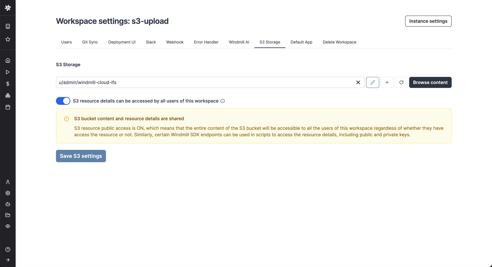

import DocCard from '@site/src/components/DocCard';
import Tabs from '@theme/Tabs';
import TabItem from '@theme/TabItem';

# Object Storage for Large Data: S3, R2, MinIO, Azure Blob

This page is part of our section on [Persistent Storage & Databases](./index.mdx) which covers where to effectively store and manage the data manipulated by Windmill. Check that page for more options on data storage.

On heavier data objects & unstructured data storage, [Amazon S3](https://aws.amazon.com/s3/) (Simple Storage Service) and its alternatives [Cloudflare R2](https://www.cloudflare.com/developer-platform/r2/) and [MinIO](https://min.io/) as well as [Azure Blob Storage](https://azure.microsoft.com/en-us/products/storage/blobs) are highly scalable and durable object storage service that provides secure, reliable, and cost-effective storage for a wide range of data types and use cases.

Windmill comes with a [native integration with S3 and Azure Blob](#connect-your-windmill-workspace-to-your-s3-bucket-or-your-azure-blob-storage), making it the recommended storage for large objects like files and binary data.

## Connect your Windmill workspace to your S3 bucket or your Azure Blob storage

Once you've created an [S3 or Azure Blob resource](#use-amazon-s3-r2-minio-and-azure-blob-directly) in Windmill, go to the workspace settings > S3 Storage. Select the resource and click Save.



From now on, Windmill will be connected to this bucket and you'll have easy access to it from the code editor and the job run details. If a script takes as input a `s3object`, you will see in the input form on the right a button helping you choose the file directly from the bucket.
Same for the result of the script. If you return an `s3object` containing a key `s3` pointing to a file inside your bucket, in the result panel there will be a button to open the bucket explorer to visualize the file.

S3 files in Windmill are just pointers to the S3 object using its key. As such, they are represented by a simple JSON:

```json
{
	"s3": "/s3/object/file/key"
}
```


The resource can be set to be public with toggle "S3 resource details can be accessed by all users of this workspace".

In this case, the [permissions](../16_roles_and_permissions/index.mdx#path) set on the resource will be ignored when users interact with the S3 bucket via Windmill. Note that when the resource is public, the users might be able to access all of its details (including access keys and secrets) via some Windmill endpoints.

When the resource is not set to be public, Windmill guarantees that users who don't have access to the resource won't be able to retrieve any of its details. That being said, access to a specific file inside the bucket will still be possible, and downloading and uploading objects will also be accessible to any workspace user. In short, as long as the user knows the path of the file they want to access, they will be able to read its content. The main difference is that users won't be able to browse the content of the bucket.

When a script accepts a S3 file as input, it can be directly uploaded or chosen from the bucket explorer.


When a script outputs a S3 file, it can be downloaded or previewed directly in Windmill's UI (for displayable files like text files, CSVs or parquet files).


### Read a file from S3 within a script

<Tabs className="unique-tabs">

<TabItem value="bun" label="TypeScript (Bun)" attributes={{className: "text-xs p-4 !mt-0 !ml-0"}}>

```ts
import * as wmill from 'windmill-client';
import { S3Object } from 'windmill-client';

export async function main(input_file: S3Object) {
	// Load the entire file_content as a Uint8Array
	const file_content = await wmill.loadS3File(input_file);

	const decoder = new TextDecoder();
	const file_content_str = decoder.decode(file_content);
	console.log(file_content_str);

	// Or load the file lazily as a Blob
	let fileContentBlob = await wmill.loadS3FileStream(input_file);
	console.log(await fileContentBlob.text());
}
```

</TabItem>

<TabItem value="deno" label="TypeScript (Deno)" attributes={{className: "text-xs p-4 !mt-0 !ml-0"}}>

```ts
import * as wmill from 'npm:windmill-client@1.253.7';
import S3Object from 'npm:windmill-client@1.253.7';

export async function main(input_file: S3Object) {
	// Load the entire file_content as a Uint8Array
	const file_content = await wmill.loadS3File(input_file);

	const decoder = new TextDecoder();
	const file_content_str = decoder.decode(file_content);
	console.log(file_content_str);

	// Or load the file lazily as a Blob
	let fileContentBlob = await wmill.loadS3FileStream(input_file);
	console.log(await fileContentBlob.text());
}
```

</TabItem>

<TabItem value="python" label="Python" attributes={{className: "text-xs p-4 !mt-0 !ml-0"}}>

```python
#requirements:
wmill>=1.251.7
import wmill
from wmill import S3Object

def main(input_file: S3Object):
    # Load the entire file_content as a bytes array
    file_content = wmill.load_s3_file(input_file)
    print(file_content.decode('utf-8'))

    # Or load the file lazily as a Buffered reader:
    with wmill.load_s3_file_reader(input_file) as file_reader:
        print(file_reader.read())
```

</TabItem>
</Tabs>


### Create a file in S3 within a script

<Tabs className="unique-tabs">

<TabItem value="bun" label="TypeScript (Bun)" attributes={{className: "text-xs p-4 !mt-0 !ml-0"}}>

```ts
import * as wmill from 'windmill-client';
import { S3Object } from 'windmill-client';

export async function main(s3_file_path: string) {
	const s3_file_output: S3Object = {
		s3: s3_file_path
	};

	const file_content = 'Hello Windmill!';
	// file_content can be either a string or ReadableStream<Uint8Array>
	await wmill.writeS3File(s3_file_output, file_content);
	return s3_file_output;
}
```

</TabItem>

<TabItem value="deno" label="TypeScript (Deno)" attributes={{className: "text-xs p-4 !mt-0 !ml-0"}}>

```ts
import * as wmill from 'npm:windmill-client@1.253.7';
import S3Object from 'npm:windmill-client@1.253.7';

export async function main(s3_file_path: string) {
	const s3_file_output: S3Object = {
		s3: s3_file_path
	};

	const file_content = 'Hello Windmill!';
	// file_content can be either a string or ReadableStream<Uint8Array>
	await wmill.writeS3File(s3_file_output, file_content);
	return s3_file_output;
}
```

</TabItem>

<TabItem value="python" label="Python" attributes={{className: "text-xs p-4 !mt-0 !ml-0"}}>

```python
#requirements:
wmill>=1.251.7
import wmill
from wmill import S3Object

def main(s3_file_path: str):
    s3_file_output = S3Object(s3=s3_file_path)

    file_content = b"Hello Windmill!"
	# file_content can be either bytes or a BufferedReader
    file_content = wmill.write_s3_file(s3_file_output, file_content)
    return s3_file_output
```

</TabItem>
</Tabs>


:::info
Certain file types, typically parquet files, can be directly rendered by Windmill
:::

For more info on how to use files and S3 files in Windmill, see [Handling files and binary data](/docs/core_concepts/files_binary_data).

## Windmill embedded integration with Polars and DuckDB for data pipelines

ETLs can be easily implemented in Windmill using its integration with Polars and DuckDB for facilitate working with tabular data. In this case, you don't need to manually interact with the S3 bucket, Polars/DuckDB does it natively and in a efficient way. Reading and Writing datasets to S3 can be done seamlessly.

<Tabs className="unique-tabs">
<TabItem value="polars" label="Polars" attributes={{className: "text-xs p-4 !mt-0 !ml-0"}}>

```python
#requirements:
polars==0.20.2
#s3fs==2023.12.0
#wmill>=1.229.0

import wmill
from wmill import S3Object
import polars as pl
import s3fs


def main(input_file: S3Object):
    bucket = wmill.get_resource("<PATH_TO_S3_RESOURCE>")["bucket"]

    # this will default to the workspace s3 resource
    storage_options = wmill.polars_connection_settings().storage_options
    # this will use the designated resource
    # storage_options = wmill.polars_connection_settings("<PATH_TO_S3_RESOURCE>").storage_options

    # input is a parquet file, we use read_parquet in lazy mode.
    # Polars can read various file types, see
    # https://pola-rs.github.io/polars/py-polars/html/reference/io.html
    input_uri = "s3://{}/{}".format(bucket, input_file["s3"])
    input_df = pl.read_parquet(input_uri, storage_options=storage_options).lazy()

    # process the Polars dataframe. See Polars docs:
    # for dataframe: https://pola-rs.github.io/polars/py-polars/html/reference/dataframe/index.html
    # for lazy dataframe: https://pola-rs.github.io/polars/py-polars/html/reference/lazyframe/index.html
    output_df = input_df.collect()
    print(output_df)

    # To write back the result to S3, Polars needs an s3fs connection
    s3 = s3fs.S3FileSystem(**wmill.polars_connection_settings().s3fs_args)
    output_file = "output/result.parquet"
    output_uri = "s3://{}/{}".format(bucket, output_file)
    with s3.open(output_uri, mode="wb") as output_s3:
        # persist the output dataframe back to S3 and return it
        output_df.write_parquet(output_s3)

    return S3Object(s3=output_file)
```

</TabItem>
<TabItem value="duckdb" label="DuckDB" attributes={{className: "text-xs p-4 !mt-0 !ml-0"}}>

```python
#requirements:
wmill>=1.229.0
#duckdb==0.9.1

import wmill
from wmill import S3Object
import duckdb


def main(input_file: S3Object):
    bucket = wmill.get_resource("u/admin/windmill-cloud-demo")["bucket"]

    # create a DuckDB database in memory
    # see https://duckdb.org/docs/api/python/dbapi
    conn = duckdb.connect()

    # this will default to the workspace s3 resource
    args = wmill.duckdb_connection_settings().connection_settings_str
    # this will use the designated resource
    # args = wmill.duckdb_connection_settings("<PATH_TO_S3_RESOURCE>").connection_settings_str

    # connect duck db to the S3 bucket - this will default to the workspace s3 resource
    conn.execute(args)

    input_uri = "s3://{}/{}".format(bucket, input_file["s3"])
    output_file = "output/result.parquet"
    output_uri = "s3://{}/{}".format(bucket, output_file)

    # Run queries directly on the parquet file
    query_result = conn.sql(
        """
        SELECT * FROM read_parquet('{}')
    """.format(
            input_uri
        )
    )
    query_result.show()

    # Write the result of a query to a different parquet file on S3
    conn.execute(
        """
        COPY (
            SELECT COUNT(*) FROM read_parquet('{input_uri}')
        ) TO '{output_uri}' (FORMAT 'parquet');
    """.format(
            input_uri=input_uri, output_uri=output_uri
        )
    )

    conn.close()
    return S3Object(s3=output_file)
```

</TabItem>
</Tabs>

:::info

Polars and DuckDB need to be configured to access S3 within the Windmill script. The job will need to accessed the S3 resources, which either needs to be accessible to the user running the job, or the S3 resource needs to be [set as public in the workspace settings](../11_persistent_storage/large_data_files.mdx#connect-your-windmill-workspace-to-your-s3-bucket-or-your-azure-blob-storage).

:::

For more info on how Data Pipelines in Windmill, see [Data Pipelines](../27_data_pipelines/index.mdx).

## Use Amazon S3, R2, MinIO and Azure Blob directly

Amazon S3, Cloudflare R2 and MinIO all follow the same API schema and therefore have a [common Windmill resource type](https://hub.windmill.dev/resource_types/42/). Azure Blob has a slightly different API than S3 but works with Windmill as well using its dedicated [resource type](https://hub.windmill.dev/resource_types/137/)

### Amazon S3

[Amazon S3](https://aws.amazon.com/s3/) (Simple Storage Service) is a scalable and durable object storage service offered by Amazon Web Services (AWS), designed to provide developers and businesses with an effective way to store and retrieve any amount of data from anywhere on the web.

<video
	className="border-2 rounded-xl object-cover w-full h-full dark:border-gray-800"
	controls
	src="/videos/s3_objects_in_bucket.mp4"
/>

<br />

1. [Sign-up to AWS](https://aws.amazon.com/resources/create-account/).

2. [Create a bucket](https://docs.aws.amazon.com/AmazonS3/latest/userguide/create-bucket-overview.html) on S3.

3. [Integrate it to Windmill](../../integrations/aws-s3.md) by filling the [resource type details](https://hub.windmill.dev/resource_types/42) for S3 APIs.

Make sure the user associated with the resource has the [right policies allowed](https://docs.aws.amazon.com/IAM/latest/UserGuide/access_policies.html) in AWS Identity and Access Management (IAM).

:::tip

You can find examples and premade S3 scripts on [Windmill Hub](https://hub.windmill.dev/integrations/s3).

:::

### Cloudflare R2

[Cloudflare R2](https://www.cloudflare.com/products/r2/) is a cloud-based storage service that provides developers and businesses with a cost-effective and secure way to store and access their data.

1. [Sign-up to Cloudflare](https://developers.cloudflare.com/fundamentals/account-and-billing/account-setup/create-account/)

2. [Create a bucket](https://developers.cloudflare.com/r2/get-started/) on R2.

3. [Integrate it to Windmill](../../integrations/cloudflare-r2.md) by filling the [resource type details](https://hub.windmill.dev/resource_types/42) for S3 APIs.

### MinIO

For best performance, [install MinIO locally](https://min.io/docs/minio/kubernetes/upstream/).

[MinIO](https://min.io/) is an open-source, high-performance, and scalable object storage server that is compatible with Amazon S3 APIs, designed for building private and public cloud storage solutions.

Then from Windmill, just [fill the S3 resource type](../../integrations/s3.mdx).

### Azure Blob

[Azure Blob Storage](https://azure.microsoft.com/en-us/products/storage/blobs) is Microsoft's alternative to S3. It serve the same purpose but has a slightly different API.

1. Go to your Azure Portal and go to the "Storage account" application

2. Either select an existing account of create a new one

3. [Create a container](https://learn.microsoft.com/en-us/azure/storage/blobs/storage-quickstart-blobs-portal). Azure's containers are roughly the equivalent to S3 buckets. Note though that secret access key are per account, not per container.

4. [Integrate it to Windmill](../../integrations/microsoft-azure-blob.md) by filling the [resource type details](https://hub.windmill.dev/resource_types/137) for Azure Blob APIs.