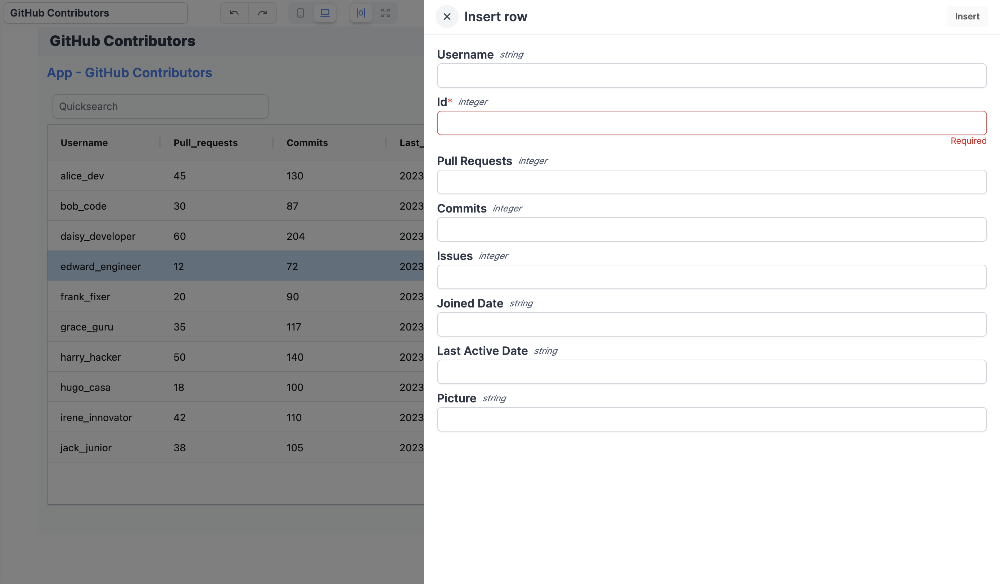

import DocCard from '@site/src/components/DocCard';

# Big structured SQL data: Postgres (Supabase, Neon.tech)

This page is part of our section on [Persistent storage & databases](./index.mdx) which covers where to effectively store and manage the data manipulated by Windmill. Check that page for more options on data storage.

For Postgres databases (best for structured data storage and retrieval, where you can define schema and relationships between entities), we recommend using Supabase or Neon.tech.

## Execute queries

From Windmill, you can connect to most SQL services (PostgreSQL, MySQL, MS SQL, BigQuery, Snowflake) and execute queries, either with dedicated [SQL scripts](../../getting_started/0_scripts_quickstart/5_sql_quickstart/index.mdx), or through other languages ([Python](../../getting_started/0_scripts_quickstart/2_python_quickstart/index.mdx), [TypeScript](../../getting_started/0_scripts_quickstart/1_typescript_quickstart/index.mdx) etc.) using the appropriate libraries.

All details at:


<div className="grid grid-cols-2 gap-6 mb-4">
	<DocCard
		title="SQL & query languages quickstart"
		description="Write your first Windmill script in PostgreSQL, MySQL, MS SQL, BigQuery or Snowflake SQL."
		href="/docs/getting_started/scripts_quickstart/sql"
	/>
</div>

### Supabase

[Supabase](https://supabase.com/) is an open-source alternative to Firebase, providing a backend-as-a-service platform that offers a suite of tools, including real-time subscriptions, authentication, storage, and a PostgreSQL-based database.

1. Sign-up to Supabase's <a href="https://app.supabase.com/sign-up" rel="nofollow" >Cloud App</a> or [Self-Host](https://supabase.com/docs/guides/self-hosting) it.

2. [Create a new Supabase project](https://supabase.com/docs/guides/getting-started).

3. Get a [Connection string](https://supabase.com/docs/guides/database/connecting-to-postgres#finding-your-connection-string).

   - Go to the `Settings` section.
   - Click `Database`.
   - Find your Connection Info and Connection String. Direct connections are on port 5432.

4. From Windmill, add your Supabase connection string as a [Postgresql resource](https://hub.windmill.dev/resource_types/114/postgresql) and [Execute queries](https://hub.windmill.dev/scripts/postgresql/1294/execute-query-and-return-results-postgresql). Tip: you might need to set the `sslmode` to "disable".

<video
	className="border-2 rounded-lg object-cover w-full h-full dark:border-gray-800"
	controls
	src="/videos/supabase_postgres_integration.mp4"
/>

<br />

You can also integrate Supabase [directly through its API](../../integrations/supabase.md#through-supabase-api).

:::tip

You can find examples and premade Supabase scripts on [Windmill Hub](https://hub.windmill.dev/integrations/supabase).

<br />

More tutorials on Supabase:

- [How to Send Database Events From Supabase to Windmill](/blog/database-events-from-supabase-to-windmill)
- [Create an E-commerce backoffice](../../apps/7_app_e-commerce.md)
- [Create an Issue Tracker App with Supabase in 15 Minutes](/blog/create-issue-tracker-in-15-minutes)
- [Create an Issue Tracker App with Supabase - Part 2 Customize Your App](/blog/create-issue-tracker-part-2)
- [Use Supabase Authentication on Windmill to query RLS protected tables for external apps](/blog/supabase-authentication-and-rls-protected-tables-on-windmill)

:::

### Neon.tech

[Neon.tech](https://neon.tech/) is an open-source cloud database platform that provides fully managed PostgreSQL databases with high availability and scalability.

1. Sign-up to Neon's <a href="https://console.neon.tech/sign_in" rel="nofollow" >Cloud App</a> or [Self-Host](https://community.neon.tech/t/can-neon-be-self-hosted/51) it.

2. [Set up a project and add data](https://neon.tech/docs/manage/projects).

3. Get a [Connection string](https://neon.tech/docs/connect/query-with-psql-editor). You can obtain it connection string from the Connection Details widget on the Neon Dashboard: select a branch, a role, and the database you want to connect to and a connection string will be constructed for you.

4. From Windmill, add your Neon.tech connection string as a [Postgresql resource](https://hub.windmill.dev/resource_types/114/postgresql) and [Execute queries](https://hub.windmill.dev/scripts/postgresql/1294/execute-query-and-return-results-postgresql).

<video
	className="border-2 rounded-lg object-cover w-full h-full dark:border-gray-800"
	controls
	src="/videos/neon_integration.mp4"
/>

<br />

:::tip

Adding the connection string as a Postgres resource requires to parse it.

<br />

For example, for `psql postgres://daniel:<password>@ep-restless-rice.us-east-2.aws.neon.tech/neondb`, that would be:

```json
{
	"host": "ep-restless-rice.us-east-2.aws.neon.tech",
	"port": 5432,
	"user": "daniel",
	"dbname": "neondb",
	"sslmode": "require",
	"password": "<password>"
}
```

Where the sslmode should be "require" and Neon uses the default PostgreSQL port, `5432`.

:::

## Database studio

From Windmill [App editor](../../apps/0_app_editor/index.mdx), you can use the [Database studio](../../apps/4_app_configuration_settings/database_studio.mdx) component to visualize and manage your databases ([PostgreSQL](../../getting_started/0_scripts_quickstart/5_sql_quickstart/index.mdx#postgresql) / [MySQL](../../getting_started/0_scripts_quickstart/5_sql_quickstart/index.mdx#mysql) / [MS SQL](../../getting_started/0_scripts_quickstart/5_sql_quickstart/index.mdx#ms-sql) / [Snowflake](../../getting_started/0_scripts_quickstart/5_sql_quickstart/index.mdx#snowflake) / [BigQuery](../../getting_started/0_scripts_quickstart/5_sql_quickstart/index.mdx#bigquery)).



<iframe
	style={{ aspectRatio: '16/9' }}
	src="https://www.youtube.com/embed/Fd_0EffVDtw"
	title="Database studio"
	frameBorder="0"
	allow="accelerometer; autoplay; clipboard-write; encrypted-media; gyroscope; picture-in-picture; web-share"
	allowFullScreen
	className="border-2 rounded-lg object-cover w-full dark:border-gray-800"
></iframe>

<br/>

The Database studio component allows you to:
- Display the content of a table.
- Edit the content of a table by directly editing the cells (only when the cell is editable).
- Add a new row.
- Delete a row.

All details at:

<div className="grid grid-cols-2 gap-6 mb-4">
	<DocCard
		title="Database studio"
		description="The Database studio is a web-based database management tool that leverages Ag Grid for table display and interaction"
		href="/docs/apps/app_configuration_settings/database_studio"
	/>
</div>