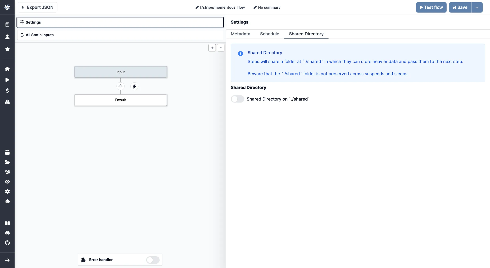

import DocCard from '@site/src/components/DocCard';
import Tabs from '@theme/Tabs';
import TabItem from '@theme/TabItem';

# Within Windmill: Not recommended

This page is part of our section on [Persistent storage & databases](./index.mdx) which covers where to effectively store and manage the data manipulated by Windmill. Check that page for more options on data storage.

## States and resources

Within Windmill, you can use [States](../3_resources_and_types/index.mdx#states) and [Resources](../3_resources_and_types/index.mdx) as a way to store a transient state - that can be represented as small JSON.

### States

States are used by scripts to keep data persistent between runs of the same script by the same trigger (schedule or user).

In Windmill, [States](../3_resources_and_types/index.mdx#states) are considered as resources, but they are excluded from the Workspace tab for clarity.
They are displayed on the Resources menu, under a dedicated tab.

A state is an object stored as a resource of the resource type `state` which is meant to persist across distinct executions of the same script.

```py
import requests
from wmill import set_state, get_state

def main():
	# Get temperature from last execution
    last_temperature = get_state()

    # Fetch the temperature in Paris from wttr.in
    response = requests.get("http://wttr.in/Paris?format=%t")

    new_temperature = response.text.strip("°F")

	# Set current temperature to state
    set_state(new_temperature)

    # Compare last_temperature and new_temperature
    if last_temperature < new_temperature:
        return "The temperature has increased."
    elif last_temperature > new_temperature:
        return "The temperature has decreased."
    else:
        return "The temperature has remained the same."
```

States are what enable Flows to watch for changes in most event watching scenarios ([trigger scripts](../../flows/10_flow_trigger.mdx)). The pattern is as follows:

- Retrieve the last state or, if undefined, assume it is the first execution.
- Retrieve the current state in the external system you are watching, e.g. the
  list of users having starred your repo or the maximum ID of posts on Hacker News.
- Calculate the difference between the current state and the last internal
  state. This difference is what you will want to act upon.
- Set the new state as the current state so that you do not process the
  elements you just processed.
- Return the differences calculated previously so that you can process them in
  the next steps. You will likely want to [forloop](../../flows/12_flow_loops.md) over the items and trigger
  one Flow per item. This is exactly the pattern used when your Flow is in the
  mode of "Watching changes regularly".

The convenience functions do this are:

_TypeScript_

- `getState()` which retrieves an object of any type (internally a simple
  Resource) at a path determined by `getStatePath`, which is unique to the user
  currently executing the Script, the Flow in which it is currently getting
  called in - if any - and the path of the Script.
- `setState(value: any)` which sets the new state.

> Please note it requires [importing](../../advanced/6_imports/index.mdx) the wmill client library from Deno/Bun.

<br />

_Python_

- `get_state()` which retrieves an object of any type (internally a simple
  Resource) at a path determined by `get_state_path`, which is unique to the user
  currently executing the Script, the Flow in which it is currently getting
  called in - if any - and the path of the Script.
- `set_state(value: Any)` which sets the new state.

> Please note it requires [importing](../../advanced/6_imports/index.mdx) the wmill client library from Python.

<br />

<div className="grid grid-cols-2 gap-6 mb-4">
	<DocCard
		title="States"
		description="A state is an object stored as a resource of the resource type `state` which is meant to persist across distinct executions of the same script."
		href="/docs/core_concepts/resources_and_types#states"
	/>
</div>

### Custom flow states

Custom flow states are a way to store data across steps in a [flow](../../flows/1_flow_editor.mdx). You can set and retrieve a value given a key from any step of flow and it will be available from within the flow globally. That state will be stored in the flow state itself and thus has the same lifetime as the flow [job](../20_jobs/index.mdx) itself.

It's a powerful escape hatch when [passing data as output/input](../../flows/16_architecture.mdx) is not feasible and using [getResource/setResource](../3_resources_and_types/index.mdx#fetching-them-from-within-a-script-by-using-the-wmill-client-in-the-respective-language) has the issue of cluttering the workspace and inconvenient UX.

<Tabs className="unique-tabs">
<TabItem value="TypeScript" label="TypeScript" attributes={{className: "text-xs p-4 !mt-0 !ml-0"}}>

```typescript
import * as wmill from 'windmill-client@1.297.0';

export async function main(x: string) {
	await wmill.setFlowUserState('FOO', 42);
	return await wmill.getFlowUserState('FOO');
}
```

</TabItem>
<TabItem value="Python" label="Python" attributes={{className: "text-xs p-4 !mt-0 !ml-0"}}>

```python
import wmill
#extra_requirements:
#wmill==1.297.0

def main(x: str):
    wmill.set_flow_user_state("foobar", 43)
    return wmill.get_flow_user_state("foobar")
```

</TabItem>
</Tabs>

<video
	className="border-2 rounded-lg object-cover w-full h-full dark:border-gray-800"
	controls
	src="/videos/flow_state.mp4"
/>

<br />

<div className="grid grid-cols-2 gap-6 mb-4">
	<DocCard
		title="Custom flow states"
		description="You can set and retrieve a value given a key from any step of flow and it will be available from within the flow globally."
		href="/docs/core_concepts/resources_and_types#custom-flow-states"
		color="teal"
	/>
</div>

### Resources

[States](#states) are a specific type of [resources](../3_resources_and_types/index.mdx) in Windmill where the type is `state` the path is automatically calculated for you based on the schedule path (if any) and the script path. In some cases, you want to set the path arbitrarily and/or use a different type than `state`. In this case, you can use the `setResource` and `getResource` functions. A same resource can be used across different scripts and flows.

- `setResource(value: any, path?: string, initializeToTypeIfNotExist?: string)`: which sets a resource at a given path. This is
  equivalent to `setState` but allows you to set an arbitrary path and chose a type other than state if wanted. [See API](https://deno.land/x/windmill/mod.ts?s=setResource).
- `getResource(path: string)`: gets a resource at a given path. [See API](https://deno.land/x/windmill/mod.ts?s=getResource).

The states can be seen in the Resources section of Windmill app with a
[Resource Type](../3_resources_and_types/index.mdx#create-a-resource-type) of `state`.

:::tip

Variables are similar to resources but have no types, can be tagged as `secret` (in which case they are encrypted by the workspace key) and can only store strings. In some situations, you may prefer `setVariable`/`getVariable` to resources.
:::

In conclusion `setState` and `setResource` are convenient ways to persist json between multiple script executions.

<div className="grid grid-cols-2 gap-6 mb-4">
	<DocCard
		title="Resources and resource types"
		description="Resources are structured configurations and connections to third-party systems, with Resource types defining the schema for each Resource."
		href="/docs/core_concepts/resources_and_types"
	/>
</div>

## Shared directory

For heavier ETL processes or sharing data between steps in a flow, Windmill provides a Shared Directory feature. This allows steps within a flow to share data by storing it in a designated folder at `./shared`.

:::caution
Although Shared Directories are recommended for persisting states within a flow, it's important to note that:

- All steps are executed on the same worker
- The data stored in the Shared Directory is strictly ephemeral to the flow execution
- The contents are not preserved across [suspends](../../flows/11_flow_approval.mdx) and [sleeps](../../flows/15_sleep.md)
  :::

To enable the Shared Directory:

1. Open the `Settings` menu in the Windmill interface
2. Go to the `Shared Directory` section
3. Toggle on the option for `Shared Directory on './shared'`



Once enabled, steps can read and write files to the `./shared` folder to pass data between them. This is particularly useful for:

- Handling larger datasets that would be impractical to pass as step inputs/outputs
- Temporary storage of intermediate processing results
- Sharing files between steps in an ETL pipeline
