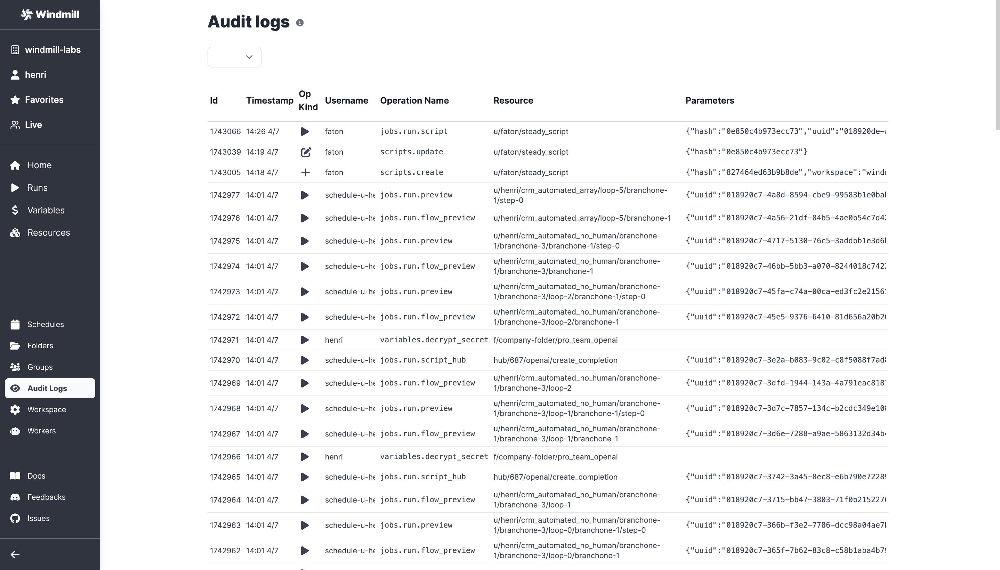

import DocCard from '@site/src/components/DocCard';

# Audit Logs

Windmill provides audit logs for every operation and action that has side-effects. These logs capture the user responsible for the operation and include metadata specific to the type of operation.

As a user, you can only see your own audit logs unless you are an admin.

    <DocCard
    	title="Runs Menu"
    	description="The Runs menu is another feature that allows you to visualise all past and future runs."
    	href="/docs/core_concepts/audit_logs"
    />

## Retention Policy

The retention policy for audit logs varies depending on your team's plan:
- Free plans: Audit logs are redacted.
- Team plan (cloud): Audit logs are retained for 7 days.
- Enterprise plan (cloud): Audit logs are retained for 60 days.
- Enterprise plan (cloud): Audit logs are stored in Postgres and also emitted as logs, which are stored in the cloud for a year with the possibility of extending the retention period.

## Viewing Query Parameters in Audit Logs

You can retrieve the job ID and access all the job metadata, including the job arguments. This applies to any actions that trigger scripts in the apps built with Windmill.

## Backing Up Audit Logs

To back up the audit logs, simply backup the Postgres database or store the logs in a cold archive. In the cloud environment, we employ both methods for backup.