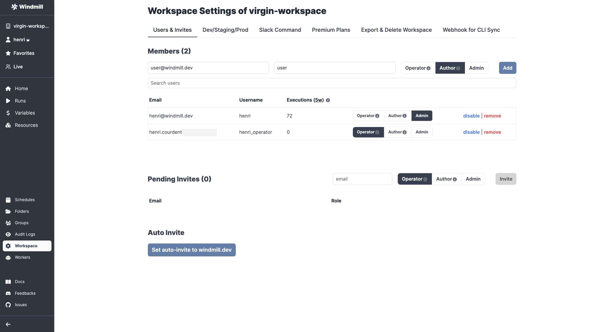
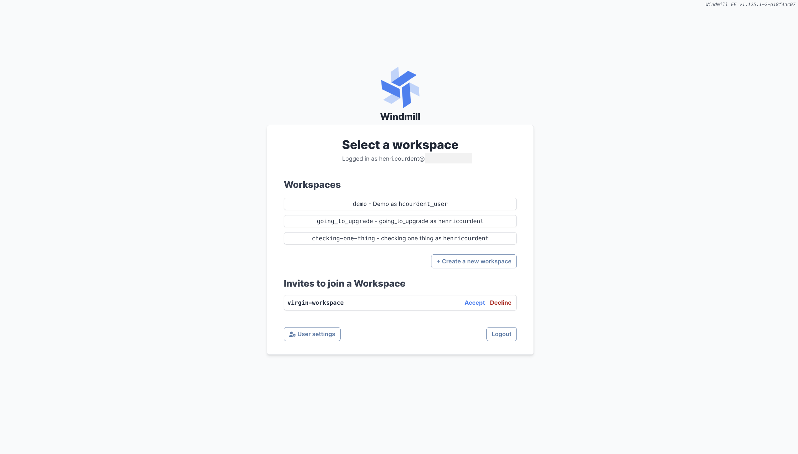
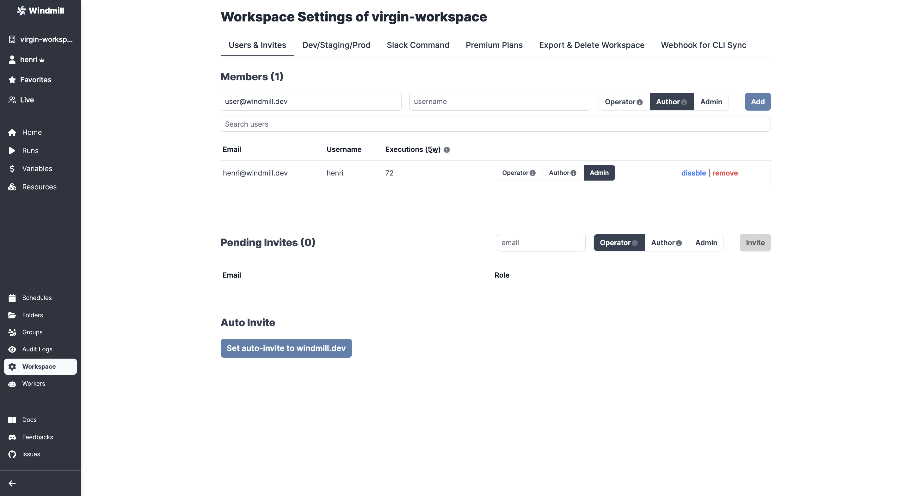

# Authentification

Windmill provides flexible authentication options to ensure secure access to the platform. Users can authenticate through Single Sign-On (SSO) with a restricted domain or with a simple e-mail if added manually by superadmins.

## Restricted Domain Authentication

Windmill supports authentication [through SSO](../../misc/2_setup_oauth/index.md) for users with email addresses from a restricted domain. This allows organizations to control access to Windmill based on their domain policy. Users with email addresses from the authorized domain can authenticate seamlessly using their SSO credentials.

To enable restricted domain authentication, an administrator can configure the authorized domain in Windmill's settings. Once configured, users with email addresses from the authorized domain will be able to log in using their SSO provider.

## Manually Add Users to a Windmill Instance

As a superadmin of the workspace, you have the ability to manually add users to the Windmill instance. This is useful for inviting users who do not have SSO credentials or for providing access to individuals outside the restricted domain.

To manually add users:
1. Log in to the Windmill instance as a superadmin.
2. Click on your username and pick "Superadmin settings".
3. Fill:
   - Email: The email address of the user.
   - Password: A password for the user's account.
   - Name (Optional): The name of the user.
   - Company (Optional): The company or organization the user belongs to.
4. "Add user to instance".

If SMTP is configured, an email will be sent to the user with their account details and instructions for accessing Windmill.

By default, users are not invited to any workspace, unless auto-invite has been set-up.

## Adding Users to a Workspace

Once added to an instance, users can create their own workspace (on cloud, those ones are not considered as Premium as plans work at the workspace-level). However, by default they will not be invited to any workspace.

### Manually

From the Workspace settings, in the `Users & Invites` tab, any admin can manually add users, filling:
- `email`: the email address linked to the Windmill account.
- `user`: the username (specific to workspace).

Users can be given roles Operator, Author or Admin. Any user can also be manually removed.

The invite will be sent even if no Windmill account is created yet. Once access is created to a Windmill account, an invite will be available from the "Select a workspace" menu.

### Auto Invite

You can send auto-invites to the workspace to users from your domain.

From the Workspace settings, in the `Users & Invites` tab, go to "Set auto-invite to [domain]".

This will add users to the list of Pending Invites, from where you can still manually cancel any invite.

At last, you can enable "Auto-invited users to join as operators".

Once access is created to a Windmill account, an invite will be available from the "Select a workspace" menu.

