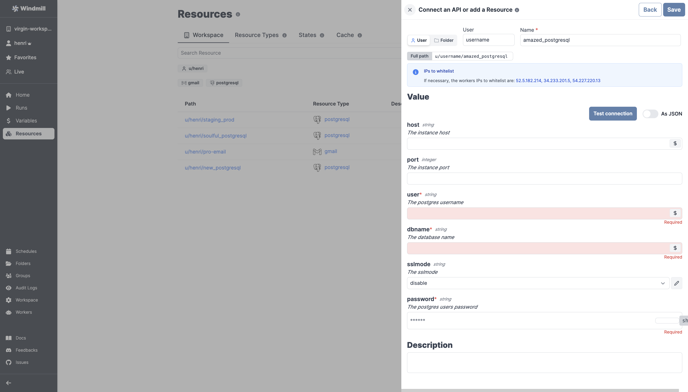
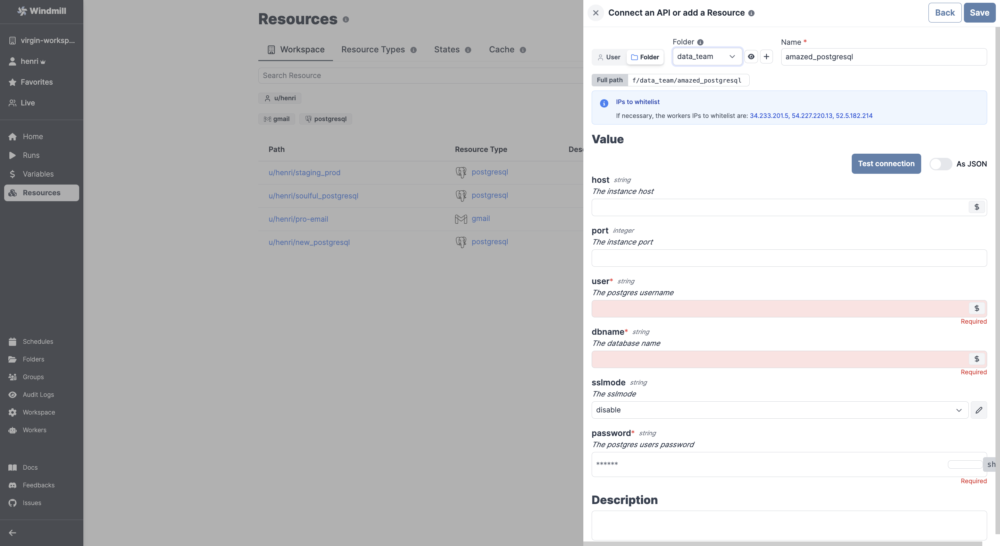
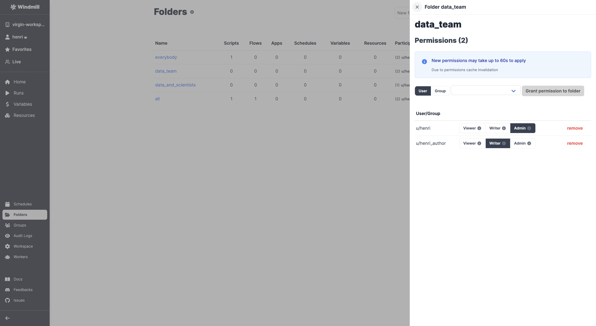

import DocCard from '@site/src/components/DocCard';

# Roles and Permissions

Windmill provides a roles and permissions system that allows you to control access and manage permissions within your instance and workspaces. Different roles have different levels of access to scripts, flows, apps, and other entities in Windmill.

Everybody having access to a Windmill instance is considered a User.

## Users

Users are uniquely identified globally by their email. They also have a unique username with respect to each workspace they are member of.

## Workspace

Every nameable or pathable entity in Windmill has a workspace attached to it.
This includes:

- users
- groups
- scripts
- resources
- variables
- schedules
- jobs

Windmill's entire database is partitioned by workspaces such that users, teams
and orgs can safely co-locate without risk of leakage.

Any user can create their own workspace. When a user creates a workspace, the user is an
admin of such workspace and he can invite others to join his workspace.

## Roles in Windmill

Users can be given different levels of permissions:

1. **Superadmin**: The superadmin role has the highest level of access and can manage the entire Windmill instance. Only superadmins can access the dedicated 'admins' workspace. Also by default, superadmins have access to all workspaces as admins of those workspaces. When an admin does an action as a user of a workspace he is not a member of and as such as no username in, their email is used in lieu of the username. Windmill can be configured to remove the ability for non-superadmins to create workspace using the: CREATE_WORKSPACE_REQUIRE_SUPERADMIN env variable.

2. **Admin**:
	- At the [workspace](#workspace) level, admins have the ability to manage a specific Windmill workspace and users within that workspace. They can see and edit all scripts, flows, apps, and other entities within the workspace. Admins have the power to create, modify, and delete entities and can manage permissions within the workspace.
	- At the [folder](../8_groups_and_folders/index.mdx#folders) level, an admin of a folder has read, write and archive access to all the elements inside the folders ([scripts](../../getting_started/0_scripts_quickstart/index.mdx), [flows](../../getting_started/6_flows_quickstart/index.mdx), [apps](../../getting_started/7_apps_quickstart/index.mdx), [resources](../3_resources_and_types/index.mdx), [schedules](../1_scheduling/index.md)) and can manage the permissions as well as add new admins.

3. **Author**: Authors can execute and view scripts, flows, and apps within a workspace. Authors see the full interface of Windmill and contrary to the Operators, they have the ability to create and edit scripts, flows and apps. Authors have read and write access to the entities they create or have been [granted access to by others](../8_groups_and_folders/index.mdx).

4. **Operator**: Operators have limited access within a workspace. They can only execute and view scripts, flows, and apps that they have visibility on, and only those that are within their allowed path or [folders](../8_groups_and_folders/index.mdx). Operators do not have the ability to create or modify entities.
The recommended way to share scripts and flows with operators is through [auto-generated apps](../6_auto_generated_uis/index.md#automatically-generated-apps).
With the second option being of sharing the script and [variables](../2_variables_and_secrets/index.mdx) it depends on (but operators won't be able to load variable directly from the UI/api, only use them within the scripts they have access to).

5. **Anonymous app viewers**: Anonymous app viewers are individuals who can access and view Windmill apps without being a user but by knowing the [secret URL](../../apps/0_toolbar.mdx#deploy) that allows app viewing. They do not have any editing or privileges to execute scripts and flows. The apps that they see execute the scripts and flows that are part of the app but only on behalf of the app author. The anonymous user cannot execute any of the scripts and flows part of the apps outside of the inputs authorized by the app through a policy that is automatically generated by the app.

	<DocCard
		title="Groups and Folders"
		description="Groups classify users with shared permissions, while folders group items and assign role-based access control."
		href="/docs/core_concepts/groups_and_folders"
	/>
    <DocCard
        color="orange"
		title="Publish Publicly (App Editor)"
		description="The app can be accessed by anyone who knows the secret URL."
		href="/docs/apps/toolbar#deploy"
	/>

## Permissions and Access Control

Windmill implements a fine-grained Access Control List (ACL) by default, allowing you to define permissions for various entities within the system, including:

- [groups](../8_groups_and_folders/index.mdx#groups)
- [folders](../8_groups_and_folders/index.mdx#folders)
- [scripts](../../getting_started/0_scripts_quickstart/index.mdx)
- [resources](../3_resources_and_types/index.mdx)
- [variables](../2_variables_and_secrets/index.mdx)
- [schedules](../1_scheduling/index.md)
- [jobs](../20_jobs/index.md)

There are 3 possible roles for each item:
- **Admin** (Owner): has read, write and archive access. Admins of an item can't delete it unless they are admins of the workspace.
- **Writer**: has read, write and archive access. They can't archive nor change the [path](#path) of the item.
- **Viewer**:  has read-only access to the item.

Admins of a workspace have elevated privileges and can read and write over everything within the workspace, disregarding ACLs.

The ACLs are defined by the path of the item.

### Path

Windmill uniquely identifies [scripts](../../getting_started/0_scripts_quickstart/index.mdx), [variables](../2_variables_and_secrets/index.mdx), [resources](../3_resources_and_types/index.mdx), [schedules](../1_scheduling/index.md) - and in general almost everything - using their path. The paths are globally unique within the category of entities they represent. In short, a Resource and a Schedule for example can have the same path, without conflict.

Each entity's ACL defines its owner and specifies the read and write permissions. By default, only the owner of an entity has read and write access to it. Entities can be explicitly shared with other [groups](../8_groups_and_folders/index.mdx#groups) and users in either read-only or read and write mode through [folders](../8_groups_and_folders/index.mdx#folders). Write mode implicitly includes read permission.

A path is either inside a user space `u/<user>/<path>` or inside a folder `f/<folder>/<path>`. The path defines permissions with:
- a User: that user will be by default given read, write and archive access on the item (`u/henri/amazed_postgresql`).
- a Folder: the item will be available to the users having access to the folder, with its own levels of permissions (`f/data_team/amazed_postgresql`).

### Example of Permissions

For example here a new SQL Resource is being given access to a user `username` with view, write and archive access:

Here the new SQL Resource is being given access to a folder `data_team`...

... folder that can give Admin, Writer or Viewer accesses to users or [groups](../8_groups_and_folders/index.mdx#groups).

 

	<DocCard
		title="Groups and Folders"
		description="Groups classify users with shared permissions, while folders group items and assign role-based access control."
		href="/docs/core_concepts/groups_and_folders"
	/>

