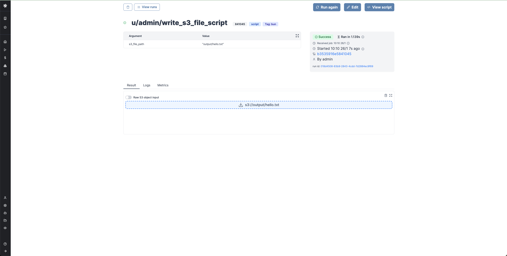

import DocCard from '@site/src/components/DocCard';
import Tabs from '@theme/Tabs';
import TabItem from '@theme/TabItem';

# Handling files and binary data

In Windmill, JSON is the primary data format used for representing information.
Binary data, such as files, are not easy to handle. Windmill provides two options.

1. Have a dedicated storage for binary data: S3, Azure Blob, or Google Cloud Storage. Windmill has a first class integration with S3 buckets, Azure Blob containers, or Google Cloud Storage buckets.
2. If the above is not an option, there's always the possibility to store the binary as base64 encoded string.

## Workspace object storage

The recommended way to store binary data is to upload it to S3, Azure Blob Storage, or Google Cloud Storage leveraging [Windmill's workspace object storage](../38_object_storage_in_windmill/index.mdx).

Instance and workspace object storage are different from using [S3 resources](../../integrations/s3.mdx) within scripts, flows, and apps, which is free and unlimited. What is exclusive to the [Enterprise](/pricing) version is using the integration of Windmill with S3 that is a major convenience layer to enable users to read and write from S3 without having to have access to the credentials.

:::info

Windmill's integration with S3, Azure Blob Storage, and Google Cloud Storage works exactly the same and the features described below work in all cases. The only difference is that you need to select an `azure_blob` resource for Azure Blob or a `gcloud_storage` resource for Google Cloud Storage when setting up the storage in the Workspace settings.

:::

By [setting a S3 resource for the workspace](../38_object_storage_in_windmill/index.mdx#workspace-object-storage), you can have an easy access to your bucket from the script editor. It becomes easy to consume S3 files as input, and write back to S3 anywhere in a script.

S3 files in Windmill are just pointers to the S3 object using its key. As such, they are represented by a simple JSON:

```json
{
	"s3": "path/to/file"
}
```

When a script accepts a S3 file as input, it can be directly uploaded or chosen from the bucket explorer.


When a script outputs a S3 file, it can be downloaded or previewed directly in Windmill's UI (for displayable files like text files, CSVs or parquet files).



Windmill provides helpers in its SDKs to consume and produce S3 file seamlessly.

All details on Workspace object storage, and how to [read](../38_object_storage_in_windmill/index.mdx#read-a-file-from-s3-or-object-storage-within-a-script) and [write](../38_object_storage_in_windmill/index.mdx#create-a-file-from-s3-or-object-storage-within-a-script) files to S3 as well as [Windmill embedded integration with Polars and DuckDB](../27_data_pipelines/index.mdx#windmill-integration-with-polars-and-duckdb-for-data-pipelines) for data pipelines, can be found in the [Object storage in Windmill](../38_object_storage_in_windmill/index.mdx) page.

<div className="grid grid-cols-2 gap-6 mb-4">
	<DocCard
		title="Workspace object storage"
		description="Connect your Windmill workspace to your S3 bucket, your Azure Blob storage or your GCS bucket to enable users to read and write from S3 without having to have access to the credentials."
		href="/docs/core_concepts/object_storage_in_windmill#workspace-object-storage"
	/>
</div>

## Base64 encoded strings

Base64 strings can also be used, but the main difficulty is that those Base64 strings can not be distinguished from normal strings.
Hence, the interpretation of those Base64 encoded strings is either done depending on the context,
or by pre-fixing those strings with the [`<data specifier:>`](https://developer.mozilla.org/en-US/docs/Web/HTTP/Basics_of_HTTP/MIME_types).

In explicit contexts, when the JSON schema specifies that a property represents Base64-encoded data:

```
foo:
    type: string
    format: base64
```

If necessary, Windmill automatically converts it to the corresponding binary type in the corresponding
language as defined in the [schema](../13_json_schema_and_parsing/index.mdx).
In Python, it will be converted to the `bytes` type (for example `def main (input_file: bytes):`). In TypeScript, they are simply represented as strings.

In ambiguous situations (file ino) where the context does not provide clear indications,
it is necessary to precede the binary data with the `data:base64` [encoding declaration](https://developer.mozilla.org/en-US/docs/Web/HTTP/Basics_of_HTTP/Data_URLs).

In the app editor, in some cases when there is no ambiguity, the data prefix is optional.

Base64 encoded strings are used in:

- File input component in the app editor: files uploaded are converted and returned as a Base64 encoded string.
- Download button: the source to be downloaded must be in Base64 format.
- File inputs to run scripts must be typed into the [JSON](../13_json_schema_and_parsing/index.mdx) `string, encodingFormat: base64` (python: `bytes`, Deno: `wmill.Base64`).

<div className="grid grid-cols-2 gap-6 mb-4">
	<DocCard
		title="File input Component"
		description="The file input allows users to drop files into the app."
		href="/docs/apps/app_configuration_settings/app_component_library#file-input"
	/>
	<DocCard
		title="Download button"
		description="The download button component allows you to download a file."
		href="/docs/apps/app_configuration_settings/app_component_library#download-button"
	/>
	<DocCard
		title="JSON schema and parsing"
		description="Windmill leverages the JSON Schema to define the structure and validation rules for JSON data."
		href="/docs/core_concepts/json_schema_and_parsing"
	/>
</div>
