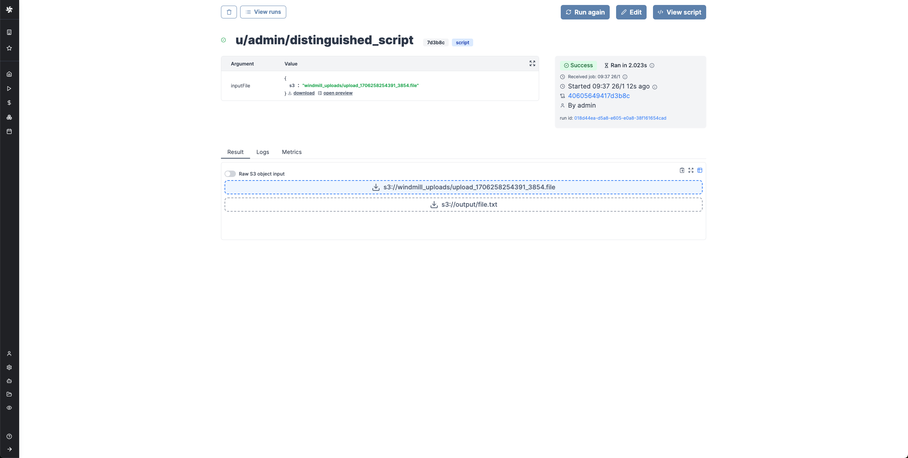
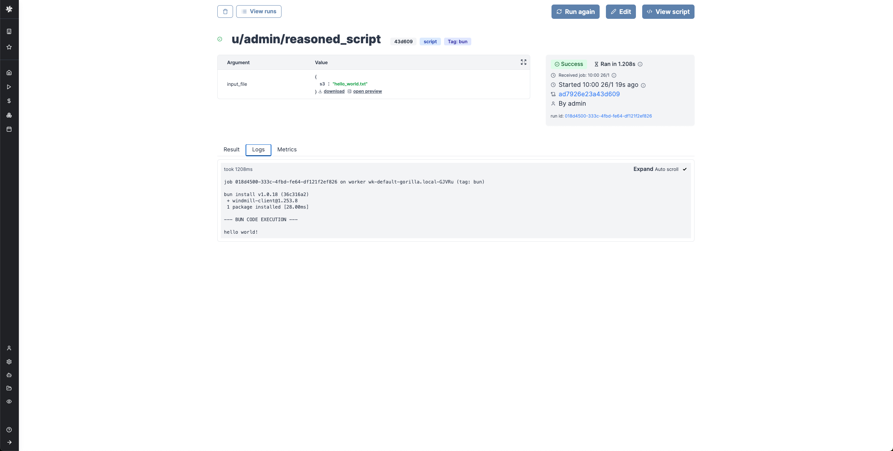

import DocCard from '@site/src/components/DocCard';
import Tabs from '@theme/Tabs';
import TabItem from '@theme/TabItem';

# Handling Files and Binary Data

In Windmill, JSON is the primary data format used for representing information.
Binary data, such as files, are not easy to handle. Windmill provides two options.

1. Have a dedicated storage for binary data: S3 or Azure Blob. Windmill has a first class integration with S3 buckets or Azure Blob containers.
2. If the above is not an option, there's always the possibility to store the binary as base64 encoded string.

## Windmill integration with S3 or Azure Blob Storage

The recommended way to store binary data is to upload it to S3 leveraging [Windmill's native S3 integrations](../11_persistent_storage/index.mdx#connect-your-windmill-workspace-to-your-s3-bucket-or-you-azure-blob-storage).

:::info

Windmill's integration with S3 and Azure Blob Storage works exactly the same and the features described below works in both cases. The only difference is that you need to select an `azure_blob` resource when setting up the S3 storage in the Workspace settings.

:::

By [setting a S3 resource for the workspace](../11_persistent_storage/index.mdx#connect-your-windmill-workspace-to-your-s3-bucket-or-you-azure-blob-storage), you can have an easy access to your bucket from the script editor. It becomes easy to consume S3 files as input, and write back to S3 anywhere in a script.

S3 files in Windmill are just pointers to the S3 object using its key. As such, they are represented by a simple JSON:

```json
{
	"s3": "/s3/object/file/key"
}
```

When a script accepts a S3 file as input, it can be directly uploaded or chosen from the bucket explorer.


When a script outputs a S3 file, it can be downloaded or previewed directly in Windmill's UI (for displayable files like text files, CSVs or parquet files).



Windmill provides helpers in its SDKs to consume and produce S3 file seamlessly.

<div className="grid grid-cols-2 gap-6 mb-4">
	<DocCard
		title="Persistent Storage - S3 Integration"
		description="Connect your Windmill workspace to your S3 bucket or you Azure Blob storage."
		href="/docs/core_concepts/persistent_storage#connect-your-windmill-workspace-to-your-s3-bucket-or-you-azure-blob-storage"
	/>
</div>

### Read a file from S3 within a script

<Tabs className="unique-tabs">

<TabItem value="bun" label="TypeScript (Bun)" attributes={{className: "text-xs p-4 !mt-0 !ml-0"}}>

```ts
import * as wmill from 'windmill-client';
import { S3Object } from 'windmill-client';

export async function main(input_file: S3Object) {
	// Load the entire file_content as a Uint8Array
	const file_content = await wmill.loadS3File(input_file);

	const decoder = new TextDecoder();
	const file_content_str = decoder.decode(file_content);
	console.log(file_content_str);

	// Or load the file lazily as a Blob
	let fileContentBlob = await wmill.loadS3FileStream(inputFile);
	console.log(await fileContentBlob.text());
}
```

</TabItem>

<TabItem value="deno" label="TypeScript (Deno)" attributes={{className: "text-xs p-4 !mt-0 !ml-0"}}>

```ts
import * as wmill from 'npm:windmill-client@1.253.7';
import S3Object from 'npm:windmill-client@1.253.7';

export async function main(input_file: S3Object) {
	// Load the entire file_content as a Uint8Array
	const file_content = await wmill.loadS3File(input_file);

	const decoder = new TextDecoder();
	const file_content_str = decoder.decode(file_content);
	console.log(file_content_str);

	// Or load the file lazily as a Blob
	let fileContentBlob = await wmill.loadS3FileStream(inputFile);
	console.log(await fileContentBlob.text());
}
```

</TabItem>

<TabItem value="python" label="Python" attributes={{className: "text-xs p-4 !mt-0 !ml-0"}}>

```python
#requirements:
#wmill>=1.251.7
import wmill
from wmill import S3Object

def main(input_file: S3Object):
    # Load the entire file_content as a bytes array
    file_content = wmill.load_s3_file(input_file)
    print(file_content.decode('utf-8'))

    # Or load the file lazily as a Buffered reader:
    with wmill.load_s3_file_reader(input_file) as file_reader:
        print(file_reader.read())
```

</TabItem>
</Tabs>



### Create a file in S3 within a script

<Tabs className="unique-tabs">

<TabItem value="bun" label="TypeScript (Bun)" attributes={{className: "text-xs p-4 !mt-0 !ml-0"}}>

```ts
import * as wmill from 'windmill-client';
import { S3Object } from 'windmill-client';

export async function main(s3_file_path: string) {
	const s3_file_output: S3Object = {
		s3: s3_file_path
	};

	const file_content = 'Hello Windmill!';
	// file_content can be either a string or ReadableStream<Uint8Array>
	await wmill.writeS3File(s3_file_output, file_content);
	return s3_file_output;
}
```

</TabItem>

<TabItem value="deno" label="TypeScript (Deno)" attributes={{className: "text-xs p-4 !mt-0 !ml-0"}}>

```ts
import * as wmill from 'npm:windmill-client@1.253.7';
import S3Object from 'npm:windmill-client@1.253.7';

export async function main(s3_file_path: string) {
	const s3_file_output: S3Object = {
		s3: s3_file_path
	};

	const file_content = 'Hello Windmill!';
	// file_content can be either a string or ReadableStream<Uint8Array>
	await wmill.writeS3File(s3_file_output, file_content);
	return s3_file_output;
}
```

</TabItem>

<TabItem value="python" label="Python" attributes={{className: "text-xs p-4 !mt-0 !ml-0"}}>

```python
#requirements:
#wmill>=1.251.7
import wmill
from wmill import S3Object

def main(s3_file_path: str):
    s3_file_output = S3Object(s3=s3_file_path)

    file_content = b"Hello Windmill!"
	# file_content can be either bytes or a BufferedReader
    file_content = wmill.write_s3_file(s3_file_output, file_content)
    return s3_file_output
```

</TabItem>
</Tabs>


:::info
Certain file types, typically parquet files, can be directly rendered by Windmill
:::

### Windmill embedded integration with Polars and DuckDB for data pipelines

ETL can be easily implemented in Windmill using its integration with Polars and DuckDB for facilitate working with tabular data. In this case, you don't need to manually interact with the S3 bucket, Polars/DuckDB does it natively and in a efficient way. Reading and Writing datasets to S3 can be done seamlessly.

<Tabs className="unique-tabs">
<TabItem value="polars" label="Polars" attributes={{className: "text-xs p-4 !mt-0 !ml-0"}}>

```python
#requirements:
#polars==0.20.2
#s3fs==2023.12.0
#wmill>=1.229.0

import wmill
from wmill import S3Object
import polars as pl
import s3fs


def main(input_file: S3Object):
    bucket = wmill.get_resource("<PATH_TO_S3_RESOURCE>")["bucket"]

    # this will default to the workspace s3 resource
    storage_options = wmill.polars_connection_settings().storage_options
    # this will use the designated resource
    # storage_options = wmill.polars_connection_settings("<PATH_TO_S3_RESOURCE>").storage_options

    # input is a parquet file, we use read_parquet in lazy mode.
    # Polars can read various file types, see
    # https://pola-rs.github.io/polars/py-polars/html/reference/io.html
    input_uri = "s3://{}/{}".format(bucket, input_file["s3"])
    input_df = pl.read_parquet(input_uri, storage_options=storage_options).lazy()

    # process the Polars dataframe. See Polars docs:
    # for dataframe: https://pola-rs.github.io/polars/py-polars/html/reference/dataframe/index.html
    # for lazy dataframe: https://pola-rs.github.io/polars/py-polars/html/reference/lazyframe/index.html
    output_df = input_df.collect()
    print(output_df)

    # To write back the result to S3, Polars needs an s3fs connection
    s3 = s3fs.S3FileSystem(**wmill.polars_connection_settings().s3fs_args)
    output_file = "output/result.parquet"
    output_uri = "s3://{}/{}".format(bucket, output_file)
    with s3.open(output_uri, mode="wb") as output_s3:
        # persist the output dataframe back to S3 and return it
        output_df.write_parquet(output_s3)

    return S3Object(s3=output_file)
```

</TabItem>
<TabItem value="duckdb" label="DuckDB" attributes={{className: "text-xs p-4 !mt-0 !ml-0"}}>

```python
#requirements:
#wmill>=1.229.0
#duckdb==0.9.1

import wmill
from wmill import S3Object
import duckdb


def main(input_file: S3Object):
    bucket = wmill.get_resource("u/admin/windmill-cloud-demo")["bucket"]

    # create a DuckDB database in memory
    # see https://duckdb.org/docs/api/python/dbapi
    conn = duckdb.connect()

    # this will default to the workspace s3 resource
    args = wmill.duckdb_connection_settings().connection_settings_str
    # this will use the designated resource
    # args = wmill.duckdb_connection_settings("<PATH_TO_S3_RESOURCE>").connection_settings_str

    # connect duck db to the S3 bucket - this will default to the workspace s3 resource
    conn.execute(args)

    input_uri = "s3://{}/{}".format(bucket, input_file["s3"])
    output_file = "output/result.parquet"
    output_uri = "s3://{}/{}".format(bucket, output_file)

    # Run queries directly on the parquet file
    query_result = conn.sql(
        """
        SELECT * FROM read_parquet('{}')
    """.format(
            input_uri
        )
    )
    query_result.show()

    # Write the result of a query to a different parquet file on S3
    conn.execute(
        """
        COPY (
            SELECT COUNT(*) FROM read_parquet('{input_uri}')
        ) TO '{output_uri}' (FORMAT 'parquet');
    """.format(
            input_uri=input_uri, output_uri=output_uri
        )
    )

    conn.close()
    return S3Object(s3=output_file)
```

</TabItem>
</Tabs>

:::info

Polars and DuckDB needs to be configured to access S3 within the Windmill script. The job will need to accessed the S3 resources, which either needs to be accessible to the user running the job, or the S3 resource needs to be [set as public in the workspace settings](/docs/core_concepts/persistent_storage#connect-your-windmill-workspace-to-your-s3-bucket-or-you-azure-blob-storage).

:::

For more info, see our page dedicated to Data Pipelines in Windmill:

<div className="grid grid-cols-2 gap-6 mb-4">
	<DocCard
		title="Data Pipelines"
		description="We have integrated with Polars and DuckDB for in-memory data processing and S3 for external storage."
		href="/docs/core_concepts/data_pipelines"
	/>
</div>

## Base64 encoded strings

Base64 strings can also be used, but the main difficulty is that those Base64 strings can not be distinguished from normal strings.
Hence, the interpretation ofthose Base64 encoded strings is either done depending on the context,
or by pre-fixing those strings with the [`<data specifier:>`](https://developer.mozilla.org/en-US/docs/Web/HTTP/Basics_of_HTTP/MIME_types).

In explicit contexts, when the JSON schema specifies that a property represents Base64-encoded data:

```
foo:
    type: string
    format: base64
```

If necessary, Windmill automatically converts it to the corresponding binary type in the corresponding
language as defined in the schema.
In python, it will be converted to the `bytes` type. In Typescript, they are simply represented as strings.

In ambiguous situations (file ino) where the context does not provide clear indications,
it is necessary to precede the binary data with the `data:base64` [encoding declaration](https://developer.mozilla.org/en-US/docs/Web/HTTP/Basics_of_HTTP/Data_URLs).

In the app editor, in some cases when there is no ambiguity, the data prefix is optional.

Base64 encoded strings are used in:

- File Input component in the app editor: files uploaded are converted and returned as a Base64 encoded string.
- Download Button: the source to be downloaded must be in Base64 format.
- File inputs to run scripts must be typed into the [JSON](../13_json_schema_and_parsing/index.md) `string, encodingFormat: base64` (python: `bytes`, Deno: `wmill.Base64`).

<div className="grid grid-cols-2 gap-6 mb-4">
	<DocCard
		title="File Input Component"
		description="The file input allows users to drop files into the app."
		href="/docs/apps/app_configuration_settings/app_component_library#file-input"
	/>
	<DocCard
		title="Download Button"
		description="The download button component allows you to download a file."
		href="/docs/apps/app_configuration_settings/app_component_library#download-button"
	/>
	<DocCard
		title="JSON Schema and Parsing"
		description="JSON Schema is a key component in Windmill for defining and validating the structure and constraints of JSON data."
		href="/docs/core_concepts/json_schema_and_parsing"
	/>
</div>
