import DocCard from '@site/src/components/DocCard';

# Rich display rendering

Windmill processes some outputs (from scripts or flows) intelligently to provide rich display rendering, allowing you to customize the display format of your results.

By default, all results are displayed in a JSON format. However, some formats are recognised automatically ([Rich Table Display](#rich-table-display)), while others can be forced through your code. By leveraging specific keys, you can display images, files, tables, HTML, JSON, and more.

If the result is an object/dict with a single key (except for `resume`, which needs 3), you can leverage the following rich results:

| Type             | Description                                                 | Example                                                                                                              |
| ----------       | ----------------------------------------------------------- | -------------------------------------------------------------------------------------------------------------------- |
| [table-col](#table-column)        | Render the value as a column-wise table.                     | `return { "table-col": { "foo": [42, 8], "bar": [38, 12] } }`                                                        |
| [table-row](#table-row)        | Render the value as a row-wise table.                        | `return { "table-row": [ [ "foo", "bar" ], [ 42, 38 ], [ 8, 12 ] ] }`                                                |
| [table-row-object](#table-row-object) | Render the value as a row-wise table but where each row is an object. | `return { "table-row-object": [ { "foo": 42, "bar": 38 }, { "foo": 8, "bar": 12 } ] }` or  `return { "table-row-object": [ ["foo", "bar" ], { "foo": 42, "bar": 38 }, { "foo": 8, "bar": 12 } ] }` |
| [s3](#s3)               | Render S3 files as a downloadable file and a bucket explorer, when Windmill is [connected to a S3 storage](../38_object_storage_in_windmill/index.mdx#workspace-object-storage).                                  | `return { "s3": "path_to_file"}`           |
| [html](#html)             | Render the value as HTML.                                    | `return { "html": "<div>...</div>" }`                                                                                |
| [markdown](#markdown)         | Render the value as Markdown.                                | `return { "markdown": "## Hello World\nNice to meet you" }` or `return { "md": "## Hello World\nNice to meet you" }`                                     |
| [file](#file)             | Render an option to download a file.                       | `return { "file": { "content": encode(file), "filename": "data.txt" } }`                                             |
| [pdf](#pdf)              | Render the value as a PDF document.                            | `return { "pdf": base64Pdf }`                               
| [png](#png)              | Render the value as a PNG image.                             | `return { "png": { "content": base64Image } }` or `return { "png": base64Image }`                                |
| [jpeg](#jpeg)             | Render the value as a JPEG image.                            | `return { "jpeg": { "content": base64Image } }` or `return { "jpeg": base64Image }`                              |
| [gif](#gif)              | Render the value as a GIF image.                             | `return { "gif": { "content": base64Image } }` or `return { "gif": base64Image }`                                |
| [svg](#svg)              | Render the value as an SVG image.                            | `return { "svg": "<svg>...</svg>" }`                                                                                 |
| [error](#error)            | Render the value as an error message.                        | `return { "error": { "name": "418", "message": "I'm a teapot", "stack": "Error: I'm a teapot" }}`                                                    |
| [resume](#resume)           | Render an approval and buttons to Resume or Cancel the step. | `return { "resume": "https://example.com", "cancel": "https://example.com", "approvalPage": "https://example.com" }` |
| [map](#map)              | Render a map with a given location.                                 | `return { "map": { lat: 40, lon: 0, zoom: 3, markers: [{lat: 50.6, lon: 3.1, title: "Home", radius: 5, color: "yellow", strokeWidth: 3, strokeColor: "Black"}]}}`           |
| [render_all](#render-all)       | Render all the results.                                      | `return { "render_all": [ { "json": { "a": 1 } }, { "table-col": { "foo": [42, 8], "bar": [38, 12] }} ] }`           |

## Tables

There are various ways to display results as tables within Windmill. [Rich Table Display](#rich-table-display) automatically renders results as an interactive table, or you can force a table view with specific keys.

If the result matches the table format (either `table-col`, `table-row`, or `table-row-object`), it will be automatically detected and [displayed as a table](#rich-table-display) even if the data is not nested under the key `table-*`.

There are 3 table shapes that are supported:
- [table-row-object](#table-row-object) (list of objects)
- [table-col](#table-column) (list of columns)
- [table-row](#table-row) (list of values)

### Rich table display

The rich table display does not require a specific key and will be enabled for [scripts](../../script_editor/index.mdx) or [flows](../../flows/1_flow_editor.mdx) when the result is an array of objects.

You can also force table display with a key ([table-col](#table-column), [table-row](#table-row), [table-row-object](#table-row-object)).


#### Example

Try with this [Python](../../getting_started/0_scripts_quickstart/2_python_quickstart/index.mdx):

```py
from typing import List, Dict

def main() -> List[Dict[str, str]]:

    pokemon_data = [
        {"Pokemon name": "Pikachu", "Type": "Electric", "Main strength": "Speed"},
        {"Pokemon name": "Charizard", "Type": "Fire/Flying", "Main strength": "Attack"},
        {"Pokemon name": "Bulbasaur", "Type": "Grass/Poison", "Main strength": "Defense"},
        {"Pokemon name": "Squirtle", "Type": "Water", "Main strength": "Defense"},
        {"Pokemon name": "Jigglypuff", "Type": "Normal/Fairy", "Main strength": "HP"},
    ]

    return pokemon_data
```

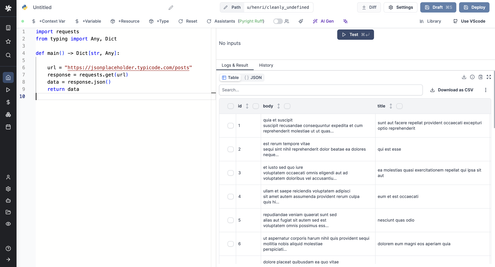

#### Force column order

As you can see in the example above, the columns are not properly ordered. You can force column order with [Table Row Object](#table-row-object).

For example, with columns ordered:

```py
from typing import List, Dict

def main() -> List[Dict[str, str]]:

    pokemon_data = [
        ["Pokemon name", "Type", "Main strength"],

        {"Pokemon name": "Pikachu", "Type": "Electric", "Main strength": "Speed"},
        {"Pokemon name": "Charizard", "Type": "Fire/Flying", "Main strength": "Attack"},
        {"Pokemon name": "Bulbasaur", "Type": "Grass/Poison", "Main strength": "Defense"},
        {"Pokemon name": "Squirtle", "Type": "Water", "Main strength": "Defense"},
        {"Pokemon name": "Jigglypuff", "Type": "Normal/Fairy", "Main strength": "HP"},
    ]

    return pokemon_data
```

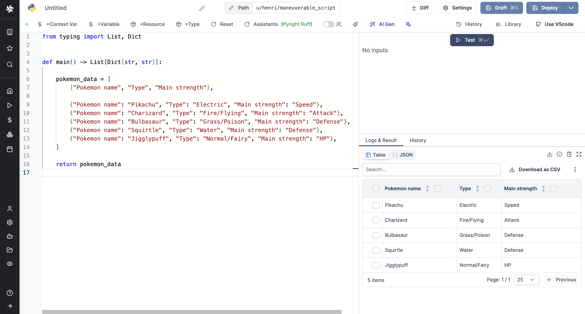

Additionaly, you can force column orders with a variable, for example `columns` in

```ts
export async function main(values: string[]) {
  let columns = ["column1","column2","column3"]
  return [columns, ...values]
}
```

Here is a more dense example:

```ts
export async function main(): Promise<Array<{ "Pokemon name": string, "Type": string, "Main strength": string } | string[]>> {
  const pokemonData = [
    { "Pokemon name": "Pikachu", "Type": "Electric", "Main strength": "Speed" },
    { "Pokemon name": "Charizard", "Type": "Fire/Flying", "Main strength": "Attack" },
    { "Pokemon name": "Bulbasaur", "Type": "Grass/Poison", "Main strength": "Defense" },
    { "Pokemon name": "Squirtle", "Type": "Water", "Main strength": "Defense" },
    { "Pokemon name": "Jigglypuff", "Type": "Normal/Fairy", "Main strength": "HP" }
  ];

  const columns: string[] = ["Pokemon name", "Main strength", "Type"];

  return [columns, ...pokemonData];
}
```

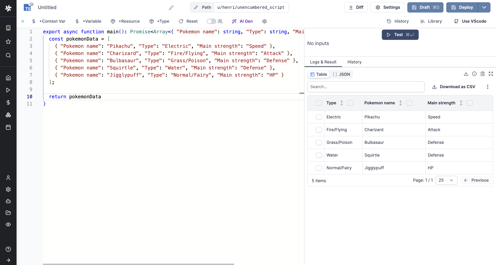

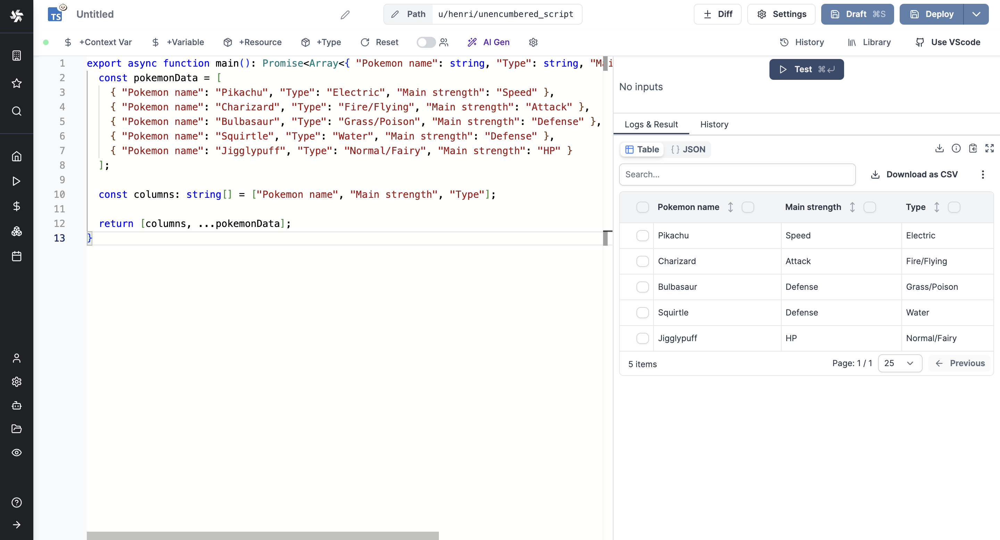

### Table column

The `table-col` key allows returning the value as a column-wise table.

If the result matches the table format, it will be displayed as a table even if the data is not nested under the key `table-col`.

```ts
return { "foo": [42, 8], "bar": [38, 12] }
```

or

```ts
return { "table-col": { "foo": [42, 8], "bar": [38, 12] } }
```


### Table row

The `table-row` key allows returning the value as a row-wise table.

If the result matches the table format, it will be displayed as a table even if the data is not nested under the key `table-row`.

```ts
return { [ [ "foo", "bar" ], [ 42, 38 ], [ 8, 12 ] ] }
```

or

```ts
return { "table-row": [ [ "foo", "bar" ], [ 42, 38 ], [ 8, 12 ] ] }
```

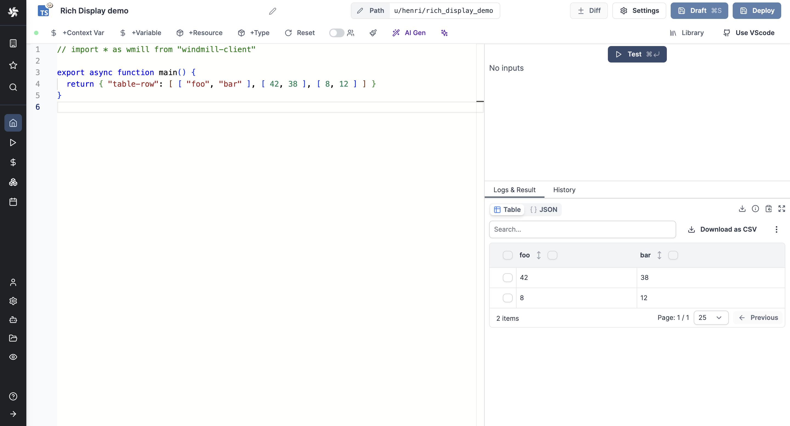

### Table row object

The `table-row-object` key allows returning the value as a row-wise table but where each row is an object (optionally the first row can be an array of strings to enforce column order).

If the result matches the table format, it will be displayed as a table even if the data is not nested under the key `table-row-object`.

List of columns is not mandatory but it allows [forcing their order](#force-column-order).

```ts
return [ { "foo": 42, "bar": 38 }, { "foo": 8, "bar": 12 } ]
```

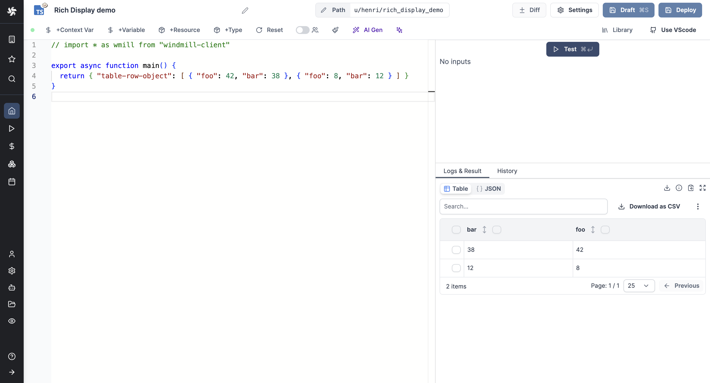

or

```ts
return [ ["foo", "bar" ], { "foo": 42, "bar": 38 }, { "foo": 8, "bar": 12 } ]
```

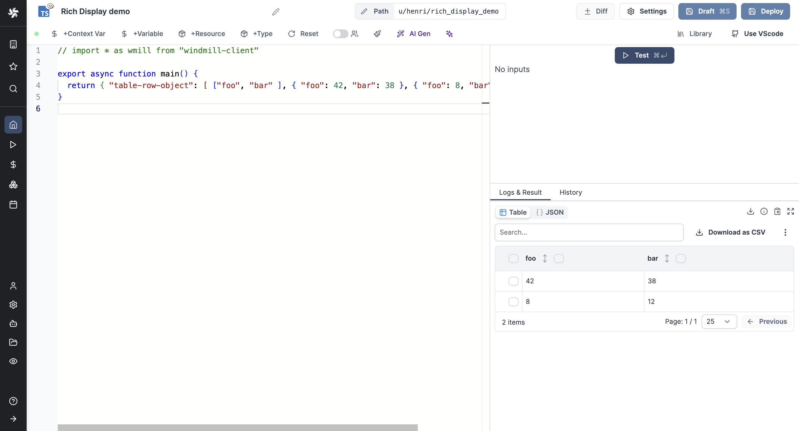

## S3

The `s3` key renders S3 files as a downloadable file and a bucket explorer, when Windmill is [connected to a S3 storage](../38_object_storage_in_windmill/index.mdx#workspace-object-storage).

```ts
return { "s3": "path/to/file" }
```

When a script outputs a S3 file, it can be downloaded or previewed directly in Windmill's UI (for displayable files like text files, CSVs, images, PDFs or parquet files).

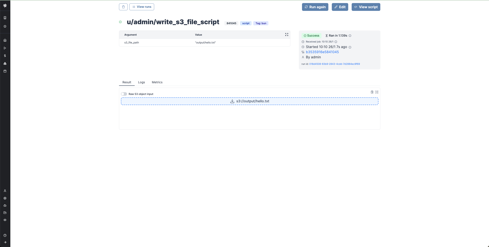

Even though the whole file is downloadable, the backend only sends the rows that the frontend needs for the preview. This means that you can manipulate objects of infinite size, and the backend will only return what is necessary.

You can even display several S3 files through an array of S3 objects:

```ts
export async function main() {
  return [{s3: "path/to/file_1"}, {s3: "path/to/file_2", {s3: "path/to/file_3"}}];
}
```


Learn more at:

<div className="grid grid-cols-2 gap-6 mb-4">
	<DocCard
		title="Workspace object storage"
		description="Connect your Windmill workspace to your S3 bucket, your Azure Blob storage or your GCS bucket to enable users to read and write from S3 without having to have access to the credentials."
		href="/docs/core_concepts/object_storage_in_windmill#workspace-object-storage"
	/>
</div>

## HTML

The `html` key allows returning the value as HTML.

```ts
return { "html": "<div>...</div>" }
```

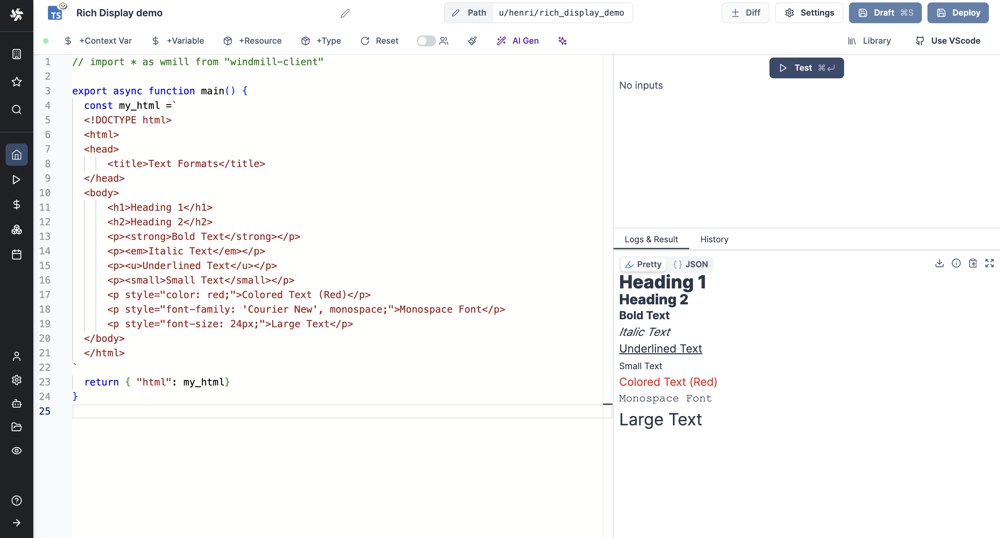

## Markdown

The `markdown` key allows returning the value as Markdown.

```ts
return { "markdown": "## Hello World\nNice to meet you" }
```

or

```ts
return { "md": "## Hello World\nNice to meet you" }
```

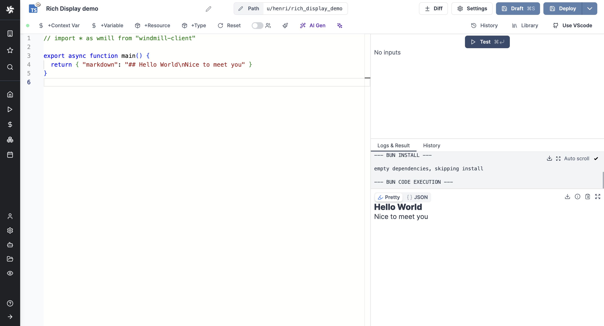

## File

The `file` key allows returning an option to download a file.

```ts
return { "file": { "content": encode(file), "filename": "data.txt" } }
```

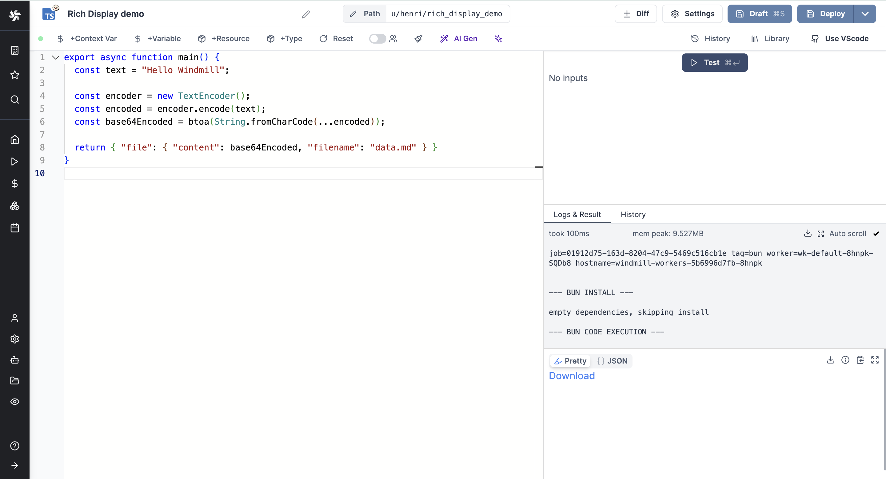

## PDF

The `pdf` key allows returning the value as a PDF.

The PDF must be encoded in base64.

```ts
return { "pdf": { "content": base64Pdf } }
```

or

```ts
return { "pdf": base64Pdf }
```


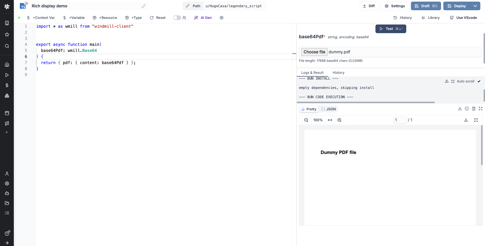

## PNG

The `png` key allows returning the value as a PNG image.

The picture must be encoded in base64.

```ts
return { "png": { "content": base64Image } }
```

or

```ts
return { "png": base64Image }
```


## JPEG

The `jpeg` key allows returning the value as a JPEG image.

The picture must be encoded in base64.

```ts
return { "jpeg": { "content": base64Image } }
```

or

```ts
return { "jpeg": base64Image }
```

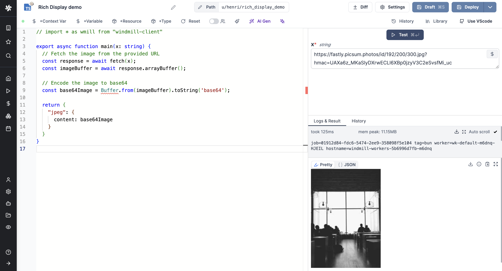

## GIF

The `gif` key allows returning the value as a GIF.

The gif must be encoded in base64.

```ts
return { "gif": { "content": base64Image } }
```

or

```ts
return { "gif": base64Image }
```
<video
	className="border-2 rounded-lg object-cover w-full h-full dark:border-gray-800"
	controls
	src="/videos/gif.mp4"
/>

## SVG

The `svg` key allows returning the value as an SVG image.

```ts
return { "svg": "<svg>...</svg>" }
```

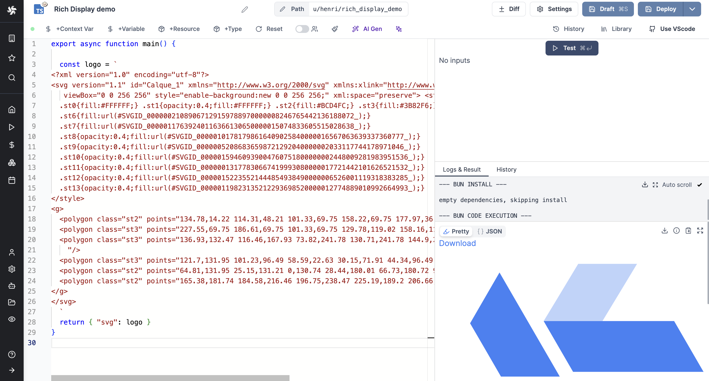


## Error

The `error` key allows returning the value as an error message.

```ts
return { "error": { "name": "418", "message": "I'm a teapot", "stack": "Error: I'm a teapot" }}
```

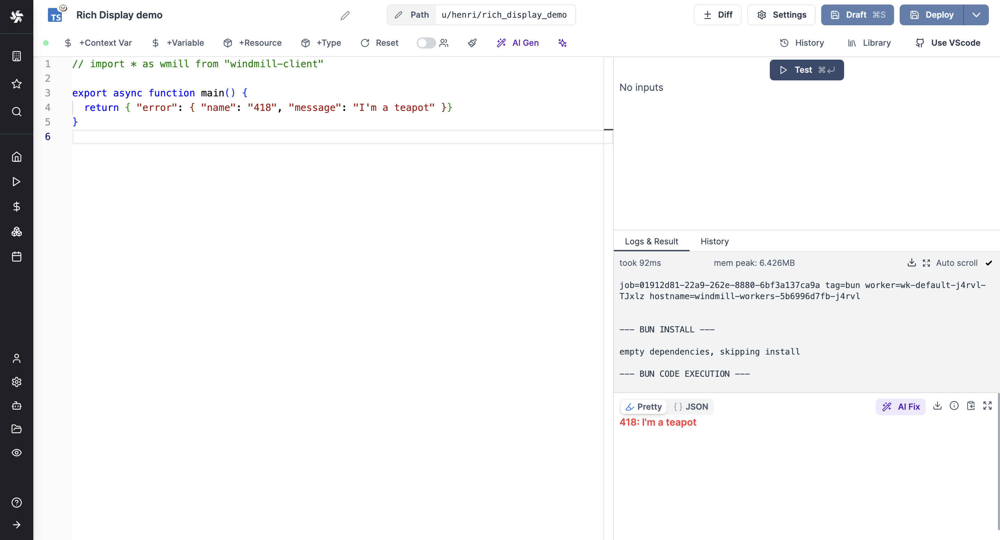

## Resume

The `resume` key allows returning an [approval](../../flows/11_flow_approval.mdx) and buttons to Resume or Cancel the step.

```ts
return { "resume": "https://example.com", "cancel": "https://example.com", "approvalPage": "https://example.com" }
```

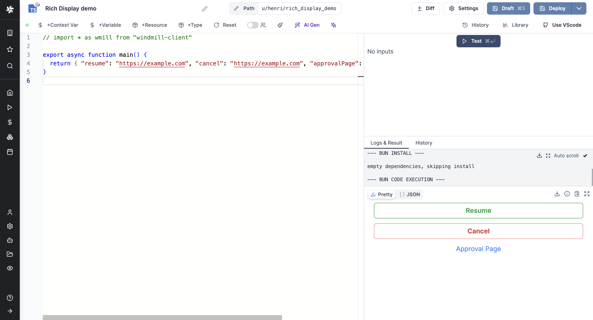

## Map

The `map` key allows returning a map with a given location.

```ts
return { "map": { lat: 40, lon: 0, zoom: 3, markers: [{lat: 50.6, lon: 3.1, title: "Home", radius: 5, color: "yellow", strokeWidth: 3, strokeColor: "Black"}]}}
```
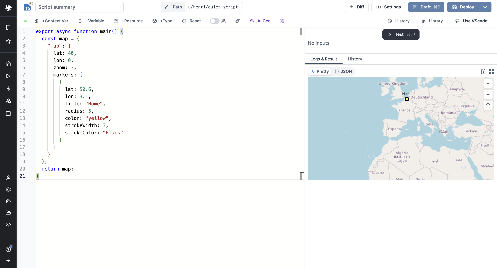

## Render all

The `render_all` key allows returning all results with their specific format.

```ts
return { "render_all": [ { "json": { "a": 1 } }, { "table-col": { "foo": [42, 8], "bar": [38, 12] }} ] }
```
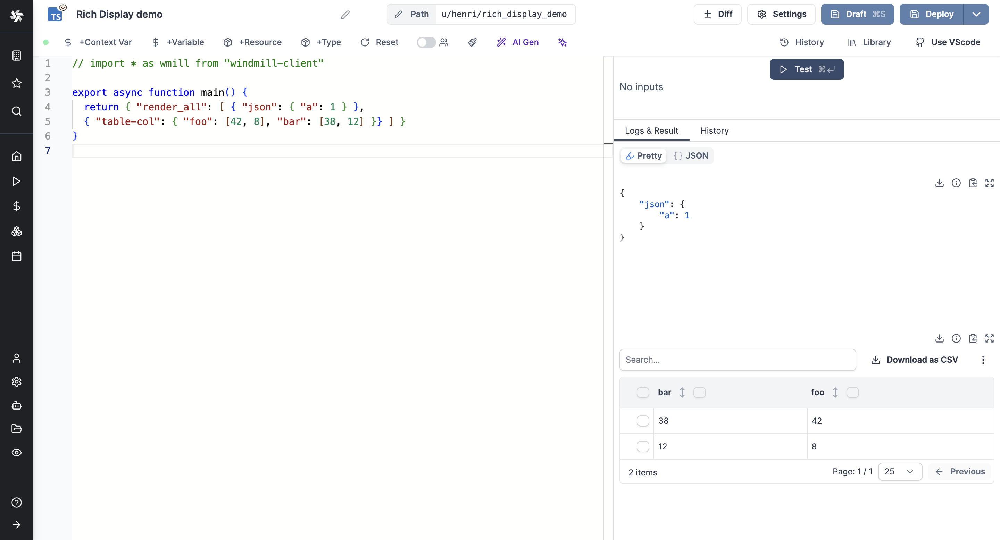