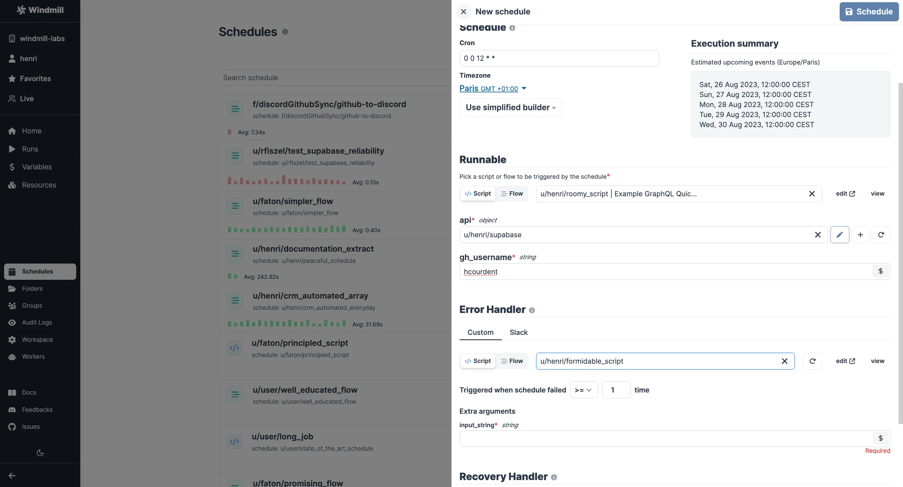

import DocCard from '@site/src/components/DocCard';

# Schedules

Windmill provides the same set of features as CRON, but with a user interface and control panels. It allows you to define Schedules for Scripts and Flows. Once a schedule is defined, the script will automatically run at the set frequency. Think of it as an easy-to-use scheduler similar to CRON that you can share with other users.

A Schedule consists of a Script or Flow, its arguments, a CRON expression that controls the execution frequency and optional Error and Recovery Handlers to deal with failed scheduled executions.

<video
	className="border-2 rounded-lg object-cover w-full h-full dark:border-gray-800"
	autoPlay
	controls
	id="main-video"
	src="/videos/schedule-cron-menu.mp4"
/>

 

Cron is a powerful and versatile tool that enables users to automate tasks by scheduling them to run at specific intervals or times. From automating routine system maintenance to sending periodic email reports, cron plays an indispensable role in streamlining processes and improving productivity for developers, system administrators, and even casual users.

However, as with any powerful tool, using outside Windmill cron comes with its own set of challenges and potential issues. Common problems associated with the use of cron include:

- **Runs History**: to maintain a record of script runs and log outputs through cron, you must manually incorporate that logic.
- **Error handling**: in the event of a failed run, self-crafted logic is required for notifications (Slack, emails).
- **Manual Runs**: executing a cron job manually, outside of its schedule, proves difficult and can lead to inconsistencies due to potential environment differences.
- **No UI**: navigating cron jobs is challenging without a centralized hub, particularly for larger engineering teams. This comes with induced issues: 1. **Handling permissions and Errors** among users and editors and 2. **Server downtime**: when the server hosting the job experiences downtime, monitoring and alerting is problematic.

Windmill addresses these issues with schedules that can be defined with pre-set configuration for scripts and flows.

:::info A bit of Context: How Windmill Works

[Windmill](../../intro.mdx) is an open-source developer platform and infra to build all internal tools through code, such as UIs and workflows based on simple scripts (TypeScript, Python, Go, PHP, Bash, SQL and Rust).

 

Managing scripts, flows and apps on Windmill works at the [workspace](../16_roles_and_permissions/index.mdx#workspace)-level. Admins invite developers and operators to the workspace where are hosted workflows. The first two can write and edit flows as well as managing permissions, executions etc.

 

Cron jobs are one of many ways to [trigger workflows](../../getting_started/9_trigger_flows/index.mdx) in Windmill (among [webhooks](../4_webhooks/index.mdx), [auto-generated UIs](../6_auto_generated_uis/index.mdx), [customized UIs][apps], [Command-line interface](../../advanced/3_cli/index.mdx), [Slackbots](/blog/handler-slack-commands) etc.)

:::

## Configure schedules for each task ([Script][scripts], [Workflows][flows])

From your workspace, navigate to the dedicated `Schedules` menu and select `New Schedule`.

1. Configure the **schedule frequency** using cron syntax, the simplified builder or a prompt with [Windmill AI](../22_ai_generation/index.mdx).

2. Select a **runnable** ([script][scripts] or [flow][flows]) from your workspace.

3. Fill in the **arguments** that will be used for the automation. The arguments are the ones of the given script or flow. If you want your arguments to be dynamic, you might want to use a [workflow][flows].

4. Optional: Add an [Error handler](#schedule-error-handler).

5. Optional: Add a [Recovery Handler](#schedule-recovery-handler).

Note that modifying a script or flow that was previously scheduled will not un-schedule it and the said script or flow will run on its modified version after [deployment](../0_draft_and_deploy/index.mdx).

Click the `Schedule` button and you're good to go! The schedule will be automatically 'Enabled'. Toggle it off if needed.

:::tip Handle Several Schedules for the Same Workflow

The previous configuration can be replicated multiple times for the same workflow and therefore several schedules can work in parallel.

:::

If the Schedules menu allows you to control future executions of scripts and workflows, you can check all past and future runs clicking on `Runs`. This will lead you to the [Runs menu](../../core_concepts/5_monitor_past_and_future_runs/index.mdx), with a filtered view on your runnable.

... where you can get details on each run:

## Configure schedules from flow editor

The same method can also be done from the [flow editor](../../getting_started/6_flows_quickstart/index.mdx).

<video
	className="border-2 rounded-lg object-cover w-full h-full dark:border-gray-800"
	controls
	src="/videos/schedule-cron.mp4"
/>

 

From your workspace, pick the workflow you want to schedule.

Go to the `Schedule` menu ...

and either schedule in [cron](https://crontab.guru) or in Basic mode that will automatically be translated in cron. Once it's done, you can see in next picture that the cron expression is now visible on the toolbar.

Fill in the inputs, toggle the Schedule Enabled option, save, and you're all set!

## Schedule app reports

Send a PDF or PNG preview of any [app](../../apps/0_app_editor/index.mdx) at a given schedule.

<iframe
	style={{ aspectRatio: '16/9' }}
	src="https://www.youtube.com/embed/4VSAZ-WTh4Y"
	title="Scheduled App Reports Tutorial"
	frameBorder="0"
	allow="accelerometer; autoplay; clipboard-write; encrypted-media; gyroscope; picture-in-picture; web-share"
	allowFullScreen
	className="border-2 rounded-lg object-cover w-full dark:border-gray-800"
></iframe>

 

More at:

	<DocCard
		title="Schedule app reports"
		description="Send a PDF or PNG preview of any app at a given schedule."
		href="/docs/apps/schedule_reports"
		color="orange"
	/>

## Cron syntax

Windmill uses [zslayton's cron expression parser](https://github.com/zslayton/cron). This library differs slightly from the Unix library.

Although the syntaxes are similar, there are some notable differences:

| Feature                   | Unix cron               | zslayton's `cron` library                        |
|---------------------------|-------------------------|--------------------------------------------|
| **Day of Week Index**        | Sunday = 0 through Saturday = 6 | Shifted by one (Sunday = 1 through Saturday = 7, 0 = Sunday) |
| **Seconds Field**         | Not included            | Included as the first field                |
| **Year Field**            | Not included            | Optional, can specify specific years       |
| **Month Representation**  | Numeric and short names | Numeric, short names, and name ranges      |
| **List and Range in Fields** | Supports lists and ranges | Supports lists, ranges, and combinations |
| **Step Values**           | Supported (e.g., `*/2`) | Supported, including complex patterns like `2018/2` |

Anyway, the simplified builder and [Windmill AI](../22_ai_generation/index.mdx) will help you to create the cron expression.

## Control permissions and errors

### Schedule error handler

From the schedule configuration, add a special script or flow to execute in case of an error.

For example, this can be a script that sends an error notification to [Slack](https://hub.windmill.dev/scripts/slack/1284/) or [Discord](https://hub.windmill.dev/scripts/discord/1292/).

You can pick the Slack pre-set schedule error handler.

<video
	className="border-2 rounded-lg object-cover w-full h-full dark:border-gray-800"
	controls
	src="/videos/schedule_error_handler.mp4"
/>

 

Schedule Error hander is an [Enterprise Edition](/pricing) feature.

### Schedule recovery handler

From the schedule configuration, add a special script or flow to execute in case of of recovery from Error.

You can pick the Slack pre-set schedule recovery handler.

### Be notified every time a scheduled workflow has been executed

For scheduled flows, add a simple step to be notified about the execution of the scheduled flow.

In this example I chose to [receive an email](https://hub.windmill.dev/scripts/gmail/1291/), but you can use other notification methods like [Slack](https://hub.windmill.dev/scripts/slack/1284/), [Discord](https://hub.windmill.dev/scripts/discord/1292/) or any other other method your imagination and API calls can create.

 

Configure the email.

 

And watch your mailbox.

 

Given how [flows][flows] work on Windmill, it means that once the previous step has been successful, the Email step will trigger.

:::tip Error handler

If you want to handle failure and receive another message in that case, add an [Error handler](../../flows/7_flow_error_handler.md) to your workflow that will let you know if a failure happened at any step.

:::

### Manage permissions from the workflow

From the settings menu, change the owner to a [folder](../../core_concepts/8_groups_and_folders/index.mdx#folders) (group of people) to manage view and editing rights.

 

The process is very simple but it will allow you to schedule tasks with confidence and get an aggregated view on them.

Not only can you build scheduled jobs [from Windmill](../../getting_started/00_how_to_use_windmill/index.mdx) but also you can import all your existing scripts - as Windmill supports TypeScript, Python, Go, PHP, Bash or SQL - [as did one of our esteemed users](/blog/stantt-case-study) for their own scheduled [jobs](../20_jobs/index.mdx).

### Failure to re-schedule

If a scheduled job fails to re-schedule, it will trigger a [workspace error handler](../10_error_handling/index.mdx#workspace-error-handler).

## Schedule to run later

From a script or flow's page (after being [deployed](../0_draft_and_deploy/index.mdx)), you can "Schedule to run later" to schedule the execution to a given time without being recurring, therefore executing only once.

Go the the script or flow's page, click on the `Advanced` button, fill in the date and time, choose to "Override Worker group tag", or pick a specific [worker group tag](../9_worker_groups/index.mdx#set-tags-to-assign-specific-queues), and click on `Run`.

<!-- Resources -->

[flows]: ../../getting_started/6_flows_quickstart/index.mdx
[scripts]: ../../getting_started/0_scripts_quickstart/index.mdx
[apps]: ../../getting_started/7_apps_quickstart/index.mdx