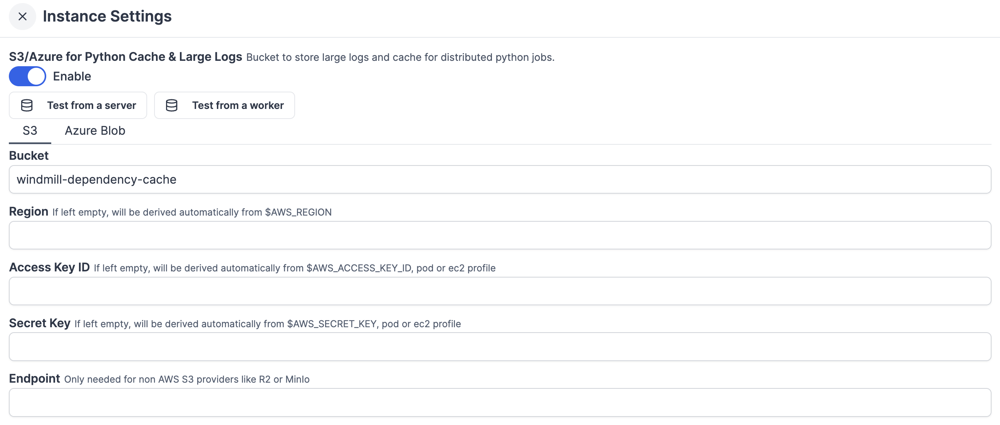

import DocCard from '@site/src/components/DocCard';

import Tabs from '@theme/Tabs';
import TabItem from '@theme/TabItem';

# Jobs

A job represents a past, present or future "task" or "work" to be executed by a
[worker](../9_worker_groups/index.mdx). Future jobs or jobs waiting for a worker are called "queued
jobs", and are ordered by the time at which they were scheduled for
(`scheduled_for`). Jobs that are created without being given a future
`scheduled_for` are [scheduled](../1_scheduling/index.mdx) for the time at which they were created.

[Workers](../9_worker_groups/index.mdx) fetch jobs from the queue, start executing them, atomically
set their state in the queue to "running", stream the logs while executing them,
then once completed remove them from the queue and create a new "completed job".

Every job has a unique UUID attached to it and as long as you have visibility
over the execution of the script, you are able to inspect the execution logs,
output and metadata in the dedicated details page of the job.

<div className="grid grid-cols-2 gap-6 mb-4">
	<DocCard
		title="Workers and worker groups"
		description="Worker Groups allow users to run scripts and flows on different machines with varying specifications."
		href="/docs/core_concepts/worker_groups"
	/>
	<DocCard
		title="Dedicated workers / High throughput"
		description="Dedicated Workers are workers that are dedicated to a particular script."
		href="/docs/core_concepts/dedicated_workers"
	/>
	<DocCard
		title="Worker groups management UI"
		description="On Enterpris Edition, worker groups can be managed through Windmill UI."
		href="/docs/misc/worker_group_management_ui"
	/>
	<DocCard
		title="Init scripts"
		description="Init scripts are executed at the beginning when the worker starts."
		href="/docs/advanced/preinstall_binaries#init-scripts"
	/>
</div>

## Job kinds

There are 5 main kinds of jobs, that each have a dedicated tab in the [runs page](../5_monitor_past_and_future_runs/index.mdx):

- **Script jobs**: Run a script as defined by the hash of the script (that
  uniquely and immutably defines a specific version of a script), its input
  arguments (args) and the `permissioned_as` user or group of whom it is going to
  act on behalf of and inherit the visibility to other items such as resources
  and variables from. An user can **NEVER** escalates his privileges but only
  de-escalates it by launching a script with either the same permissions as
  himself or a subset of it (by giving the permissions of a group that he is
  member of).

- **Preview jobs**: similar to script jobs but instead of hash, they contain the
  whole raw code they will run. Those are the jobs that are launched from the
  script editors. Even when code is executed as a preview, you keep a trace of
  its execution.

- **Dependencies jobs**: Scripts written in Python generate a lockfile when
  they are saved/created. This lockfile ensures that an execution of the same
  hash will always use the same versions. The process of generating this
  lockfile is also a job in itself so you can easily inspect the issues
  generating the lockfile if any. See
  [Dependency Management](../../advanced/6_imports/index.mdx) for more information.

- **Flow jobs**: A flow job is the "meta" job that orchestrates the execution of
  every step. The execution of the steps are in-themselves jobs. It is defined
  similarly to a script job but instead of being defined by a path to a script,
  it is defined by a path to the flow.

- **Preview flow jobs**: A preview flow is a job that contains the raw json
  definition of the flow instead of merely a path to it. It is the underlying
  job for the preview of flows in the flow editor interface.

## Run jobs on behalf of

The `permissioned_as` value from script and preview jobs is the most important
concept to grasp to understand what makes Windmill's security and permission
model consistent, predictable and safe. `permissioned_as` is distinct from the
`created_by` value, even though in the vast majority of jobs, they will be the
same. It represents the level of permissions this job will execute with. As a
direct consequence, the variables (including secrets) that are accessible to the
scripts are only those whom the user or group has visibility on, given his
[permissions](../16_roles_and_permissions/index.mdx).

Similarly for the [contextual variable](../47_environment_variables/index.mdx#contextual-variables) `WM_TOKEN` which
contains an ephemeral token (ephemeral to the script execution), which has the
same privilege and permissions as the owner in `permissioned_as`. The
[Python client](../../advanced/2_clients/python_client.md) inside the script implicitly uses that same
token to be granted privilege to do Windmill operations (like running other
scripts or getting resources), meaning that the same script ran by 2 different
users, will run differently and may be unauthorized to do partially or all
operations of the script. This is what enables anyone to share scripts doing
sensitive operations safely as long as the resources and secrets that the script
relies on are permissioned correctly.

A user can only run a script permissioned as either himself, one of the group
that he is a member of.

## Job inputs and script parameters

Jobs take a JSON object as input which can be empty. That input is passed as the payload of the POST request that triggers the Script. The different key-value pairs of the objects are passed as the different parameters of the main function, with just a few language-specific transformations to more adequate types in the target language, if necessary (e.g base64/datetime encoding). Values can be nested JSON objects themselves, but we recommend trying to keep the input flat when possible.

If the payload contains keys that are not defined as parameters in the main function, they will be ignored. This allows you to handle arbitrary JSON payloads, as you can choose which keys to define as parameters in your script and process the data accordingly.

## Result

Jobs have as result the return of the main function serialized as a json object. We highly recommend to return small objects as they will be stored directly in the Database. For larger objects, use [Object Storage](../38_object_storage_in_windmill/index.mdx).

### Result of jobs that failed

If the jobs fail, it will have result an error object of the following shape:

```
{
	"error": {
		"name": "ErrorName",
		"message": "Error message",
		"stack": "full stack"
	}
}
```

In python and typescript, and similarly for all languages, this is constructed by extracting those information from the native Exception and Error objects that are raised by the code.

### Result streaming

In Python and TypeScript (bun, nativets, deno), it's possible to stream back the result as a text stream (any `AsyncGenerator<string>` or `iter` compatible object) as a result OR to stream text before the result is fully returned.
If not returning the stream directly, we introduce 2 new functions on our SDK: `wmill.streamResult(stream)` (TS) and `wmill.stream_result(stream)` (Python), to do it prior to the return.

The stream only exists while the job is in the queue. Afterwards, the full stream becomes the result (or added as the field "wm_stream" if there is already a result).

You can run a job and get an SSE stream of the result using the [SSE stream webhooks](../4_webhooks/index.mdx#sse-stream-webhooks).

#### Returning a stream directly

<Tabs className="unique-tabs">
<TabItem value="bun" label="TypeScript" attributes={{className: "text-xs p-4 !mt-0 !ml-0"}}>

```typescript
// can work with //native and recommended

async function* streamWeatherReport(): AsyncGenerator<string> {
	const reportLines = [
		'📍 Current Weather Report\n',
		'Location: San Francisco, CA\n\n',
		'🌤️ Conditions: Partly Cloudy\n',
		'🌡️ Temperature: 72°F (22°C)\n',
		'💨 Wind: 8 mph SW\n',
		'💧 Humidity: 65%\n',
		'👁️ Visibility: 10 miles\n\n',
		"📊 Today's Forecast:\n",
		'Morning: Sunny, 68°F\n',
		'Afternoon: Partly cloudy, 75°F\n',
		'Evening: Clear skies, 70°F\n',
		'Night: Cool and clear, 62°F\n\n',
		'🔮 Tomorrow: Sunny with highs near 78°F\n',
		'Perfect weather for outdoor activities! ☀️\n'
	];

	for (const line of reportLines) {
		yield line;
		// Sleep between 200-500ms for natural reading pace
		await new Promise((resolve) => setTimeout(resolve, 200 + Math.random() * 300));
	}
}

export async function main(x: string) {
	return streamWeatherReport();
}
```

</TabItem>
<TabItem value="python" label="Python" attributes={{className: "text-xs p-4 !mt-0 !ml-0"}}>

```python

import time
from typing import AsyncGenerator

def stream_weather_report():
    report_lines = [
        "📍 Current Weather Report\n",
        "Location: San Francisco, CA\n\n",
        "🌤️ Conditions: Partly Cloudy\n",
        "🌡️ Temperature: 72°F (22°C)\n",
        "💨 Wind: 8 mph SW\n",
        "💧 Humidity: 65%\n",
        "👁️ Visibility: 10 miles\n\n",
        "📊 Today's Forecast:\n",
        "Morning: Sunny, 68°F\n",
        "Afternoon: Partly cloudy, 75°F\n",
        "Evening: Clear skies, 70°F\n",
        "Night: Cool and clear, 62°F\n\n",
        "🔮 Tomorrow: Sunny with highs near 78°F\n",
        "Perfect weather for outdoor activities! ☀️\n"
    ]

    for line in report_lines:
        yield line
        # Sleep 0.2s for reading peace
        time.sleep(0.2)

def main() -> AsyncGenerator[str, None]:
    return stream_weather_report()
```

</TabItem>
</Tabs>

#### Proxy the stream before returning the result

<Tabs className="unique-tabs">
<TabItem value="bun" label="TypeScript" attributes={{className: "text-xs p-4 !mt-0 !ml-0"}}>

```typescript
// similar as above

export async function main(x: string) {
	await wmill.streamResult(streamWeatherReport());
	return { foo: 42 };
}
```

</TabItem>
<TabItem value="python" label="Python" attributes={{className: "text-xs p-4 !mt-0 !ml-0"}}>

```python
# similar as above

def main() -> AsyncGenerator[str, None]:
    wmill.stream_result(stream_weather_report())
    return { "foo": 42}
```

</TabItem>
</Tabs>

## Retention policy

The retention policy for jobs runs details varies depending on your team's [plan](/pricing):

- Community plan (cloud): Jobs runs details are retained for 60 days.
- Team plan (cloud): Jobs runs details are retained for 60 days.
- Enterprise plan (cloud): Unlimited retention period.
- Open Source (self-host): Jobs runs details are retained for maximum 30 days.
- Enterprise plan (self-host): Unlimited retention period.

You can set a custom retention period for the jobs runs details. The retention period can be configured in the [instance settings](../../advanced/18_instance_settings/index.mdx#retention-period-in-secs), in the "Core" tab.


<div className="grid grid-cols-2 gap-6 mb-4">
	<DocCard
		title="Plans & How to Upgrade"
		description="Details on each Windmill Plan"
		href="/pricing"
	/>
</div>

## Job Progress Stream API

This section is relevant if you want to use the API of Windmill to build your own client or frontend that watch the progress of a job, retrieve its new logs, result stream and get the job at completion with its result and all job metadata.

Windmill provides an [SSE endpoint](https://developer.mozilla.org/en-US/docs/Web/API/Server-sent_events/Using_server-sent_events) to watch a given job for new logs or completion. The API endpoint is [api/job/get/w/\{workspace\}/jobs_u/getupdate_sse/\{id\}](https://app.windmill.dev/openapi.html#tag/job/get/w/{workspace}/jobs_u/getupdate_sse/{id})

It takes as query args:

### Job progress SSE Query args

```
running (optional boolean, default false): was the job already running ? Optimization for the backend to not waste time checking if the job is running if we know it's already the case
log_offset (optional integer, default 0): what was the last log offset known by the client to start from when streaming new logs
stream_offset (optional integer, default 0): what was the last log offset known by the client to start from when streaming the result stream
get_progress (optional integer, default false): should the updates contains [explicit job progress](/docs/advanced//19_explicit_progress/index.mdx)
only_result (optional integer, default false): should we only care about the result and ignore all else
no_logs (optionbal boolean, default false): should we skip streaming logs
```

### Job Progress event response

The response from the SSE endpoint is a stream of JSON objects, each with a `type` field indicating the kind of event. The possible shapes are:

- **Update**

  The updates will only contain new updates since the last one, no update will be sent if there are no updates to share, otherwise the maximum frequency at which updates are sent is every 100ms.

  with only_result = false (default):
  ```json
  {
    "type": "update",
    "running": true,                // optional, boolean: whether the job is running
    "completed": false,             // optional, boolean: whether the job is completed
    "new_logs": "string",           // optional, string: new logs since last update
    "new_result_stream": "string",  // optional, string: new result stream data since last update
    "log_offset": 123,              // optional, integer: current log offset
    "stream_offset": 456,           // optional, integer: current result stream offset
    "mem_peak": 789,                // optional, integer: peak memory usage
    "progress": 50,                 // optional, integer: explicit job progress (0-100)
    "flow_status": {...},           // optional, JSON: status of the flow (raw JSON)
    "workflow_as_code_status": {...}, // optional, JSON: status of workflow as code (raw JSON)
    "job": {...},                   // optional, JSON: job metadata
  }

Once completed, the job field will contain the full completed job data, including its result but not only


- **workspace_id** (string): The unique identifier of the workspace where the job was run.
- **id** (UUID): The unique identifier of the job.
- **parent_job** (UUID, optional): The ID of the parent job, if this job was triggered by another job.
- **created_by** (string): The user who created the job.
- **created_at** (datetime): The timestamp when the job was created.
- **started_at** (datetime, optional): The timestamp when the job started running.
- **duration_ms** (integer): The duration of the job in milliseconds.
- **success** (boolean): Whether the job completed successfully.
- **script_hash** (string, optional): The hash of the script that was executed.
- **script_path** (string, optional): The path to the script that was executed.
- **args** (object, optional): The arguments passed to the job, as a JSON object.
- **result** (object, optional): The result of the job, as a JSON object.
- **result_columns** (array of strings, optional): The columns of the result, if applicable.
- **logs** (string, optional): The logs generated by the job.
- **deleted** (boolean): Whether the job has been deleted.
- **canceled** (boolean): Whether the job was canceled.
- **canceled_by** (string, optional): The user who canceled the job, if applicable.
- **canceled_reason** (string, optional): The reason the job was canceled, if provided.
- **job_kind** (enum): The kind of job (e.g., script, flow, etc.).
- **schedule_path** (string, optional): The path of the schedule that triggered the job, if any.
- **permissioned_as** (string): The permission context under which the job ran.
- **flow_status** (object, optional): The status of the flow, as a JSON object.
- **workflow_as_code_status** (object, optional): The status of the workflow as code, as a JSON object.
- **is_flow_step** (boolean): Whether this job is a step in a flow.
- **language** (enum, optional): The language of the script executed.
- **is_skipped** (boolean): Whether this job was skipped.
- **email** (string): The email of the user who created the job.
- **visible_to_owner** (boolean): Whether the job is visible to the owner.
- **mem_peak** (integer, optional): The peak memory usage during the job.
- **tag** (string): The tag associated with the job.
- **priority** (integer, optional): The priority of the job.
- **labels** (object, optional): Arbitrary labels associated with the job, as a JSON object.


This structure provides a comprehensive record of a completed job, including its metadata, execution details, results, and status.

with only_result = true, the updates are much lighter.

```json
{
  "type": "update",
  "running": true,                // optional, boolean: whether the job is running
  "completed": false,             // optional, boolean: whether the job is completed
  "new_result_stream": "string",  // optional, string: new result stream data since last update
  "stream_offset": 456,           // optional, integer: current result stream offset
  "only_result": {...}            // optional, JSON: only the result, only
}
```

- **Error**

  ```json
  {
  	"type": "error",
  	"0": "Error message as string"
  }
  ```

- **NotFound**

  ```json
  {
  	"type": "notfound"
  }
  ```

- **Timeout**

  ```json
  {
  	"type": "timeout"
  }
  ```

- **Ping**
  ```json
  {
  	"type": "ping"
  }
  ```

**Notes:**

- All fields except `type` are optional and may be omitted if not relevant for the event.
- The `update` event contains job status, logs, result stream, and progress information.
- The `error` event contains a string error message.
- The `notfound`, `timeout`, and `ping` events are signals with no additional data.


## High priority jobs

High priority jobs are jobs that are given a `priority` value between 1 and 100. Jobs with a higher priority value will be given precedence over jobs with a lower priority value in the job queue.

## Large job logs management

To optimize log storage and performance, Windmill leverages S3 for log management. This approach minimizes database load by treating the database as a temporary buffer for up to 5000 characters of logs per job.

For jobs with extensive logging needs, Windmill [Enterprise Edition](/pricing) users benefit from seamless log streaming to S3. This ensures logs, regardless of size, are stored efficiently without overwhelming local resources.

This allows the handling of large-scale logs with minimal database impact, supporting more efficient and scalable workflows.

For large logs storage (and display) and cache for distributed Python jobs, you can [connect your instance to a bucket](../38_object_storage_in_windmill/index.mdx#instance-object-storage) from the [instance settings](../../advanced/18_instance_settings/index.mdx#instance-object-storage).



This feature has no overlap with the [Workspace object storage](../38_object_storage_in_windmill/index.mdx#workspace-object-storage).

You can choose to use S3, Azure Blob Storage, AWS OIDC or Google Cloud Storage. For each you will find a button to test settings from a server or from a worker.

<div className="grid grid-cols-2 gap-6 mb-4">
	<DocCard
		title="Instance object storage"
		description="Connect instance to S3 for large-scale log management and distributed dependency caching."
		href="/docs/core_concepts/object_storage_in_windmill"
	/>
</div>

### S3

| Name         | Type       | Description                                                                   |
| ------------ | ---------- | ----------------------------------------------------------------------------- |
| Bucket       | string     | Name of your S3 bucket.                                                       |
| Region       | string     | If left empty, will be derived automatically from $AWS_REGION.   			    |
| Access key ID       | string     | If left empty, will be derived automatically from $AWS_ACCESS_KEY_ID, pod or ec2 profile.   	    |
| Secret key       | string     | If left empty, will be derived automatically from $AWS_SECRET_KEY, pod or ec2 profile.   	    |
| Endpoint       | string     | Only needed for non AWS S3 providers like R2 or MinIo.   	    |
| Allow http       | boolean     | Disable if using https only policy.   	    |

### Azure Blob

| Name           | Type       | Description                                                                   |
| -------------- | ---------- | ----------------------------------------------------------------------------- |
| Account name   | string     | The name of your Azure Storage account. It uniquely identifies your Azure Storage account within Azure and is required to authenticate with Azure Blob Storage. |
| Container name | string     | The name of the specific blob container within your storage account. Blob containers are used to organize blobs, similar to a directory structure. |
| Access key     | string     | The primary or secondary access key for the storage account. This key is used to authenticate and provide access to Azure Blob Storage. |
| Tenant ID      | string     | (optional) The unique identifier (GUID) for your Azure Active Directory (AAD) tenant. Required if using Azure Active Directory for authentication. |
| Client ID      | string     | (optional) The unique identifier (GUID) for your application registered in Azure AD. Required if using service principal authentication via Azure AD. |
| Endpoint       | string     | (optional) The specific endpoint for Azure Blob Storage, typically used when interacting with non-Azure Blob providers like Azurite or other emulators. For Azure Blob Storage, this is auto-generated and not usually needed. |

#### Google Cloud Storage

| Field | Description |
|-------|-------------|
| Bucket | The name of your Google Cloud Storage bucket |
| Service Account Key | The service account key for your Google Cloud Storage bucket in JSON format |
