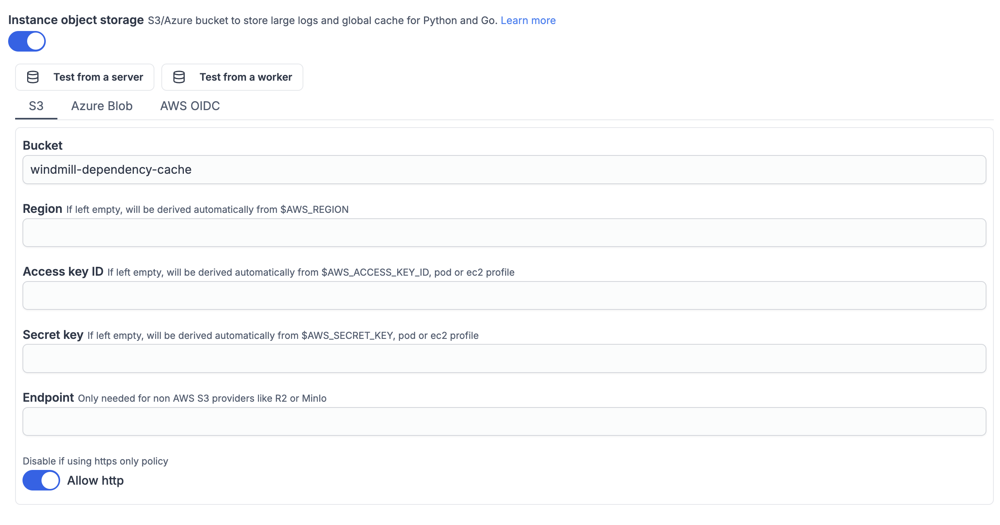

import DocCard from '@site/src/components/DocCard';

# Jobs

A job represents a past, present or future "task" or "work" to be executed by a
[worker](../9_worker_groups/index.mdx). Future jobs or jobs waiting for a worker are called "queued
jobs", and are ordered by the time at which they were scheduled for
(`scheduled_for`). Jobs that are created without being given a future
`scheduled_for` are [scheduled](../1_scheduling/index.mdx) for the time at which they were created.

[Workers](../9_worker_groups/index.mdx) fetch jobs from the queue, start executing them, atomically
set their state in the queue to "running", stream the logs while executing them,
then once completed remove them from the queue and create a new "completed job".

Every job has a unique UUID attached to it and as long as you have visibility
over the execution of the script, you are able to inspect the execution logs,
output and metadata in the dedicated details page of the job.

	<DocCard
		title="Workers and Worker Groups"
		description="Worker Groups allow users to run scripts and flows on different machines with varying specifications."
		href="/docs/core_concepts/worker_groups"
	/>
	<DocCard
		title="Dedicated Workers / High Throughput"
		description="Dedicated Workers are workers that are dedicated to a particular script."
		href="/docs/core_concepts/dedicated_workers"
	/>
	<DocCard
		title="Worker Groups Management UI"
		description="On Enterpris Edition, worker groups can be managed through Windmill UI."
		href="/docs/misc/worker_group_management_ui"
	/>
	<DocCard
		title="Init Scripts"
		description="Init Scripts are executed at the beginning when the worker starts."
		href="/docs/advanced/preinstall_binaries#init-scripts"
	/>

## Job kinds

There are 5 main kinds of jobs, that each have a dedicated tab in the [runs page](../5_monitor_past_and_future_runs/index.mdx):

- **Script Jobs**: Run a script as defined by the hash of the script (that
  uniquely and immutably defines a specific version of a script), its input
  arguments (args) and the `permissioned_as` user or group of whom it is going to
  act on behalf of and inherit the visibility to other items such as resources
  and variables from. An user can **NEVER** escalates his privileges but only
  de-escalates it by launching a script with either the same permissions as
  himself or a subset of it (by giving the permissions of a group that he is
  member of).

- **Preview Jobs**: similar to script jobs but instead of hash, they contain the
  whole raw code they will run. Those are the jobs that are launched from the
  script editors. Even when code is executed as a preview, you keep a trace of
  its execution.

- **Dependencies Jobs**: Scripts written in Python generate a lockfile when
  they are saved/created. This lockfile ensures that an execution of the same
  hash will always use the same versions. The process of generating this
  lockfile is also a job in itself so you can easily inspect the issues
  generating the lockfile if any. See
  [Dependency Management](../../advanced/6_imports/index.mdx) for more information.

- **Flow Jobs**: A flow job is the "meta" job that orchestrates the execution of
  every step. The execution of the steps are in-themselves jobs. It is defined
  similarly to a script job but instead of being defined by a path to a script,
  it is defined by a path to the flow.

- **Preview Flow Jobs**: A preview flow is a job that contains the raw json
  definition of the flow instead of merely a path to it. It is the underlying
  job for the preview of flows in the flow editor interface.

## Run jobs on behalf of

The `permissioned_as` value from script and preview jobs is the most important
concept to grasp to understand what makes Windmill's security and permission
model consistent, predictable and safe. `permissioned_as` is distinct from the
`created_by` value, even though in the vast majority of jobs, they will be the
same. It represents the level of permissions this job will execute with. As a
direct consequence, the variables (including secrets) that are accessible to the
scripts are only those whom the user or group has visibility on, given his
[permissions](../16_roles_and_permissions/index.mdx).

Similarly for the [Contextual Variable](../2_variables_and_secrets/index.mdx#contextual-variables) `WM_TOKEN` which
contains an ephemeral token (ephemeral to the script execution), which has the
same privilege and permissions as the owner in `permissioned_as`. The
[Python client](../../advanced/2_clients/python_client.md) inside the script implicitly uses that same
token to be granted privilege to do Windmill operations (like running other
scripts or getting resources), meaning that the same script ran by 2 different
users, will run differently and may be unauthorized to do partially or all
operations of the script. This is what enables anyone to share scripts doing
sensitive operations safely as long as the resources and secrets that the script
relies on are permissioned correctly.

A user can only run a script permissioned as either himself, one of the group
that he is a member of.

## Job inputs and Script parameters

Jobs take a JSON object as input which can be empty. That input is passed as the payload of the POST request that triggers the Script. The different key-value pairs of the objects are passed as the different parameters of the main function, with just a few language-specific transformations to more adequate types in the target language, if necessary (e.g base64/datetime encoding). Values can be nested JSON objects themselves, but we recommend trying to keep the input flat when possible.

If the payload contains keys that are not defined as parameters in the main function, they will be ignored. This allows you to handle arbitrary JSON payloads, as you can choose which keys to define as parameters in your script and process the data accordingly.

## Retention Policy

The retention policy for jobs runs details varies depending on your team's [plan](/pricing):

- Community plan (cloud): Jobs runs details are retained for 60 days.
- Team plan (cloud): Jobs runs details are retained for 60 days.
- Enterprise plan (cloud): Unlimited retention period.
- Open Source (self-host): Jobs runs details are retained for maximum 30 days.
- Enterprise plan (self-host): Unlimited retention period.

You can set a custom retention period for the jobs runs details. The retention period can be configured in the instance settings, in the "Core" tab.

	<DocCard
		title="Plans & How to Upgrade"
		description="Details on each Windmill Plan"
		href="/pricing"
	/>

## S3/Azure for Python Cache & Large Logs

For large logs storage (and display) and cache for distributed Python jobs, you can connect your instance to a bucket.

This feature has no overlap with the [Workspace S3 integration](../11_persistent_storage/large_data_files.mdx).