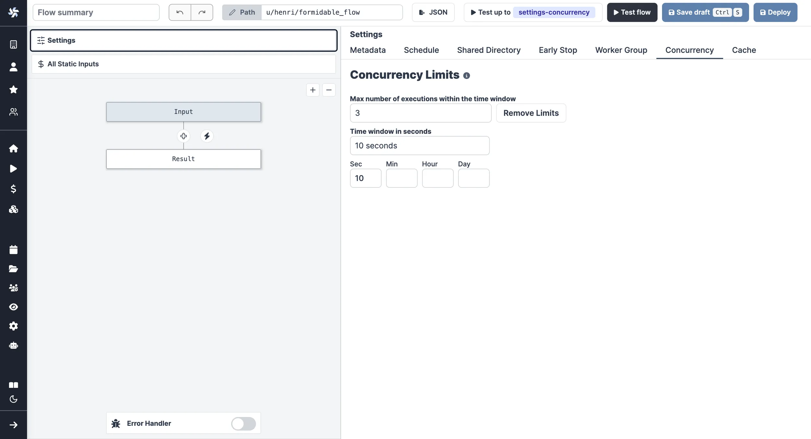
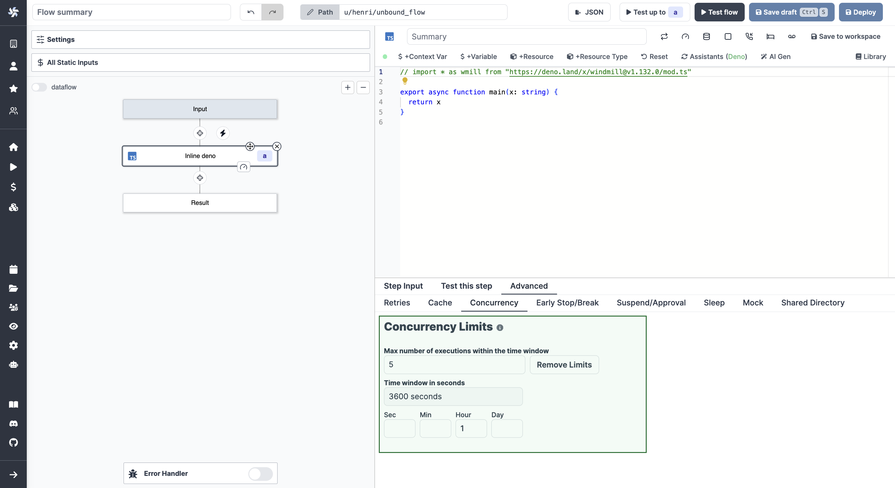

# Concurrency limits

The Concurrency limits feature allows you to define concurrency limits for scripts, flows and inline scripts within flows. Its primary goal is to prevent exceeding the API Limit of the targeted API, eliminating the need for complex workarounds using worker groups.

Concurrency limit is a [Cloud plans and Pro Enterprise Self-Hosted](/pricing) only.

Concurrency limit can be set from the Settings menu. When jobs reach the concurrency limit, they are automatically queued for execution at the next available optimal slot given the time window.

The Concurrency limit operates globally and across flow runs. It involves three key parameters:

## Max number of executions within the time window

The maximum number of executions allowed within the time window. If the number of executions exceeds this limit, the job is queued for execution at the next available optimal slot.

## Time window in seconds

Set in seconds, the time window defines the period within which the maximum number of executions is allowed.

## Custom concurrency key

This parameter is optional. Concurrency keys are global, you can have them be workspace specific using the variable `$workspace`. You can also use an argument's value using `$args[name_of_arg]`.

Jobs can be filtered from the [Runs menu](../5_monitor_past_and_future_runs/index.mdx) using the Concurrency Key.

## Concurrency limit in Script & Flows

### Concurrency limit of Script

[Concurrency limit of a script](../../script_editor/concurrency_limit.mdx) can be set from the Settings menu. Pick "Concurrency" and define a time window, max number of executions of the flow within that time window and optionally a custom concurrency key.

### Concurrency limit of flow

From the Flow Settings menu, pick "Concurrency" and define a time window, a max number of executions of the flow within that time window and optionally a custom concurrency key.

### Concurrency limit of scripts within flow

The Concurrency limit operates globally and across flow runs. It involves two key parameters: "Maximum number of runs" and the "Per time window (seconds)."

Concurrency limit can be set for each step of a flow in the `Advanced` menu, on tab "Concurrency".

