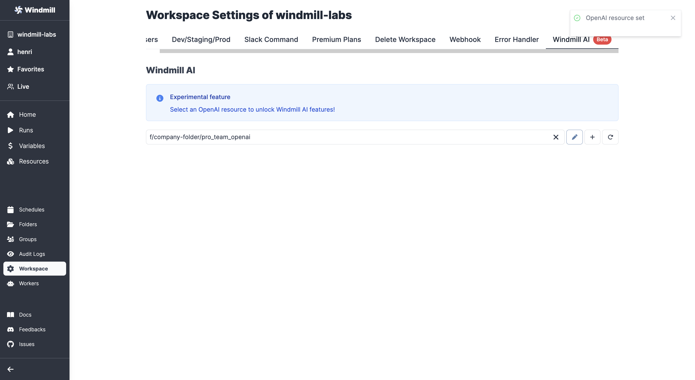
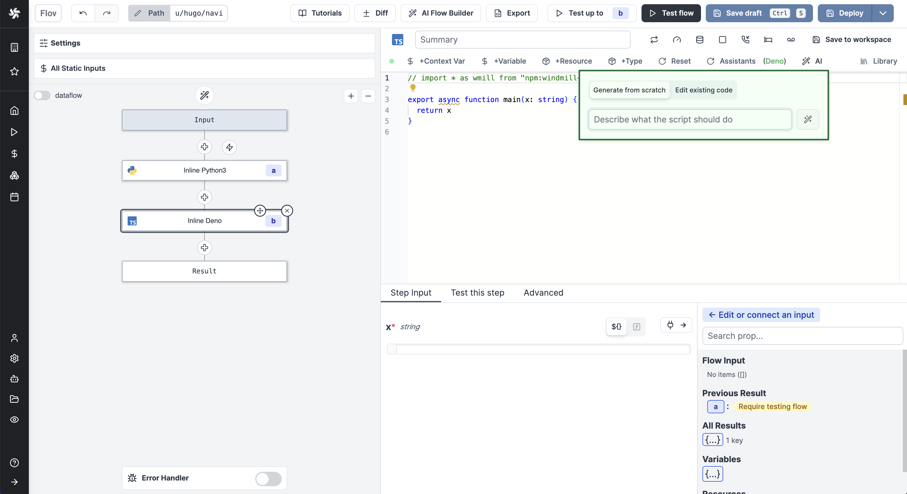

# AI Generation

Windmill provides ways to have AI help you in your coding experience.

:::info OpenAI Integration

If you're interested leveraging OpenAI from your scripts, flows and apps, check [OpenAI Integration](../../integrations/openai.md).

:::

## Code Generation

Generate Windmill-specific code from simple text.

<video
    className="border-2 rounded-xl object-cover w-full h-full dark:border-gray-800"
    controls
    src="/videos/ai_generation.mp4"
/>

 

On the workspace settings, go to the "OpenAI Credentials" tab and add an [OpenAI resource](../../integrations/openai.md).

:::caution

Code generation on Windmill from OpenAI only works on GPT-4 so far.

:::

Then from a [code editor](../../code_editor/index.mdx) (Script, Flow, Apps), click on `AI Gen` and write with a prompt what the script should do. The script will use Windmill's main requirements and features (exposing a main function, importing libraries, using resource types, declaring required parameters with types, leveraging database schema).

### Code Edition

When in the [code editor](../../code_editor/index.mdx), select the code section you want to edit and the "AI Gen" button will turn into "AI Edit", letting you enter instructions for the AI Assistant.

You will then be offered to accept or decline the suggested code.

<video
    className="border-2 rounded-xl object-cover w-full h-full dark:border-gray-800"
    controls
    src="/videos/ai_edit.mp4"
/>

### Code Fixing

Upon error when executing code, you will be offered to "AI Fix" it. The assistant will automatically read the code, explain what went wrong, and suggest a way to fix it.

<video
    className="border-2 rounded-xl object-cover w-full h-full dark:border-gray-800"
    controls
    src="/videos/ai_fix.mp4"
/>

## Code Auto-Completion with Codium

[Codeium](https://codeium.com/) is a code acceleration toolkit built on AI technology. In particular, Codeium has a free [browser extension](https://codeium.com/download) that works as a code completion assistant.

<video
    className="border-2 rounded-xl object-cover w-full h-full dark:border-gray-800"
    controls
    src="/videos/codeium_example.mp4"
/>

 

Here is how to install the extension on Chrome (details [here](https://codeium.com/chrome_tutorial)):

1. Install the [extension](https://chrome.google.com/webstore/detail/codeium-ai-code-autocompl/hobjkcpmjhlegmobgonaagepfckjkceh).
2. Sign in to Codeium using an e-mail or Google.
3. If it works, you should see the Codeium extension turn green.
4. To have it work on Windmill, add it to your Codeium allowlist:
   - Click on Codeium extension icon.
   - Select `Open Options Page`.
   - In the Allowlist, write `https:\/\/app\.windmill\.dev\/.*` (or your domain, if self-hosting).
   - `Save Allowlist`.

Now you're good to have Codeium suggest code in Windmill's code editor (scripts, flows, apps).

The code will auto-suggest, and if you like it, press on `tab` to accept.

You can help it by giving proper functions names:

<video
    className="border-2 rounded-xl object-cover w-full h-full dark:border-gray-800"
    controls
    src="/videos/codeium_function.mp4"
/>

 

Or by writing comments:

<video
    className="border-2 rounded-xl object-cover w-full h-full dark:border-gray-800"
    controls
    src="/videos/codeium_comments.mp4"
/>

 

:::caution

Please note that the code suggested by Codeidum is not specific to Windmill and therefore does not necessarily meet its requirements (exposing a main function and declaring dependencies in the same file).

:::
