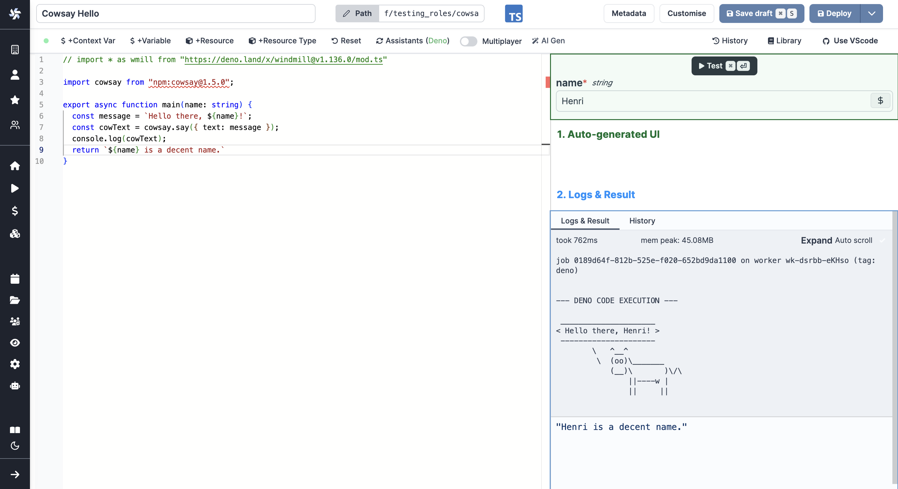
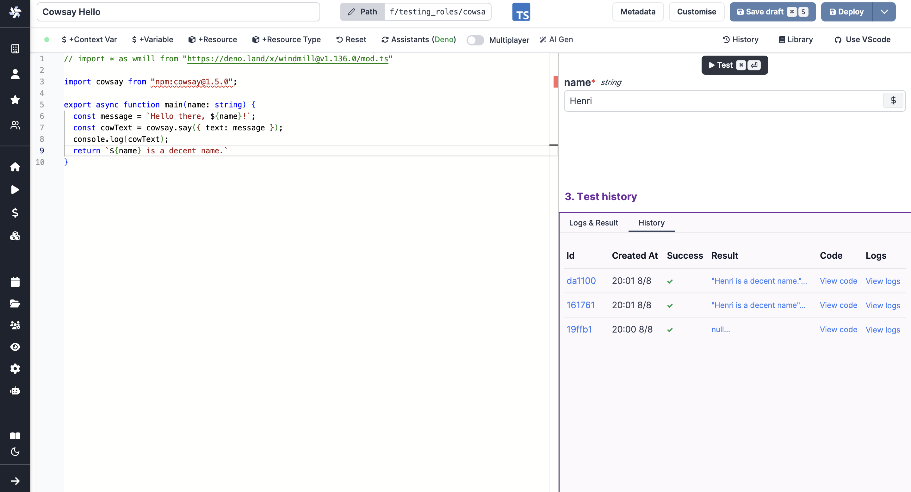
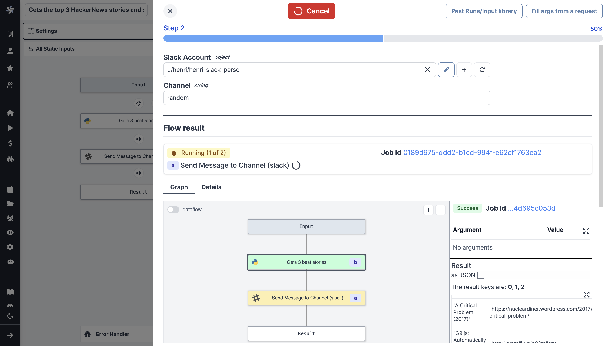
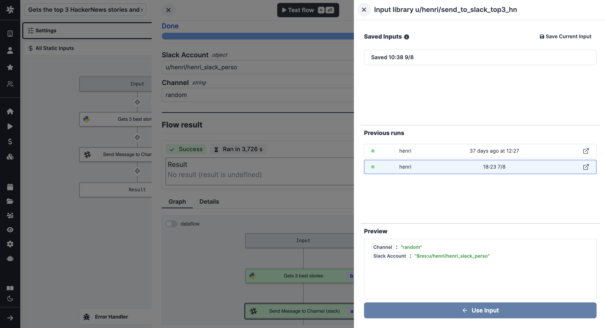
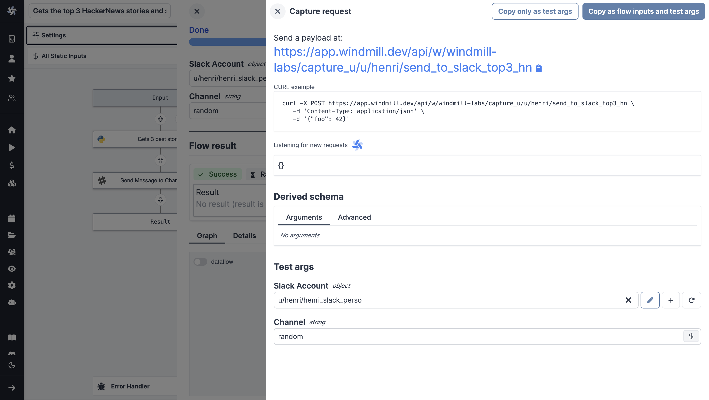

import DocCard from '@site/src/components/DocCard';

# Instant Preview & Testing

On top of its integrated editors ([scripts](../../script_editor/index.mdx), [flows](../../flows/1_flow_editor.mdx), [apps](../../apps/0_app_editor/index.mdx)), Windmill allows users to test what they are building directly from the editor, even before deployment.

## Instant preview in Script Editor

<video
    className="border-2 rounded-xl object-cover w-full h-full dark:border-gray-800"
    controls
    src="/videos/auto_g_ui_landing.mp4"
/>

 

The right margin of the script editor displays:

1. The inputs of the main function, which are parsed to create an auto-generated UI.
2. The logs and results of the last execution.
3. The history of the latest runs via the editor.

	<DocCard
		title="Script Editor"
		description="Scripts are the basic building blocks that can be written in Typescript, Python, Go, Bash, SQL or launch docker containers."
		href="/docs/script_editor"
	/>

### VS Code Extension

For users on [VS Code Extension](../../cli_local_dev/1_vscode-extension/index.md), you can also preview instantly and test with the `Windmill: Run preview` command.

	<DocCard
		title="VSCode Extension"
		description="The Windmill VSCode extension allows you to run your scripts and preview the output within VSCode."
		href="/docs/cli_local_dev/vscode-extension"
	/>

## Instant preview in Flow Editor

The flow editor has several methods of previewing results instantly.

Testing the flow or certain steps is often required to have the outputs of previous steps suggested as input for another step:

<video
    className="border-2 rounded-xl object-cover w-full h-full dark:border-gray-800"
    controls
    src="/videos/flow_test_preview_results.mp4"
/>

 

	<DocCard
		color="teal"
		title="Flow Editor"
		description="Windmill's Flow Editor allows you to build flows with a low-code builder."
		href="/docs/flows/flow_editor"
	/>

### Test flow

While editing the flow, you can run the whole flow as a test.

<video
    className="border-2 rounded-xl object-cover w-full h-full dark:border-gray-800"
    controls
    src="/videos/flow_test_flow.mp4"
/>

 

Click on `Test flow`. This will open a drawer with the [flow's inputs](../../flows/3_editor_components.mdx#flow-inputs) and its status.

Upon execution, you can graphically preview (as a directed acyclic graph) the execution of the flow & the results & logs of each step.

From the menu, you can also access past runs & saved inputs.

At last, you can fill arguments from a request.

### Test up to step

<video
    className="border-2 rounded-xl object-cover w-full h-full dark:border-gray-800"
    controls
    src="/videos/flow_test_up_to.mp4"
/>

 

As for `Test flow`, you will get the same components (Flow inputs, status, input library etc.), only the flow will execute untill a given step, included.

### Test this step

<video
    className="border-2 rounded-xl object-cover w-full h-full dark:border-gray-800"
    controls
    src="/videos/flow_test_this_step.mp4"
/>

 

`Test this step` is a way to test a single step of the flow. It comes useful to check your code or to have the results of your current steps suggested as inputs for further steps.

The arguments are pre-filled from the step inputs (if the arguments use results from previous steps, they will be used if those were tested before), but you can change them manually.

## Instant preview in App Editor

The app editor has several methods of previewing results instantly.

	<DocCard
		title="App Editor"
		description="The app editor is where you build an app with components, create interactions with runnables, and configure the app settings."
		href="/docs/apps/app_editor"
		color="orange"
	/>

### Run manually a runnable

<video
    className="border-2 rounded-xl object-cover w-full h-full dark:border-gray-800"
    controls
    src="/videos/app_test_run.mp4"
/>

 

When on a runnable from the [runnable pannel](../../apps/3_app-runnable-panel.mdx), you can manually run it.

### Run all

<video
    className="border-2 rounded-xl object-cover w-full h-full dark:border-gray-800"
    controls
    src="/videos/app_test_run_all.mp4"
/>

 

On the top bar of the app, you can either manually run all runnables of set a given run frequency.

### Preview

<video
    className="border-2 rounded-xl object-cover w-full h-full dark:border-gray-800"
    controls
    src="/videos/app_test_preview.mp4"
/>

 

The [preview mode](../../apps/0_toolbar.md#preview-mode) of the app will run all runnables before previewing them.