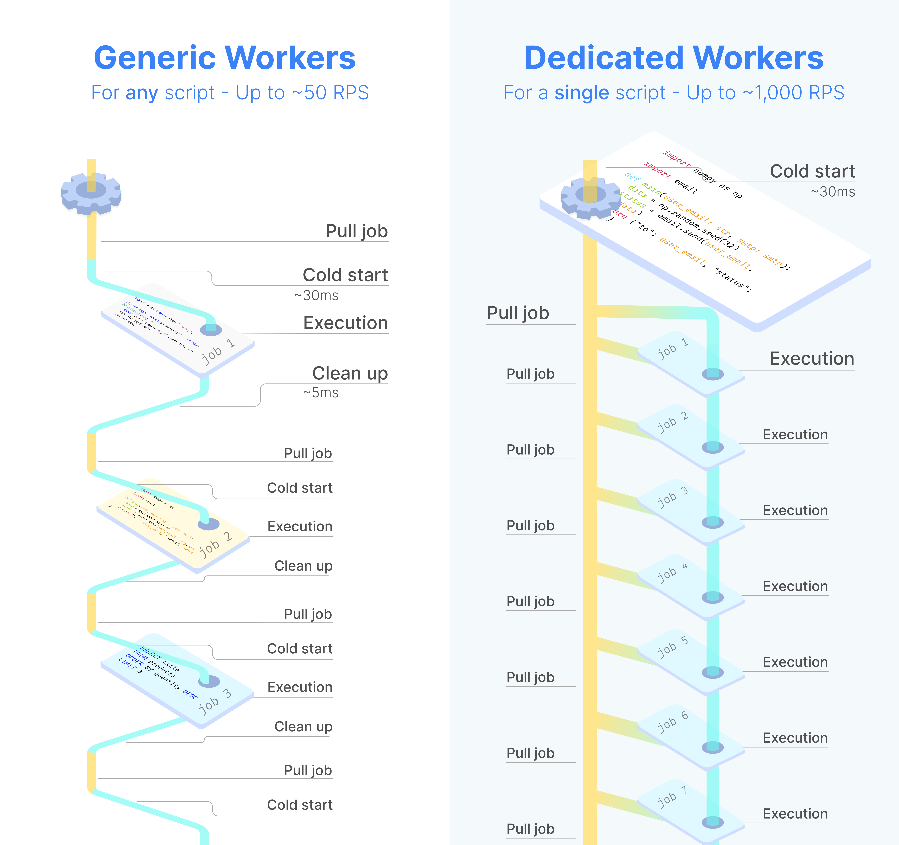
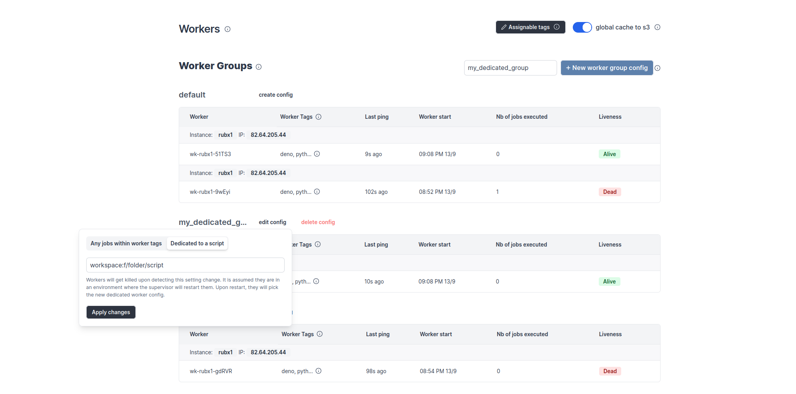

import DocCard from '@site/src/components/DocCard';

# Dedicated Workers / High Throughput

Dedicated Workers are [workers](../9_worker_groups/index.mdx) that are dedicated to a particular script. They are able to execute any job that target this script much faster than normal workers at the expense of being capable to only execute that one script.
They are as fast as running the same logic in a forloop, but keep the benefit of showing separate jobs per execution.

Dedicated Workers / High Throughput are an [enterprise-only](../../misc/7_plans_details/index.mdx#enterprise-edition---self-hosted) feature.

For now it only works with [Deno, Bun](../../getting_started/0_scripts_quickstart/1_typescript_quickstart/index.mdx) and [Python](../../getting_started/0_scripts_quickstart/2_python_quickstart/index.mdx) scripts that have been pre-deployed.

The scripts can be used within flows.

## How to assign dedicated workers to a script

From Windmill UI's Workers page:

1. "Edit config" of a [worker group](../9_worker_groups/index.mdx) and enter script's workspace & [path](../../script_editor/settings.mdx#path) as `worker:path`.

The worker group will restart (assuming the pods/restart are set to restart automatically) and will now wait for step 2. below to happen:

1. Toggle the "Dedicated Workers" option for that script in the [script Settings](../../script_editor/settings.mdx):

Each [run](../5_monitor_past_and_future_runs/index.mdx) will have a Worker Group Tag assigned to it. [Worker Group Tags](../9_worker_groups/index.mdx) allow to assign custom worker groups to scripts and flows in Windmill for efficient execution on different machines with varying specifications.

	<DocCard
		title="Workers and Worker Groups"
		description="Worker Groups allow users to run scripts and flows on different machines with varying specifications."
		href="/docs/core_concepts/worker_groups"
	/>

