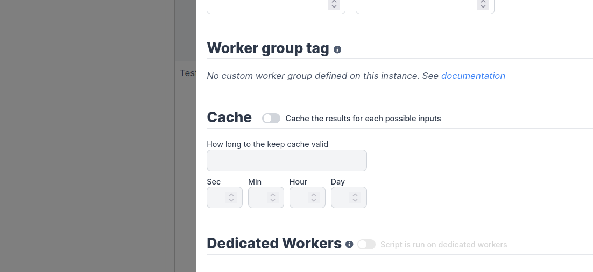

import DocCard from '@site/src/components/DocCard';

# Dedicated Workers / Native Performance

Dedicated Workers are workers that are dedicated for a particular script. They are able to execute any job that target this script much faster than normal workers at the expense of being capable to only execute that one script.
They are as fast as running the same logic in a forloop, but keep the benefit of showing separate jobs per execution.

For now it only work with bun scripts that have been pre-deployed.

The scripts can be used within flows.

To setup, pass:

```
DEDICATED_WORKER=<workspace>:<path>
```

to the dedicated worker that will be tasked with executing that script.

or use the dedicatedWorkers section in the values.yaml of the helm chart.

You will also need to toggle the "Dedicated Workers" option for that script in the metadata:


