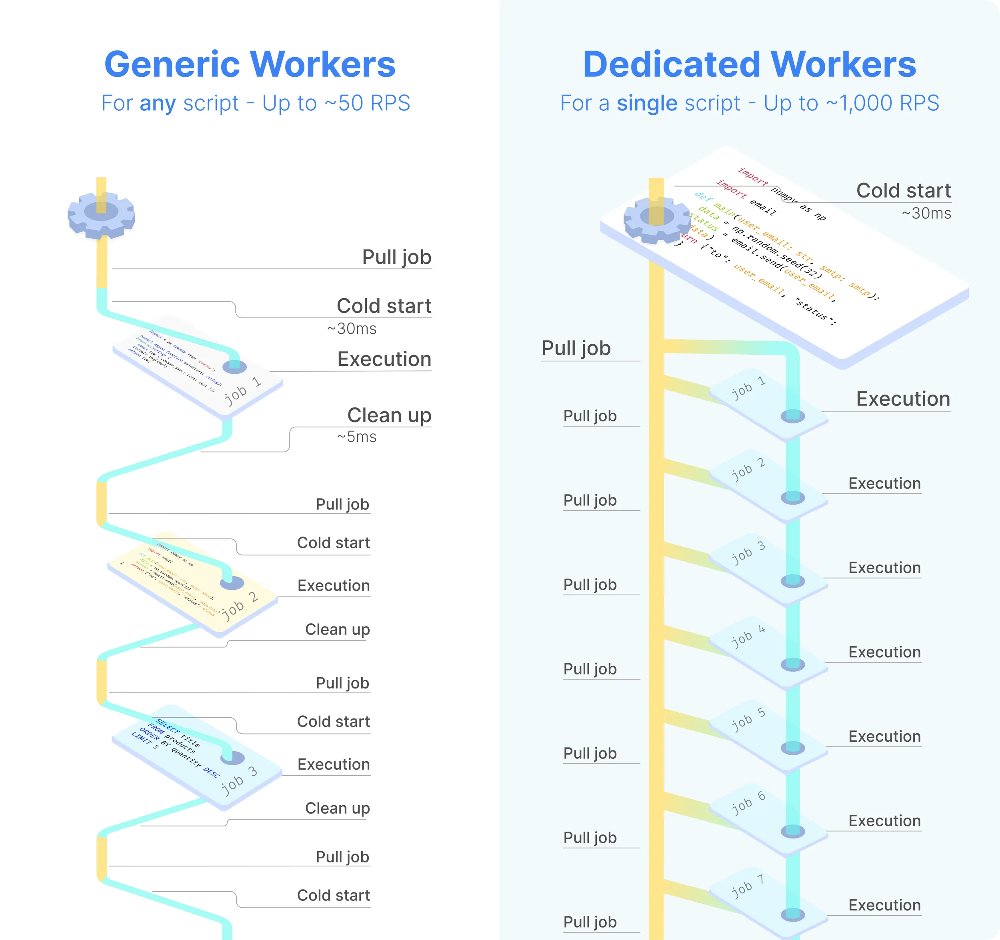
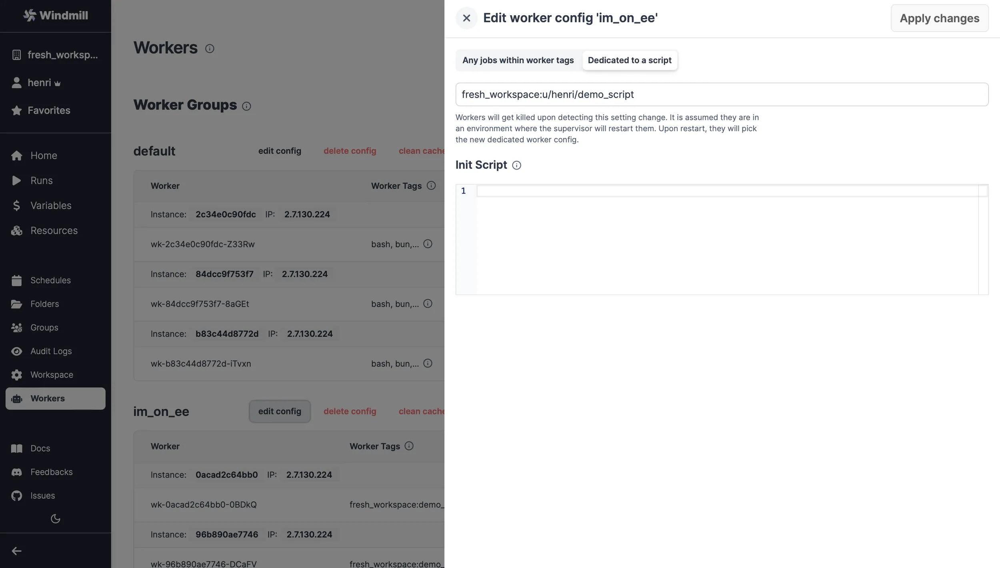

import DocCard from '@site/src/components/DocCard';

# Dedicated workers / High throughput

Dedicated Workers are [workers](../9_worker_groups/index.mdx) that are dedicated to a particular script. They are able to execute any job that target this script much faster than normal workers at the expense of being capable to only execute that one script.
They are as fast as running the same logic in a forloop, but keep the benefit of showing separate jobs per execution.

Workers serve as the backbone of Windmill. Workers are autonomous processes that run one script at a time using the full cpu and memory available to them.

To put it simply, workers are responsible for executing code in Windmill. A single normal worker in Windmill is capable of handling up to 26 million tasks a month, with each task taking roughly 100ms. You can easily scale the number of workers horizontally without incurring extra overhead.

Typically, workers fetch jobs from the job queue based on their `scheduled_for` datetime, provided it's in the past. Once a worker retrieves a job, it immediately changes its status to "running", processes it, streams its logs, and upon completion, archives it in the database as a "finished job". Both the final outcome and the logs are preserved indefinitely.

This simple process allows one to reliably count on a small number of workers for very different jobs. However, there is a latency between each task since the worker must perform a clean-up and a cold start between each execution (to be able to handle successive jobs but from completely different scripts). This latency amounts to around a dozen milliseconds, which can be crucial in the execution of certain priority jobs:



Dedicated workers allow you to remove completely the cold start for selected scripts. They are workers that are dedicated to a particular script. They are able to execute any job that target this script much faster than normal workers at the expense of being capable to only execute that one script. They are as fast as running the same logic in a while-loop processing requests, that is how they are implemented actually, but keep the benefit of showing separate jobs per execution.

Dedicated workers / High throughput are a [Cloud plans & Self-Hosted Enterprise](/pricing) feature.

Dedicated workers work with [TypeScript](../../getting_started/0_scripts_quickstart/1_typescript_quickstart/index.mdx) (Bun and Deno), [Python](../../getting_started/0_scripts_quickstart/2_python_quickstart/index.mdx), and native TypeScript (nativets) scripts. For nativets, dedicated workers use prewarmed V8 isolates that are pipelined — the next isolate starts warming up while the current job runs, minimizing latency between executions. Queries to databases such as PostgreSQL, MySQL, BigQuery, or bash and go scripts do not suffer from any cold starts and hence have the same benefits already without any complexity.

The scripts can be used within flows.

Dedicated workers are faster than AWS lambda: https://www.windmill.dev/docs/misc/benchmarks/aws_lambda.

## How to assign dedicated workers to a script

From Windmill UI's Workers page:

1. "Edit config" of a [worker group](../9_worker_groups/index.mdx) and enter script's workspace & [path](../../script_editor/settings.mdx#path) as `worker:path`.



The worker group will restart (assuming the pods/restart are set to restart automatically) and will now wait for step 2. below to happen:

1. Toggle the "Dedicated Workers" option for that script in the [script Settings](../../script_editor/settings.mdx):


Each [run](../5_monitor_past_and_future_runs/index.mdx) will have a Worker group tag assigned to it. [Worker group tags](../9_worker_groups/index.mdx) allow to assign custom worker groups to scripts and flows in Windmill for efficient execution on different machines with varying specifications.


<div className="grid grid-cols-2 gap-6 mb-4">
	<DocCard
		title="Workers and worker groups"
		description="Worker Groups allow users to run scripts and flows on different machines with varying specifications."
		href="/docs/core_concepts/worker_groups"
	/>
</div>

## Multiple dedicated workers per worker group

A worker group can be configured with multiple dedicated workers, allowing a single worker to be dedicated to several scripts or flows across workspaces. Instead of configuring a single `worker:path`, use the `dedicated_workers` array in the worker group configuration:

```
dedicated_workers:
  - "workspace_id:f/folder/script_a"
  - "workspace_id:f/folder/script_b"
  - "other_workspace:u/user/script_c"
```

Each entry uses the format `<workspace_id>:<path>`. The worker will dispatch incoming jobs to the appropriate dedicated runner based on the job's script path.

This is configured from the worker group settings in the UI using the dedicated workers selector, which lets you search and pick scripts and flows from any workspace.

## Shared runners

Shared runners allow multiple scripts that share the same [workspace dependency](../55_workspace_dependencies/index.mdx) and language to execute in a single long-lived subprocess, instead of requiring a separate dedicated worker process per script.

With standard dedicated workers, each script gets its own process. If you have 10 scripts that all use the same Python dependency file, that means 10 separate processes — each loading the same dependencies into memory. Shared runners solve this by grouping those scripts into a single subprocess that can dispatch jobs to any of them.

### How it works

Shared runners are auto-detected based on script annotations. When multiple dedicated worker scripts in the same worker group:

1. Share the same [workspace dependency](../55_workspace_dependencies/index.mdx) name (e.g. `# requirements: myfile`)
2. Use the same language (e.g. all Python, or all Bun)

...they are automatically grouped into a shared runner. The subprocess loads all scripts at startup and dispatches incoming jobs to the correct one based on the script path.

Shared runners work with [TypeScript](../../getting_started/0_scripts_quickstart/1_typescript_quickstart/index.mdx) (Bun and Deno) and [Python](../../getting_started/0_scripts_quickstart/2_python_quickstart/index.mdx).

### Configuration

1. Create a [workspace dependency](../55_workspace_dependencies/index.mdx) file (e.g. a `requirements.in` or `package.json`) in workspace settings under "Dependencies".
2. Reference the same workspace dependency from multiple scripts using annotations (e.g. `# requirements: myfile` for Python or `// requirements: myfile` for TypeScript).
3. Enable "Dedicated Workers" on each script in the [script settings](../../script_editor/settings.mdx).
4. Add all scripts to the same worker group using the [dedicated workers selector](#multiple-dedicated-workers-per-worker-group).

The worker group configuration UI automatically detects and displays shared runners. Scripts that share a workspace dependency and language are shown grouped together.


<div className="grid grid-cols-2 gap-6 mb-4">
	<DocCard
		title="Workspace dependencies"
		description="Manage dependencies centrally at the workspace level."
		href="/docs/core_concepts/workspace_dependencies"
	/>
</div>

## Dedicated workers for flows

Dedicated workers can also be assigned to a flow. In that case, the dedicated worker will start one runner for each flow step that supports it ([TypeScript](../../getting_started/0_scripts_quickstart/1_typescript_quickstart/index.mdx), [Python](../../getting_started/0_scripts_quickstart/2_python_quickstart/index.mdx), and native TypeScript), eliminating cold start between each execution.
Other steps will be run on the same worker but without any optimization.

To enable it, the process is the same as for scripts, but the "Dedicated Workers" option for that flow has to be enabled in the [flow Settings](../../flows/3_editor_components.mdx#settings).
