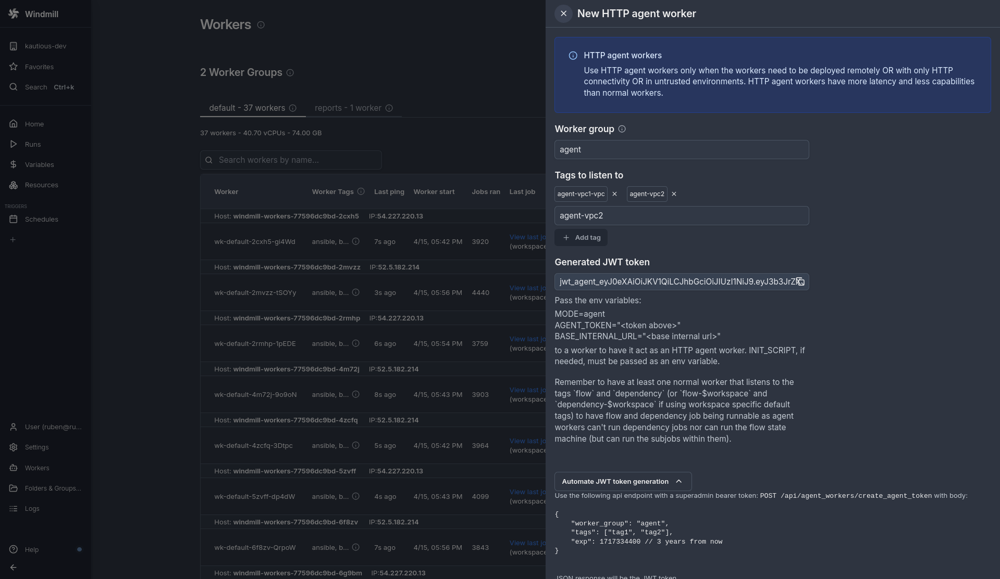

# Agent workers

Agent workers are a Cloud & Self-hosted [Enterprise](/pricing) feature.

Agent workers are remote computing resources that can execute your Windmill jobs from anywhere in the world, even in environments with limited or unreliable network connectivity to your main Windmill cluster. Think of them as lightweight, secure workers that can run your automation tasks in remote locations, behind firewalls, or in untrusted environments without needing direct access to your database.

In terms of [billing](../../misc/7_plans_details/index.mdx), agent workers are counted as 1 [Compute Unit](/pricing#compute-units) per agent worker on self-hosted EE (if not used for compute) and 0.5 Compute Unit on cloud EE (if not used for compute).

Agent workers are a 4th mode of execution of the Windmill binary, but instead of using `MODE=worker`, we use here `MODE=agent`. Instead of using a direct connection to the database, they only require an HTTP connection to an internal base url of the cluster.

They should be used:

- For remote workers with non-low latency to the main database/cluster and or unreliable connectivity to it or complex firewall since they only require an HTTP connection to an internal base url of the cluster
- Untrusted sites, since they do not require access to the database and only have access to a limited set of APIs relative to the jobs that have been assigned to them
- If you need thousands of workers as it is less taxing on the database since the servers act as a connection pooler

Note that agent workers can even be running without docker on Linux, Windows and Apple targets using the cross-compiled binaries of Windmill attached to each release.

## Quickstart

Go to the Workers page (/workers) as a superadmin and click "+ New agent worker"


After clicking, a drawer will open:



Fill the form with the following values:

- Agent Group: this is only used to group agent workers together on the workers page, contrary to normal workers, no config is pulled dynamically from the agent group.
- Tags: this is a list of tags that the agent worker will listen to. It can't be changed by the worker and is encoded in the JWT token passed to the worker

You will see a token below once the tags are added.

You can now start any windmill binary or container with the following env variables:

```
MODE=agent
AGENT_TOKEN="<token above>"
BASE_INTERNAL_URL="<base internal url>"
```

If needed, pass an INIT_SCRIPT env variable with the content of the script you want to run when the worker starts. See [this page](../../advanced/8_preinstall_binaries/index.mdx) for more information.

BASE_INTERNAL_URL must correspond to the base of the url of the windmill instance the worker should send HTTP requests to, it has no trailing slash (e.g. `http://my-windmill-instance.xyz`). It can be the same as BASE_URL but it can be different if it's within a private network.

You can mix and match normal and agent workers. You actually will need to have at least one normal worker that listens to the tags `flow` and `dependency` (or `flow-$workspace` and `dependency-$workspace` if using workspace specific default tags) to have flow and dependency job being runnable as agent workers can't run dependency jobs nor can run the flow state machine (but can run the subjobs within them).

That's it! You can now start your worker and it will be ready to run jobs that are tagged with the worker's tags.

### Dynamic tags for agent workers

The tags are assigned statically to a script/flow at deployment time but can have a dynamic part to make them more flexible.

You can use dynamic tags based on the job's args `tag-$args[argName]` or the job's workspace id `tag-$workspace` to target a different agent worker based either on the job's args or the job's workspace id. See more about [dynamic tags](../9_worker_groups/index.mdx#dynamic-tag).

## Architecture

Normal workers interact with the Postgresql database directly.

Agent workers interact only via HTTP requests with the server which expose api methods specifically for it at `/api/agent_workers/` and `/api/w/<workspace>/agent_workers/`. Those methods all require the requests to be authenticated with a JWT token, and that's what the `AGENT_TOKEN` env variable is for.

The JWT token is a signed JSON Web Token that contains the following information:

- The worker's tags
- The worker's group

It make sure that the worker can only pull and run jobs that are tagged with the worker's tags. A benefit of this architecture is that it is both secure and lightweight. Only a superadmin can create an agent worker because only a superadmin can create the JWT token with the arbitrary tags. The API exposed expose methods that are needed by the worker to run the jobs and only those. All the HTTP requests are retried in case of a transient error which make them resilient.

In addition, agent workers have slightly less throughput than normal workers but you can have many more of them because the servers act as an connection pool to the Postgresql database. You can for instance have 1000 agent workers on a single server without having to worry about the database connection limit.
