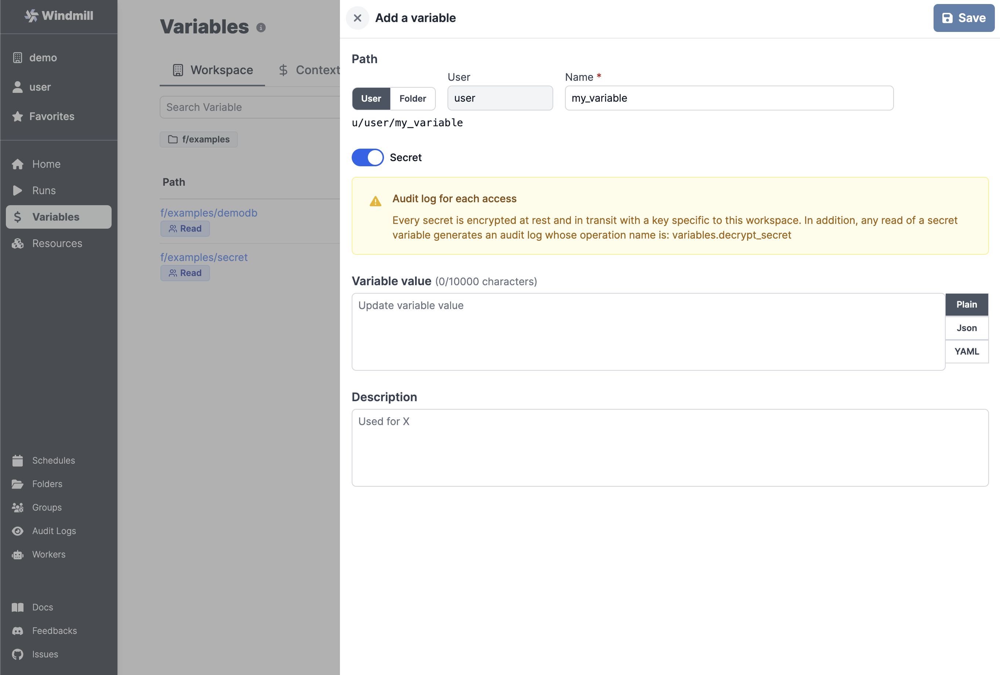

# Save Variables and Secrets

When writing scripts, you may want to reuse variables, or safely pass secrets to
scripts. You can do that with **Variables**. Windmill has user-defined variables
and contextual variables.

:::caution

Secrets are encrypted when stored on Windmill. From a usage standpoint, secrets
are kept safe in three different ways:

- Secrets can only be accessed by users with the right permissions, as defined
  by their path. In addition, secrets can be explicitly shared with users or
  groups. A secret in `u/alice/secret` will only be accessible by `alice`,
  unless explicitly shared. A secret in `f/devops/secret` will be accessible by anyone with read access to `f/devops`.
- Secrets cannot be viewed outside of scripts. Note that a user could still
  `print` a secret if they have access to it from a script.
- Accessing secrets generates `variables.decrypt_secret` event that ends up in
  the [Audit Logs](https://app.windmill.dev/audit_logs). It means that you can
  audit who accesses secrets. Additionally you can audit results, logs and
  script code for every script run.

:::

## Contextual variables

Contextual variables are automatically set by Windmill. See the `Contextual` tab
on the [Variables page](https://app.windmill.dev/variables) for the list of
reserved variables and what they are used for.

## Add a variable or secret

You can define variables from the **Variables** page. Like all objects in
Windmill, variable ownership is defined by the **path** - see
[ownership path prefix](../../reference/index.md#owner).

Variables also have a **name**, generated from the path, and names are used to
access variables from scripts.

A variable can be made **secret**. In this case, the value of it will not be
visible outside of a script.

<!-- - see [secrets security note](#secrets-security-note). -->



## Accessing a variable from a script

### Contextual variables

Reserved variables are passed to the job as environment variables. For example, the ephemeral token is passed as `WM_TOKEN`.

### User-defined variables

There are 2 main ways variables are used withing scripts:

1. passing variables as parameters to scripts
2. fetching them from within a script by using the wmill client in the respective language

3. Variables can be easily passed as parameters of the script, using the UI based variable picker. Underneath, the variable is passed as a string of the form: `$var:<variable_path>` and replaced by the worker at time of execution of the script by fetching the value with the job's permissions. So the job will fail if the job's permissions inherited from the caller do not allow it to access the variable. This is the same mechanism used for resource, but they use `$res:` instead of `$var:`.

4. Within a script, one can the wmill client of their respective language. For instance, for the variable `u/user/foo`:

```typescript
wmill.getVariable('u/user/foo');
```

```python
wmill.get_variable("u/user/foo")
```

```go
wmill.GetVariable("u/user/foo")
```

```bash
curl -s -H "Authorization: Bearer $WM_TOKEN" \
  "$BASE_INTERNAL_URL/api/w/$WM_WORKSPACE/variables/get/u/user/foo" \
    | jq -r .value
```

The last example is in bash and showcase well how it works under the hood: It fetches the secret from the API using the job's permissions through the ephemeral token passed as environment variable to the job.
