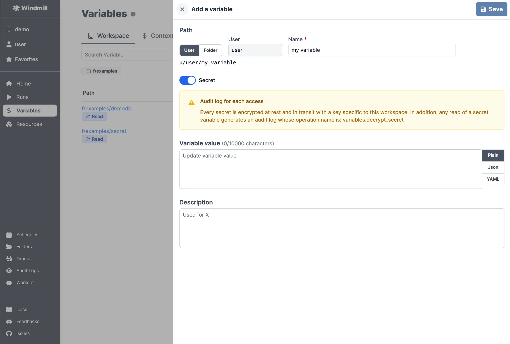
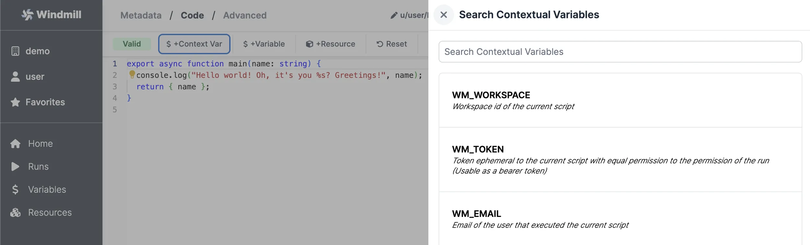
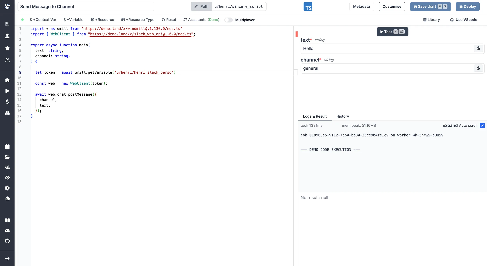

import DocCard from '@site/src/components/DocCard';
import Tabs from '@theme/Tabs';
import TabItem from '@theme/TabItem';

# Variables and secrets

When writing scripts, you may want to reuse variables, or safely pass secrets to
scripts. You can do that with Variables. Windmill has user-defined variables
and contextual variables.

Variables are dynamic values that have a key associated to them and can be retrieved during the execution of a Script or Flow.

All Variables (not just secrets) are encrypted with a workspace specific symmetric key to avoid leakage.

There are 2 types of Variables in Windmill: user-defined and contextual (including environment variables).

## User-defined variables

User-defined Variables is essentially a key-value store where every user can
read, set and share values at given keys as long as they have the privilege to
do so.

They are editable in the UI and also readable if they are not
Secret Variables.

Inside the Scripts, one would use the Windmill client to interact with the
user-defined Variables.

<Tabs className="unique-tabs">
<TabItem value="python" label="Python" attributes={{className: "text-xs p-4 !mt-0 !ml-0"}}>

```python
import wmill

wmill.get_variable("u/user/foo")
wmill.set_variable("u/user/foo", value)
```

</TabItem>
<TabItem value="bun" label="TypeScript (Bun)" attributes={{className: "text-xs p-4 !mt-0 !ml-0"}}>

```ts
import { getVariable, setVariable } from 'windmill-client';

getVariable('u/user/foo');
setVariable('u/user/foo', value);
```

</TabItem>
<TabItem value="deno" label="TypeScript (Deno)" attributes={{className: "text-xs p-4 !mt-0 !ml-0"}}>

```ts
import { getVariable, setVariable } from 'npm:windmill-client@1';

getVariable('u/user/foo');
setVariable('u/user/foo', value);
```

</TabItem>
</Tabs>

Note that there is a similar API for getting and setting [Resources](../3_resources_and_types/index.mdx)
which are simply Variables that can contain any JSON values, not just a string
and that are labeled with a [Resource Type](../3_resources_and_types/index.mdx#create-a-resource-type) to be automatically
discriminated in the auto-generated form to be of the proper type (e.g. a
parameter in TypeScript of type `pg: Postgresql` is only going to
offer a selection over the resources of type postgresql in the auto-generated UI).

There is also a concept of [state](..//3_resources_and_types/index.mdx#states) to share values
across script executions.

## Environment variables

Environment variables are used to configure the behavior of scripts and services, allowing for dynamic and flexible execution across different environments.

<div className="grid grid-cols-2 gap-6 mb-4">
	<DocCard
		title="Environment variables"
		description="Environment variables are used to configure the behavior of scripts and services, allowing for dynamic and flexible execution across different environments."
		href="/docs/core_concepts/environment_variables"
	/>
</div>

## Contextual variables

[Contextual variables](../47_environment_variables/index.mdx#contextual-variables) are variables whose values are contextual to the script execution. They are automatically set by Windmill. This is how the [languages](../../getting_started/0_scripts_quickstart/index.mdx) clients get their implicit credentials to interact with the platform.

## Secrets

Secrets are encrypted when stored on Windmill. From a usage standpoint, secrets
are kept safe in three different ways:

- Secrets can only be accessed by users with the right [permissions](../16_roles_and_permissions/index.mdx), as defined
  by their path. In addition, secrets can be explicitly shared with users or
  groups. A secret in `u/alice/secret` will only be accessible by `alice`,
  unless explicitly shared. A secret in `f/devops/secret` will be accessible by anyone with read access to `f/devops`.
- Secrets cannot be viewed outside of scripts. Note that a user could still
  `print` a secret if they have access to it from a script.
- Accessing secrets generates `variables.decrypt_secret` event that ends up in
  the <a href="https://app.windmill.dev/audit_logs" rel="nofollow">Audit logs</a>. It means that you can audit who accesses secrets. Additionally you can audit results, logs and
  script code for every script run.

## Add a variable or secret

You can define variables from the Variables page. Like all objects in
Windmill, variable ownership is defined by the path - see
[ownership path prefix](../16_roles_and_permissions/index.mdx).

Variables also have a name, generated from the path, and names are used to
access variables from scripts.

A variable can be made secret. In this case, its value will not be visible outside of a script.



## Accessing a variable from a script

<div className="grid grid-cols-2 gap-6 mb-4">
	<DocCard
		title="Add resources and variables to code editor"
		description="You can directly access Variables and Resources from the Code editor."
		href="/docs/code_editor/add_variables_resources"
	/>
</div>

### Accessing contextual variables from a script

See the `Contextual` tab on the <a href="https://app.windmill.dev/variables" rel="nofollow">Variable page</a> for the list of reserved variables and what they are used for.

You can use them in a Script by clicking on "+Context Var":



Reserved variables are passed to the job as environment variables. For example, the ephemeral token is passed as `WM_TOKEN`.

### Accessing user-defined variables from a script

There are 2 main ways variables are used within scripts:

#### Passing variables as parameters to scripts

Variables can be passed as parameters of the script, using the UI-based variable picker. Underneath, the variable is passed as a string of the form: `$var:<variable_path>` and replaced by the worker at time of execution of the script by fetching the value with the job's permissions. So the job will fail if the job's permissions inherited from the caller do not allow access to the variable. This is the same mechanism used for resource, but they use `$res:` instead of `$var:`.


#### Fetching them from within a script by using the wmill client in the respective language

By clicking on `+ Variable`, you'll get to pick a variable from your workspace and be able to fetch it from within the script.



TypeScript:

```typescript
wmill.getVariable('u/user/foo');
```

Python:

```python
wmill.get_variable("u/user/foo")
```

Go:

```go
wmill.GetVariable("u/user/foo")
```

Bash:

```bash
curl -s -H "Authorization: Bearer $WM_TOKEN" \
  "$BASE_INTERNAL_URL/api/w/$WM_WORKSPACE/variables/get/u/user/foo" \
    | jq -r .value
```

PowerShell:

```powershell
$Headers = @{
  "Authorization" = "Bearer $Env:WM_TOKEN"
}
Invoke-RestMethod -Headers $Headers -Uri "$Env:BASE_INTERNAL_URL/api/w/$Env:WM_WORKSPACE/variables/get/u/user/foo"
```

Nu:

```python
get_variable u/user/foo
```

Examples in bash and PowerShell showcase well how it works under the hood: It fetches the secret from the API using the job's permissions through the ephemeral token passed as an environment variable to the job.

## Mocked API files

Simulate API interactions locally by using a JSON file to store and retrieve variables and resources.

<div className="grid grid-cols-2 gap-6 mb-4">
	<DocCard
		title="Mocked API files"
		description="Simulate API interactions locally by using a JSON file to store and retrieve variables and resources."
		href="/docs/advanced/local_development/#mocked-api-files"
	/>
</div>
